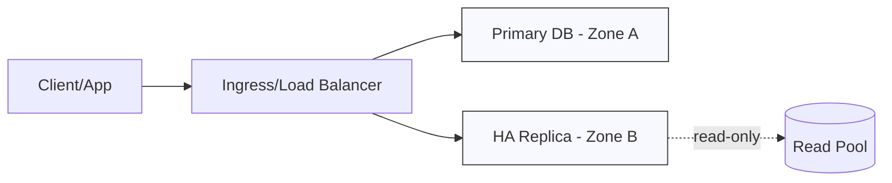
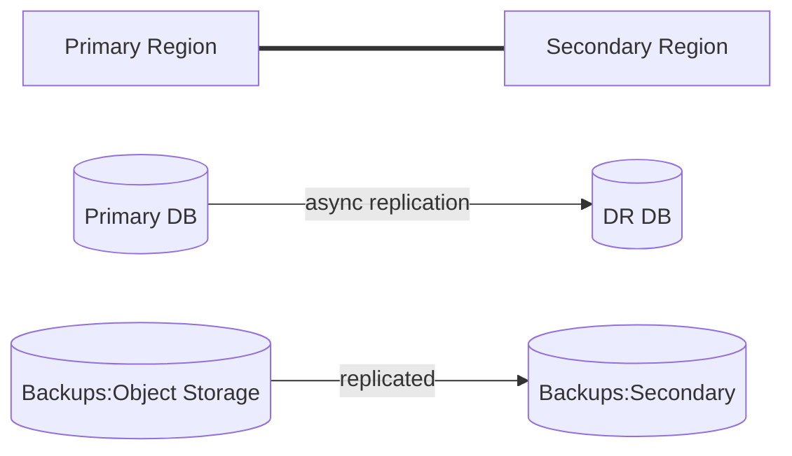

<small align="right">Contact: <a href="mailto:vandersantanna@gmail.com">Email</a> · <a href="https://www.linkedin.com/in/vandersantanna">LinkedIn</a> · <a href="https://github.com/vandersantanna">GitHub</a></small>

# Google Cloud Database Engineering Manual
*SLO-driven reliability for Cloud SQL, AlloyDB, and Spanner—Terraform + WIF, HA/DR blueprints, and audit-ready ops.*

## Table of Contents
- [Executive Summary](#executive-summary)
- [What I Deliver](#what-i-deliver)
- [Core Expertise](#core-expertise)
- [Architecture Principles](#architecture-principles)
- [Platform Services Map](#platform-services-map)
- [Deep DB Patterns](#deep-db-patterns)
- [Reference Architectures](#reference-architectures)
  - [In-Region High Availability](#in-region-high-availability)
  - [Cross-Region Disaster Recovery](#cross-region-disaster-recovery)
  - [Zero-Downtime Change Management](#zero-downtime-change-management)
- [Infrastructure as Code](#infrastructure-as-code)
  - [Repo Structure](#repo-structure)
  - [Terraform Baseline](#terraform-baseline)
  - [CI/CD with GitHub Actions (OIDC)](#cicd-with-github-actions-oidc)
  - [Command-Line Essentials](#command-line-essentials)
- [Security & Compliance Baseline](#security--compliance-baseline)
- [Observability](#observability)
- [SLOs, Readiness & Testing](#slos-readiness--testing)
- [FinOps & Cost Controls](#finops--cost-controls)
- [Runbooks](#runbooks)
- [Case Studies (Representative)](#case-studies-representative)


## Executive Summary
Production-grade database reliability, performance, security, and cost efficiency on **GCP** with a strong focus on automation (IaC + GitOps), auditable operations, and measurable SLOs.

## What I Deliver
- **HA/DR design & implementation** with repeatable runbooks and automated drills.
- **Performance engineering** (IO layout, indexing, parameter tuning, connection resiliency).
- **Security-by-default** stacks (private endpoints, KMS, least-privilege IAM, secret hygiene).
- **Cost optimization** with commitments, right-sizing, and storage lifecycle policies.
- **Automation-first** environments (Terraform modules, CI/CD, policy-as-code, drift detection).
- **Operational excellence**: backups that restore, patching pipelines, on-call readiness.

## Core Expertise
- **DB Platforms:** Oracle 19c (RAC/ADG/GoldenGate/Exadata), SQL Server 2022 (MI/AG), PostgreSQL, MySQL, Redis, MongoDB.
- **Data Platform:** ingestion (CDC/ETL/ELT), streaming, analytics, governance.
- **Tooling:** Terraform, Ansible, GitHub Actions, GitLab CI, Azure DevOps, Prometheus/Grafana.

## Architecture Principles
1. **Secure by Default:** private networking, managed keys, secrets rotation, no public DB endpoints.
2. **Resilient by Design:** multi-zone/AD, cross-region DR, automated failover testing.
3. **Automated & Observable:** everything as code; metrics, logs, traces with golden dashboards.
4. **Cost-Aware:** choose right tiers, scale-to-zero (where possible), commitments/discounts.

## Platform Services Map
    - **Networking:** VPC (global), Subnets, Firewall Rules, Cloud NAT, Load Balancing, Cloud DNS
- **Identity:** IAM, Workforce/Workload Identity Federation, Org Policies
- **Encryption:** Cloud KMS, Secret Manager
- **Storage:** Cloud Storage (Std/Nearline/Coldline/Archive), Persistent Disks, Filestore
- **Observability:** Cloud Logging/Monitoring/Trace, Error Reporting, Profiler
- **Databases:** Cloud SQL (PG/MySQL/SQL Server), **AlloyDB**, BigQuery, Datastream
- **Data Platform:** Dataflow, Dataproc, Pub/Sub, Data Fusion, Composer (Airflow)

## Deep DB Patterns
    - **Cloud SQL (PG/MySQL/SQL Server):** Regional HA; cross-region replicas; PITR backups.
- **AlloyDB:** Primary + read pool; cross-region DR with replicas.
- **BigQuery:** Multi-region datasets; DR via dataset copies/exports; governance with IAM.

## Reference Architectures

### In-Region High Availability


### Cross-Region Disaster Recovery


### Zero-Downtime Change Management
- Blue/Green or Rolling deployments with connection draining.
- Schema changes with **expand/contract** and backward compatibility windows.
- Feature flags and **retry policies** at clients.

## Infrastructure as Code

    ### Repo Structure
    ```text
    /infra
      /modules
        /network
        /kms
        /database
      /stacks
        /prod
        /staging
        /dev
    ```

    ### Terraform Baseline
    ```hcl
terraform {
  required_providers { google = { source = "hashicorp/google", version = "~> 5.0" } }
}
provider "google" { project = var.project_id, region = var.region }
resource "google_compute_network" "vpc" { name = "dbre-vpc", auto_create_subnetworks = false }
resource "google_compute_subnetwork" "db" {{
  name = "db-subnet"; ip_cidr_range = "10.40.1.0/24"
  network = google_compute_network.vpc.id; region = var.region
}}
```

    ### CI/CD with GitHub Actions (OIDC)
    ```yaml
    name: iac-plan-apply
    on: {
      push: { branches: [ "main" ] },
      pull_request: { branches: [ "main" ] }
    }
    jobs:
      tf:
        runs-on: ubuntu-latest
        permissions: { id-token: write, contents: read }
        steps:
          - uses: actions/checkout@v4
          - uses: hashicorp/setup-terraform@v3
          - name: Authenticate (OIDC)
            run: echo "Exchange OIDC token to assume cloud workload identity"
          - name: Terraform Init/Plan
            run: |
              terraform init
              terraform validate
              terraform plan -out tf.plan
          - name: Terraform Apply (main only)
            if: github.ref == 'refs/heads/main' && github.event_name == 'push'
            run: terraform apply -auto-approve tf.plan
    ```

    ### Command-Line Essentials
    ```bash
gcloud auth list
gcloud sql instances list
bq ls --format=prettyjson
```

## Security & Compliance Baseline
- **Identity:** least privilege RBAC/ABAC; workload identities; JIT/PIM for admins; periodic access reviews.
- **Encryption:** managed KMS keys at rest; TLS in transit; **TDE** for supported engines.
- **Secrets:** central secret manager; rotation; short-lived credentials.
- **Network:** private endpoints; inbound restricted; WAF/DDoS protections; egress controls.
- **Policy-as-Code:** pre-commit & CI checks; CIS/cloud guardrails; drift detection.
- **Audit:** centralized logs with immutable retention; alerts on anomalous activity.

## Observability
    - **Metrics:** CPU/Memory/Connections/Replication lag; query latency histograms.
- **Logs:** Cloud SQL logs, VPC flow, audit logs; aggregated to Log Buckets.
- **Dashboards:** Uptime checks; error budgets; Looker Studio for cost + performance.

## SLOs, Readiness & Testing
- **Targets (illustrative):** Availability ≥ 99.9%, RTO ≤ 15 min, RPO ≤ 30 sec (where engine supports).
- **Readiness:** runbooks reviewed; access tested; backups restore-tested; on-call rotation active.
- **Testing:** DR drills (quarterly), load tests before scale decisions, chaos experiments for failover paths.

## FinOps & Cost Controls
    - **Committed/Sustained Use Discounts**; storage lifecycle (Nearline/Coldline/Archive).
- Budget alerts; label-driven cost allocation; anomaly detection.

## Runbooks
- **Backup/Restore:** validate last backup age; restore to isolated env; verify checksums; time the restore.
- **Failover/Failback:** promotion procedure; DNS/connection string switch; data consistency checks; rollback plan.
- **Patching:** stage → canary → rollout; health gates; SLO watch; auto-rollback on breach.

## Case Studies (Representative)
- **Cross-Region DR Enablement:** implemented async replication + automated drills; documented RTO/RPO; added dashboards/alerts.
- **Performance Program:** IO and indexing improvements; pool sizing; retry policies; latency down significantly under peak.
- **Cost Optimization:** commitments/reservations + storage lifecycle + right-size → sustained TCO reduction.

---
[Back to top](#table-of-contents)

---

**[🏠 Back to Main Portfolio](../README.md#top)**

---

## Author & Maintainer
<table>
  <tr>
    <td width="96" valign="top">
      
    </td>
    <td valign="top">
      <strong>Vanderley Sant Anna</strong><br>
      Senior Database Engineer (DBE) / Senior Database Reliability Engineer (DBRE) / Senior DBA / DataOps Engineer
    </td>
  </tr>
</table>

**Preferred name:** Vander  

**Education:**  
- B.Sc. in Software Engineering — Centro Universitário de Maringá (UniCesumar) — *UniCesumar University Center*, Maringá, Brazil (2020)  
- Postgraduate Specialization (Lato Sensu) in Software Project Engineering — Universidade do Sul de Santa Catarina (UNISUL) — *Southern Santa Catarina University*, Florianópolis, Brazil (2008)  
- Technologist in Data Processing (*Tecnólogo em Processamento de Dados*) — Universidade do Estado de Santa Catarina (UDESC) — *Santa Catarina State University*, Joinville, Brazil (1995)  

**Certifications:**  
- Oracle OCP  
- MongoDB University — M102: MongoDB for DBAs  
- IBM Certified Database Associate — DB2 9 Fundamentals  

**Location & Timezone:** Blumenau, SC, Brazil (UTC−3) • **Availability:** Remote (Americas & Europe)

**Last Updated:** 2025-10-24 • **Status:** Actively maintained

## 📫 Contact
- **Email (primary):** [vandersantanna@gmail.com](mailto:vandersantanna@gmail.com)  
- **LinkedIn:** [linkedin.com/in/vandersantanna](https://www.linkedin.com/in/vandersantanna)  
- **GitHub:** [github.com/vandersantanna](https://github.com/vandersantanna)

<details>
  <summary><strong>Trademarks</strong></summary>

  <small>All product names, logos, and brands are property of their respective owners. 
  Use of these names is for identification purposes only and does not imply endorsement or affiliation.</small>
</details>
