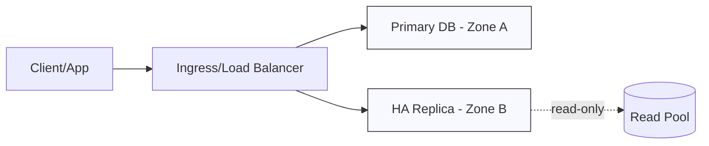
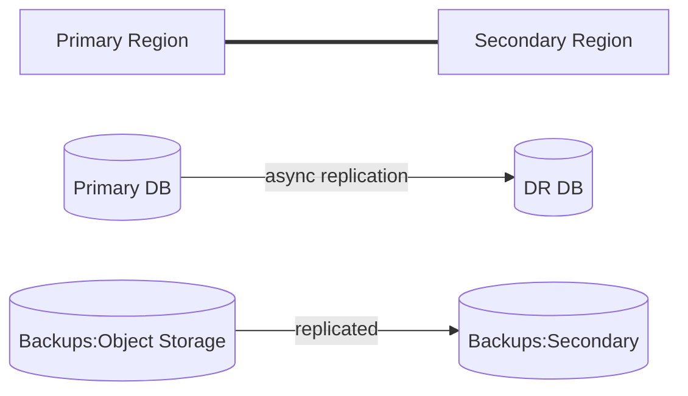

# Oracle Cloud Infrastructure (OCI) — Data Platform & DBRE Portfolio

[](#)

**Vander Sant Anna — Senior DBA / DBRE — Remote — US/Canada/EU/Latin America time zones**  
Email: [vandersantanna@gmail.com](mailto:vandersantanna@gmail.com) • LinkedIn: [linkedin.com/in/vandersantanna](https://linkedin.com/in/vandersantanna) • GitHub: [github.com/vandersantanna](https://github.com/vandersantanna)

*Last updated: October 14, 2025*

## Table of Contents
- [Executive Summary](#executive-summary)
- [What I Deliver](#what-i-deliver)
- [Core Expertise](#core-expertise)
- [Architecture Principles](#architecture-principles)
- [Platform Services Map](#platform-services-map)
- [Deep DB Patterns](#deep-db-patterns)
- [Reference Architectures](#reference-architectures)
  - [In-Region High Availability](#in-region-high-availability)
  - [Cross-Region Disaster Recovery](#cross-region-disaster-recovery)
  - [Zero-Downtime Change Management](#zero-downtime-change-management)
- [Infrastructure as Code](#infrastructure-as-code)
  - [Repo Structure](#repo-structure)
  - [Terraform Baseline](#terraform-baseline)
  - [CI/CD with GitHub Actions (OIDC)](#cicd-with-github-actions-oidc)
  - [Command-Line Essentials](#command-line-essentials)
- [Security & Compliance Baseline](#security--compliance-baseline)
- [Observability](#observability)
- [SLOs, Readiness & Testing](#slos-readiness--testing)
- [FinOps & Cost Controls](#finops--cost-controls)
- [Runbooks](#runbooks)
- [Case Studies (Representative)](#case-studies-representative)
- [Links & Cross-Navigation](#links--cross-navigation)
- [Contact](#contact)

## Executive Summary
Production-grade database reliability, performance, security, and cost efficiency on **OCI** with a strong focus on automation (IaC + GitOps), auditable operations, and measurable SLOs.

## What I Deliver
- **HA/DR design & implementation** with repeatable runbooks and automated drills.
- **Performance engineering** (IO layout, indexing, parameter tuning, connection resiliency).
- **Security-by-default** stacks (private endpoints, KMS, least-privilege IAM, secret hygiene).
- **Cost optimization** with commitments, right-sizing, and storage lifecycle policies.
- **Automation-first** environments (Terraform modules, CI/CD, policy-as-code, drift detection).
- **Operational excellence**: backups that restore, patching pipelines, on-call readiness.

## Core Expertise
- **DB Platforms:** Oracle 19c (RAC/ADG/GoldenGate/Exadata), SQL Server 2022 (MI/AG), PostgreSQL, MySQL, Redis, MongoDB.
- **Data Platform:** ingestion (CDC/ETL/ELT), streaming, analytics, governance.
- **Tooling:** Terraform, Ansible, GitHub Actions, GitLab CI, Azure DevOps, Prometheus/Grafana.

## Architecture Principles
1. **Secure by Default:** private networking, managed keys, secrets rotation, no public DB endpoints.
2. **Resilient by Design:** multi-zone/AD, cross-region DR, automated failover testing.
3. **Automated & Observable:** everything as code; metrics, logs, traces with golden dashboards.
4. **Cost-Aware:** choose right tiers, scale-to-zero (where possible), commitments/discounts.

## Platform Services Map
    - **Networking:** VCN, Subnets (Private), NSG, DRG, Service Gateway, Load Balancer, DNS
- **Identity:** IAM (Compartments/Policies/Dynamic Groups), Cloud Guard, Security Zones
- **Encryption:** OCI Vault (Keys/Secrets), TDE for DBs
- **Storage:** Object Storage (Std/IA/Archive), Block Volumes, File Storage (NFS)
- **Observability:** OCI Monitoring/Logging/Events/Alarms, Logging Analytics
- **Databases:** Oracle Autonomous (ATP/ADW), Exadata Cloud Service, DB Systems (19c), MySQL HeatWave
- **Integration/Analytics:** GoldenGate on OCI, Data Integration, Data Flow (Spark), Streaming

## Deep DB Patterns
    - **Oracle 19c on DB Systems/Exadata:** Primary in AD1 with **Data Guard** to AD2/Region; **FSFO** enabled; **ACFS/NFS** for wallet/file shares where appropriate.
- **Autonomous (ATP/ADW):** Cross-region **ADG** for DR; Data Safe; private APEX/ORDS.
- **MySQL HeatWave:** Multi-AZ HA; backups to Object Storage; scripted promotion and cutover.

## Reference Architectures

### In-Region High Availability


### Cross-Region Disaster Recovery


### Zero-Downtime Change Management
- Blue/Green or Rolling deployments with connection draining.
- Schema changes with **expand/contract** and backward compatibility windows.
- Feature flags and **retry policies** at clients.

## Infrastructure as Code

    ### Repo Structure
    ```text
    /infra
      /modules
        /network
        /kms
        /database
      /stacks
        /prod
        /staging
        /dev
    ```

    ### Terraform Baseline
    ```hcl
terraform {
  required_providers { oci = { source = "oracle/oci", version = "~> 6.0" } }
}
provider "oci" { region = var.region }
# Modules (network, kms, database) go here; example:
module "network" {
  source = "github.com/org/oci-network-module"
  compartment_ocid = var.compartment_ocid
  vcn_cidr = "10.10.0.0/16"
}
```

    ### CI/CD with GitHub Actions (OIDC)
    ```yaml
    name: iac-plan-apply
    on: {
      push: { branches: [ "main" ] },
      pull_request: { branches: [ "main" ] }
    }
    jobs:
      tf:
        runs-on: ubuntu-latest
        permissions: { id-token: write, contents: read }
        steps:
          - uses: actions/checkout@v4
          - uses: hashicorp/setup-terraform@v3
          - name: Authenticate (OIDC)
            run: echo "Exchange OIDC token to assume cloud workload identity"
          - name: Terraform Init/Plan
            run: |
              terraform init
              terraform validate
              terraform plan -out tf.plan
          - name: Terraform Apply (main only)
            if: github.ref == 'refs/heads/main' && github.event_name == 'push'
            run: terraform apply -auto-approve tf.plan
    ```

    ### Command-Line Essentials
    ```bash
oci iam compartment list
oci db system list --compartment-id $COMP_OCID
oci monitoring alarm create --compartment-id $COMP_OCID --display-name "High CPU DB"   --query-text "CpuUtilization[5m].mean() > 80" --severity CRITICAL --is-enabled true
```

## Security & Compliance Baseline
- **Identity:** least privilege RBAC/ABAC; workload identities; JIT/PIM for admins; periodic access reviews.
- **Encryption:** managed KMS keys at rest; TLS in transit; **TDE** for supported engines.
- **Secrets:** central secret manager; rotation; short-lived credentials.
- **Network:** private endpoints; inbound restricted; WAF/DDoS protections; egress controls.
- **Policy-as-Code:** pre-commit & CI checks; CIS/cloud guardrails; drift detection.
- **Audit:** centralized logs with immutable retention; alerts on anomalous activity.

## Observability
    - **Metrics:** CPU/IOPS, session count, wait events; **DB time** and **redo generation** for Oracle.
- **Logs:** DB alert/listener logs; route to **Logging Analytics** with saved searches and alerts.
- **Dashboards:** RTO/RPO gauges (replication lag + restore tests), error budgets, cost per env.

## SLOs, Readiness & Testing
- **Targets (illustrative):** Availability ≥ 99.9%, RTO ≤ 15 min, RPO ≤ 30 sec (where engine supports).
- **Readiness:** runbooks reviewed; access tested; backups restore-tested; on-call rotation active.
- **Testing:** DR drills (quarterly), load tests before scale decisions, chaos experiments for failover paths.

## FinOps & Cost Controls
    - Prefer **Flex shapes** for right-sizing; move cold backups to **Archive**.
- Use **Commitment contracts** for steady usage; enforce tagging for showback; spend anomaly alarms.

## Runbooks
- **Backup/Restore:** validate last backup age; restore to isolated env; verify checksums; time the restore.
- **Failover/Failback:** promotion procedure; DNS/connection string switch; data consistency checks; rollback plan.
- **Patching:** stage → canary → rollout; health gates; SLO watch; auto-rollback on breach.

## Case Studies (Representative)
- **Cross-Region DR Enablement:** implemented async replication + automated drills; documented RTO/RPO; added dashboards/alerts.
- **Performance Program:** IO and indexing improvements; pool sizing; retry policies; latency down significantly under peak.
- **Cost Optimization:** commitments/reservations + storage lifecycle + right-size → sustained TCO reduction.

### OCI-Specific Notes
- **Security Zones** to enforce no-public DBs, encryption, and logging guardrails.
- **GoldenGate on OCI** for near-real-time replication between regions/clouds (where needed).

## Links & Cross-Navigation
- **Multi-Cloud Landing:** `/portfolio-cloud/cloud-portfolio.md`
- **Other Cloud Portfolios:** [OCI](./oci-portfolio.md) • [AWS](./aws-portfolio.md) • [Azure](./azure-portfolio.md) • [GCP](./gcp-portfolio.md)

## Contact
Available for remote consulting, migrations, HA/DR reviews, performance tuning, cost optimization, and reliability audits.  
Email: [vandersantanna@gmail.com](mailto:vandersantanna@gmail.com)
