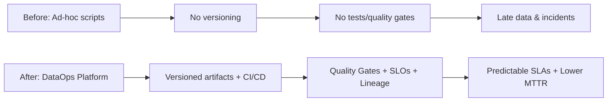
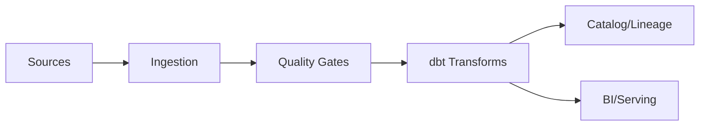
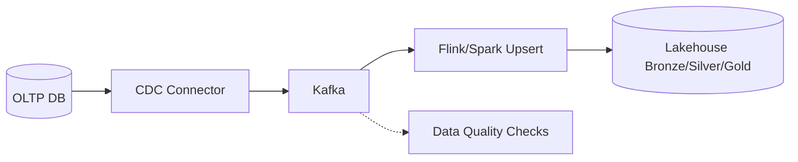
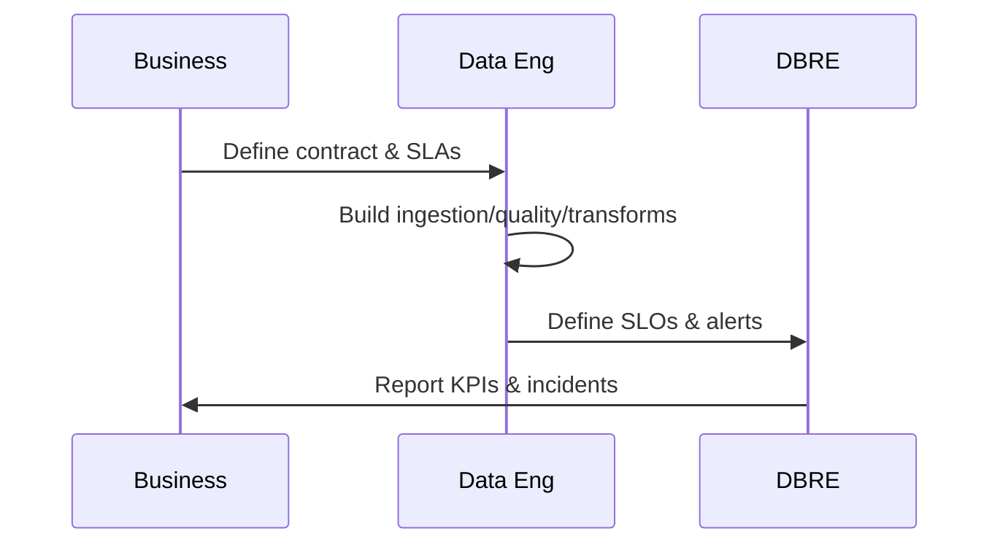

# DataOps Professional Portfolio — Full Edition

> **Author:** Vander Sant Anna — Senior DBA / DBRE / DataOps
> **Scope:** 29-topic reference with concrete code, checklists, and diagrams for a complete DataOps portfolio.

---

## Table of Contents
- [1. Executive Summary & Value Proposition](#1-executive-summary--value-proposition)
- [1.1 Outcomes & KPIs](#11-outcomes--kpis)
- [1.2 Before/After Example](#12-before-after-example)
- [1.3 KPI Readiness Checklist](#13-kpi-readiness-checklist)
- [2. Core Competencies (Hard Skills)](#2-core-competencies-hard-skills)
- [2.1 Ingestion/CDC](#21-ingestion-cdc)
- [2.2 Orchestration](#22-orchestration)
- [2.3 Transformations (dbt)](#23-transformations-dbt)
- [2.4 Lakehouse](#24-lakehouse)
- [2.5 Streaming](#25-streaming)
- [2.6 Data Quality](#26-data-quality)
- [2.7 Metadata & Lineage](#27-metadata--lineage)
- [2.8 Observability](#28-observability)
- [2.9 Security & Compliance](#29-security--compliance)
- [2.10 IaC/PaC & CI/CD](#210-iac-pac--ci-cd)
- [3. Services (Consulting Catalog)](#3-services-consulting-catalog)
- [4. Reference Architectures](#4-reference-architectures)
- [5. Cloud Mapping (OCI, AWS, Azure, GCP)](#5-cloud-mapping-oci,-aws,-azure,-gcp)
- [6. Standards & Conventions](#6-standards--conventions)
- [7. Data Lifecycle (Operating Model)](#7-data-lifecycle-operating-model)
- [8. Ingestion & CDC (Deep)](#8-ingestion--cdc-deep)
- [9. Transformations & Data Modeling (Deep)](#9-transformations--data-modeling-deep)
- [10. Data Quality & Data Contracts (Deep)](#10-data-quality--data-contracts-deep)
- [11. Metadata, Catalog & Lineage](#11-metadata,-catalog--lineage)
- [12. Data Observability](#12-data-observability)
- [13. Security, Privacy & Compliance](#13-security,-privacy--compliance)
- [14. CI/CD for Data](#14-ci-cd-for-data)
- [15. Infrastructure as Code & Policy as Code](#15-infrastructure-as-code--policy-as-code)
- [16. Lakehouse & Storage Formats](#16-lakehouse--storage-formats)
- [17. Serving & Semantic Layer](#17-serving--semantic-layer)
- [18. Streaming & Real-Time](#18-streaming--real-time)
- [19. SRE/DBRE for Data](#19-sre-dbre-for-data)
- [20. Performance & FinOps](#20-performance--finops)
- [21. Migration & Modernization Playbooks](#21-migration--modernization-playbooks)
- [22. Operational Governance](#22-operational-governance)
- [23. Templates & Reusable Assets](#23-templates--reusable-assets)
- [24. Case Studies (Outcomes)](#24-case-studies-outcomes)
- [25. Labs & Demos (Hands-On)](#25-labs--demos-hands-on)
- [26. Documents & Artifacts](#26-documents--artifacts)
- [27. Certifications, Publications & Talks](#27-certifications,-publications--talks)
- [28. Roadmap & Portfolio Backlog](#28-roadmap--portfolio-backlog)
- [29. Contact & Engagement Models](#29-contact--engagement-models)

---

## 1. Executive Summary & Value Proposition

DataOps applies software engineering, SRE, and product thinking to data delivery. It reduces **lead time**, improves **reliability**, and increases **trust** by enforcing version control, CI/CD, observability, automation, and governance.

### 1.1 Outcomes & KPIs

| KPI | Definition | Target (example) |
|---|---|---|
| Lead Time | Idea→prod for a data change | < 2 days for minor models |
| Deployment Frequency | Releases per week per domain | ≥ 10/week |
| Change Failure Rate (CFR) | % of failed releases | < 5% |
| MTTR | Mean Time To Recover from data incidents | < 60 min |
| Freshness | Time since last successful run | < 15 min (near-real-time domains) |
| Data Quality Score | % checks passing | ≥ 99% critical checks |
| Cost per TB | Storage+compute per TB processed | −20% YoY |

### 1.2 Before/After Example



### 1.3 KPI Readiness Checklist

- [ ] KPIs have precise definitions and owners.
- [ ] Measurement jobs and dashboards exist for each KPI.
- [ ] Alerts tie to error budgets (SLOs) and paging policy.
- [ ] KPIs used in postmortems and quarterly reviews.

## 2. Core Competencies (Hard Skills)

End-to-end capabilities to build reliable, cost-aware, secure data products.

### 2.1 Ingestion/CDC

Batch, API, files, and **CDC** from OLTP (Debezium, GoldenGate, Airbyte). Handles schema evolution, ordering, idempotency, DLQ.

```json
{
  "name": "mysql-cdc-connector",
  "config": {
    "connector.class": "io.debezium.connector.mysql.MySqlConnector",
    "database.hostname": "mysql",
    "database.port": "3306",
    "database.user": "debezium",
    "database.password": "********",
    "database.server.id": "5400",
    "database.server.name": "mysqlsrv",
    "database.include.list": "salesdb",
    "table.include.list": "salesdb.orders,salesdb.order_items",
    "include.schema.changes": "false",
    "tombstones.on.delete": "false",
    "snapshot.mode": "initial"
  }
}
```

### 2.2 Orchestration

Airflow/Dagster/Prefect with SLAs, retries, backfills, lineage hooks.

```python
from airflow import DAG
from airflow.operators.bash import BashOperator
from datetime import datetime, timedelta

with DAG(
    "hourly_orders",
    start_date=datetime(2024,1,1),
    schedule_interval="@hourly",
    catchup=False,
    default_args={"retries": 2, "retry_delay": timedelta(minutes=5)},
    tags=["etl","orders"]
) as dag:
    extract = BashOperator(task_id="extract", bash_command="python etl/extract.py")
    transform = BashOperator(task_id="transform", bash_command="dbt build --select +tag:orders")
    load = BashOperator(task_id="load", bash_command="python etl/load.py")
    extract >> transform >> load
```

### 2.3 Transformations (dbt)

```sql
-- models/silver/orders.sql
{{ config(materialized='incremental', unique_key='order_id') }}
select
  order_id,
  customer_id,
  cast(amount as decimal(18,2)) as amount,
  status,
  order_ts
from {{ source('bronze','orders_bronze') }}

where order_ts > (select coalesce(max(order_ts), '1970-01-01') from {{ this }})

```

### 2.4 Lakehouse

ACID tables with Delta/Iceberg/Hudi; catalogs (Unity/Glue/HMS). Maintenance: optimize/compact/vacuum; statistics and small-file mitigation.

### 2.5 Streaming

Kafka topics with compaction for upserts; Flink/Spark for stateful processing, watermarks, and exactly-once sinks.

```properties
cleanup.policy=compact,delete
retention.ms=604800000
min.cleanable.dirty.ratio=0.1
```

### 2.6 Data Quality

```yaml
checks for orders_bronze:
  - missing_count(order_id) = 0
  - freshness(order_ts) < 15m
  - schema:
      warn:
        when required column missing: [order_id, customer_id, amount, status]
```

### 2.7 Metadata & Lineage

OpenMetadata/DataHub + OpenLineage for column-level and job lineage; impact analysis on schema changes.

### 2.8 Observability

```yaml
groups:
- name: data-freshness
  rules:
  - alert: OrdersPipelineStale
    expr: time() - orders_last_success_ts_seconds > 900
    for: 5m
    labels: { severity: page }
```

### 2.9 Security & Compliance

IAM least privilege; KMS; masking/tokenization; LGPD/GDPR workflows.

### 2.10 IaC/PaC & CI/CD

```hcl
# Terraform module skeleton
terraform {
  required_providers { aws = { source = "hashicorp/aws", version = "~> 5.0" } }
}
provider "aws" { region = var.region }
module "lake_s3" {
  source      = "./modules/s3"
  bucket_name = var.bucket_name
  tags        = var.tags
}
```


**Checklist — Tech stack readiness & gaps**
- [ ] Connectors for each source with CDC where applicable
- [ ] Orchestrator with lineage hooks and SLAs
- [ ] dbt with tests, snapshots, exposures
- [ ] Lakehouse tables under catalog control and maintenance
- [ ] Streaming runtime for NRT domains
- [ ] Quality gates in CI/CD
- [ ] Observability dashboards and alerts
- [ ] Secrets and IAM baselines in place

## 3. Services (Consulting Catalog)

- **Maturity Assessment & Roadmap** (current vs target state, prioritized gaps)
- **Reference Architectures** (batch/stream/lakehouse; multi-cloud)
- **E2E Pipelines** (ingestion → quality → modeling → serving)
- **Modernization** (DW→Lakehouse; batch→NRT; on-prem→cloud)
- **FinOps & Governance** (cost models, policies, audits)
- **DBRE for Data** (SLOs, incident mgmt, DR)

**Engagement Models**

| Model | Scope | Typical Deliverables |
|---|---|---|
| Assessment (2–4 wks) | Gap analysis & roadmap | Report, backlog, ADRs |
| Pilot (4–8 wks) | 1–2 pipelines in prod | Pipelines, CI/CD, dashboards |
| Platform (8–16 wks) | Lakehouse foundation | IaC modules, catalog, SLOs |
| Retainer | Ops & evolution | SLO reviews, templates, coaching |

**RACI (sample)**

| Activity | R | A | C | I |
|---|---|---|---|---|
| Data Contracts | Data Eng | Product | DBRE, Security | BI |
| Pipeline Releases | Data Eng | Platform Lead | DBRE | Stakeholders |
| Incident Mgmt | DBRE | Platform Lead | Data Eng | Product |

**Checklist — Scoping a DataOps engagement**
- [ ] Business outcomes and KPIs defined
- [ ] Scope of domains and sources agreed
- [ ] Security/compliance constraints known
- [ ] Success criteria and timebox set

## 4. Reference Architectures

Designs for batch, streaming, lakehouse, and hybrid, with trade-offs.





**ADR essentials**
- Context, decision, options, trade-offs, risks, follow-ups

**Checklist — ADR**
- [ ] Decision owners and date
- [ ] Options evaluated with evidence
- [ ] Security & cost impacts stated
- [ ] Rollback plan documented

## 5. Cloud Mapping (OCI, AWS, Azure, GCP)

| Capability | OCI | AWS | Azure | GCP |
|---|---|---|---|---|
| Storage | Object Storage | S3 | ADLS Gen2 | GCS |
| Orchestration | Data Flow/ODI | MWAA/Step | Data Factory | Cloud Composer |
| Processing | Data Flow (Spark) | EMR/Glue | Databricks/Synapse | Dataproc/Dataflow |
| DW | ADW/ATP | Redshift | Synapse | BigQuery |
| Catalog/Lineage | Data Catalog | Glue + Data Catalog | Purview | Data Catalog + OpenLineage |
| Security | Vault/KMS | KMS | Key Vault | KMS |

**Terraform providers (minimal)**
```hcl
# AWS
provider "aws" { region = var.region }
# Azure
provider "azurerm" { features {} }
# GCP
provider "google" { project = var.project, region = var.region }
# OCI
provider "oci" { region = var.region }
```

**Checklist — Cross-cloud parity & pitfalls**
- [ ] Equivalent encryption & access controls
- [ ] Consistent tagging & cost allocation
- [ ] Similar SLIs/SLOs & monitoring
- [ ] Network egress and latency planned

## 6. Standards & Conventions

Repository layout, naming, SQL conventions, and DAG patterns to keep teams aligned.

```text
repo-root/
  pipelines/
  dbt/
  infra/
  docs/
  .github/workflows/
```

**Naming regex (examples)**
```text
Datasets: ^[a-z][a-z0-9_]{2,30}$
Tables:   ^[a-z][a-z0-9_]{2,40}$
Columns:  ^[a-z][a-z0-9_]{2,40}$
```

**dbt macro skeleton**
```sql

to_char({{ col }}, 'YYYY-MM-DD"T"HH24:MI:SS"Z"')

```

**Checklist — Conventions adoption**
- [ ] Documented in repo root (CONTRIBUTING.md)
- [ ] Linters enforce naming & SQL style
- [ ] Pre-commit hooks in place
- [ ] Templates for DAGs/models

## 7. Data Lifecycle (Operating Model)



**Checklist — Lifecycle gates defined?**
- [ ] Contract signed-off by data product owner
- [ ] Quality gates blocking promotion
- [ ] SLOs agreed & visible to consumers
- [ ] Handoffs and runbooks documented

## 8. Ingestion & CDC (Deep)

Connectors, schema evolution, dedup/order/idempotency, and DLQ patterns.

**Airbyte connection (JSON)**
```json
{
  "name": "mysql_orders_to_kafka",
  "source": "mysql",
  "destination": "kafka",
  "namespaceDefinition": "destination",
  "namespaceFormat": "salesdb",
  "syncCatalog": { "streams": [ { "name": "orders", "syncMode": "incremental" } ] }
}
```

**Kafka Connect worker properties**
```properties
bootstrap.servers=kafka:9092
key.converter=org.apache.kafka.connect.json.JsonConverter
value.converter=org.apache.kafka.connect.json.JsonConverter
config.storage.topic=connect-configs
offset.storage.topic=connect-offsets
status.storage.topic=connect-status
```

**Checklist — CDC reliability & replay strategy**
- [ ] Binlog/redo enabled & retained long enough
- [ ] Keys stable; compaction on upsert topics
- [ ] Watermarks & ordering logic verified
- [ ] DLQ and replay from offset/checkpoint tested

## 9. Transformations & Data Modeling (Deep)

Kimball vs Data Vault vs wide tables; incrementals; partitioning/clustering; performance.

```sql
-- dbt snapshot for SCD2 (customers)

{{
  config(
    target_schema='snapshots',
    unique_key='customer_id',
    strategy='check',
    check_cols=['name','tier','status']
  )
}}
select * from {{ source('silver','customers') }}

```

**Performance tips**
- Use partition pruning and clustering keys
- Pushdown filters to DW/Lakehouse
- Gather statistics and cache hot tables

**Checklist — Transformation performance readiness**
- [ ] Incremental models with unique keys
- [ ] Partition/cluster strategy documented
- [ ] Stats refresh & maintenance scheduled
- [ ] Query plans checked for hot spots

## 10. Data Quality & Data Contracts (Deep)

Define contracts, enforce checks in CI/CD, and manage incidents.

```json
{
  "$schema": "https://json-schema.org/draft/2020-12/schema",
  "title": "orders_contract",
  "type": "object",
  "required": ["order_id","customer_id","amount","status","order_ts"],
  "properties": {
    "order_id": {"type":"integer"},
    "customer_id": {"type":"integer"},
    "amount": {"type":"string","pattern":"^[0-9]+(\.[0-9]{2})?$"},
    "status": {"type":"string","enum":["NEW","PAID","CANCELLED","SHIPPED"]},
    "order_ts": {"type":"string","format":"date-time"}
  },
  "additionalProperties": false
}
```

```yaml
# Great Expectations (suite)
expectation_suite_name: orders_suite
expectations:
  - expect_column_values_to_not_be_null: { column: order_id }
  - expect_table_row_count_to_be_between: { min_value: 1 }
  - expect_column_values_to_match_regex:
      column: status
      regex: "^(NEW|PAID|CANCELLED|SHIPPED)$"
```

```yaml
# Soda
checks for orders_bronze:
  - missing_count(order_id) = 0
  - freshness(order_ts) < 15m
```

**Checklist — Quality SLAs & escalation**
- [ ] Contract versioned; change process defined
- [ ] Critical checks block promotion in CI
- [ ] Escalation path & incident template ready
- [ ] Postmortems produce new tests

## 11. Metadata, Catalog & Lineage

Bootstrap OpenMetadata/DataHub; ingest dbt, Lakehouse, Kafka, BI; enable column lineage and impact analysis.

```yaml
# DataHub ingestion example
source:
  type: dbt
  config:
    manifest_path: target/manifest.json
    catalog_path: target/catalog.json
sink:
  type: datahub-rest
  config:
    server: http://datahub:8080
```

**Checklist — PII classification & lineage coverage**
- [ ] PII tags and access policies applied
- [ ] dbt + jobs emitting lineage
- [ ] Impact analysis used in PRs
- [ ] Catalog linked from BI tools

## 12. Data Observability

SLIs/SLOs for freshness, completeness, latency; anomaly detection; alerting; postmortems.

```yaml
service: cdc_orders
slos:
  - name: freshness_under_15m
    objective: 0.99
    sli: last_success_gap_seconds
    threshold: 900
```

```yaml
groups:
- name: data-pipeline
  rules:
  - alert: HighKafkaLag
    expr: kafka_consumer_lag > 10000
    for: 10m
    labels: { severity: page }
```

**Checklist — Alerting noise vs signal**
- [ ] Error budgets in place
- [ ] Alerts grouped by user impact
- [ ] Noisy alerts tuned or removed
- [ ] On-call rotation documented

## 13. Security, Privacy & Compliance

```hcl
# AWS KMS + S3 encryption (excerpt)
resource "aws_kms_key" "dataops" { description = "DataOps KMS" }
resource "aws_s3_bucket_server_side_encryption_configuration" "sse" {
  bucket = aws_s3_bucket.lake.id
  rule { apply_server_side_encryption_by_default { sse_algorithm = "aws:kms", kms_master_key_id = aws_kms_key.dataops.arn } }
}
```

```sql
-- Example masking policy
CREATE VIEW orders_masked AS
SELECT order_id, customer_id, CASE WHEN has_role('pii_reader') THEN amount ELSE NULL END AS amount, status, order_ts
FROM orders;
```

**Checklist — Least privilege & key rotation**
- [ ] IAM roles least-privileged
- [ ] Key rotation automated
- [ ] Secrets in Vault/Key Vault
- [ ] DSR workflow documented (LGPD/GDPR)

## 14. CI/CD for Data

```yaml
name: dataops-ci
on:
  push: { branches: [ "main" ] }
  pull_request: { branches: [ "main" ] }
jobs:
  test:
    runs-on: ubuntu-latest
    steps:
      - uses: actions/checkout@v4
      - uses: actions/setup-python@v5
        with: { python-version: "3.11" }
      - run: pip install dbt-core great_expectations
      - run: dbt deps && dbt build --fail-fast
      - run: ge checkpoint run orders_suite
  deploy:
    if: github.ref == 'refs/heads/main'
    runs-on: ubuntu-latest
    steps:
      - uses: actions/checkout@v4
      - run: terraform -chdir=infra init && terraform -chdir=infra apply -auto-approve
```

```yaml
stages: [validate, test, deploy]
validate:
  stage: validate
  image: hashicorp/terraform:1.9
  script:
    - cd infra && terraform init && terraform validate
test:
  stage: test
  image: python:3.11
  script:
    - pip install dbt-core great_expectations
    - dbt build --fail-fast
    - ge checkpoint run orders_suite
deploy:
  stage: deploy
  image: hashicorp/terraform:1.9
  when: manual
  script:
    - cd infra && terraform apply -auto-approve
```

**Checklist — Promotion & rollback**
- [ ] Branch strategy agreed (trunk/GitFlow)
- [ ] Ephemeral envs for PRs
- [ ] Database migrations reversible (Flyway/DACPAC)
- [ ] Rollback playbook tested

## 15. Infrastructure as Code & Policy as Code

Terraform modules for storage, catalog, networking, and guardrails via OPA/Conftest, with FinOps tags.

```hcl
# Lakehouse module (excerpt)
module "lakehouse" {
  source       = "./modules/lakehouse"
  bucket_name  = var.bucket_name
  catalog_name = var.catalog_name
  kms_key_arn  = var.kms_key_arn
  tags         = var.tags
}
```

```rego
package policy.tags
deny[msg] {
  not input.resource.tags.env
  msg := "Missing 'env' tag"
}
deny[msg] {
  input.resource.tags.env == "prod"
  not input.resource.tags.costcenter
  msg := "Prod resources must include costcenter tag"
}
```

**Checklist — Drift detection & policy coverage**
- [ ] Terraform state secured (remote backend + KMS)
- [ ] conftest in CI for every PR
- [ ] Periodic drift detection job
- [ ] Cost tags 100% coverage

## 16. Lakehouse & Storage Formats

```sql
-- Delta maintenance
OPTIMIZE delta.`/delta/orders_bronze` ZORDER BY (order_ts);
VACUUM delta.`/delta/orders_bronze` RETAIN 168 HOURS;
```

```sql
-- Iceberg table spec (Flink SQL)
CREATE TABLE lake.orders (
  order_id BIGINT,
  order_ts TIMESTAMP(3),
  status STRING,
  PRIMARY KEY (order_id) NOT ENFORCED
) WITH (
  'connector'='iceberg',
  'catalog-name'='hadoop_cat',
  'write.upsert.enabled'='true'
);
```

**Checklist — Table maintenance schedule**
- [ ] Optimize/compact cadence by growth
- [ ] Small-file mitigation jobs
- [ ] Stats refresh and validation
- [ ] Time-travel retention policy

## 17. Serving & Semantic Layer

```yaml
# dbt metrics (example)
version: 2
metrics:
  - name: total_revenue
    label: Total Revenue
    model: ref('orders')
    calculation_method: sum
    expression: amount
    timestamp: order_ts
    time_grains: [day, week, month]
```

**Checklist — Serving SLAs & caching**
- [ ] RLS/column masking configured in BI
- [ ] Metrics controlled in a semantic layer
- [ ] Caching/aggregation for hot queries
- [ ] API/feature store latency SLOs

## 18. Streaming & Real-Time

```yaml
# Kafka sink connector (JDBC sink to warehouse)
name: sink-orders
config:
  connector.class: io.confluent.connect.jdbc.JdbcSinkConnector
  topics: mysqlsrv.salesdb.orders
  connection.url: jdbc:postgresql://warehouse:5432/dwh
  auto.create: true
  insert.mode: upsert
  pk.mode: record_key
```

```java
// Flink Job skeleton (pseudo)
public class OrdersJob {
  public static void main(String[] args) {
    // read from Kafka, parse Debezium JSON, upsert to Iceberg
  }
}
```

**Checklist — Throughput/latency SLOs**
- [ ] Topics partitioned to avoid hotspots
- [ ] Backpressure & watermark strategies
- [ ] Exactly-once or at-least-once chosen
- [ ] Lag dashboards & auto-scaling

## 19. SRE/DBRE for Data

```markdown
### Incident Template
- Impact & time window
- User-facing symptoms
- Root cause hypothesis
- Mitigation & recovery steps
- Follow-ups & owners
```

```bash
# Backup verification (example)
set -euo pipefail
DEST=/backups/check
mkdir -p "$DEST"
spark-submit verify_parquet.py --path s3://lake/orders_bronze --out "$DEST/report.json"
jq '.' "$DEST/report.json"
```

**Checklist — Game days & restore tests**
- [ ] Quarterly recovery drills
- [ ] Synthetic incident runbook
- [ ] Error budget reviews
- [ ] Pager rotation health

## 20. Performance & FinOps

```conf
# Spark tunables (example)
spark.sql.shuffle.partitions=400
spark.sql.adaptive.enabled=true
spark.memory.fraction=0.6
```

```yaml
# Budget and alerts (pseudo)
budget:
  monthly: 15000
  alerts:
    - threshold: 0.8
      action: notify
    - threshold: 1.0
      action: freeze_nonprod
```

**Checklist — Cost/perf guardrails**
- [ ] Cost per TB & per pipeline tracked
- [ ] Auto-scaling policies tuned
- [ ] Storage lifecycle policies set
- [ ] Query/job benchmarks in CI

## 21. Migration & Modernization Playbooks

```markdown
### Cutover Plan (excerpt)
1. Dual-run for 2 weeks with parity checks
2. Sign-off criteria (freshness, quality, cost)
3. Final sync & freeze window
4. Switch consumers + rollback plan
```

```bash
# Validation script (example)
python tools/rowcount_diff.py --src jdbc:oracle:thin:@... --dst bigquery://project.dataset --tables orders,customers
```

**Checklist — Rollback readiness**
- [ ] Dual-run with automated checks
- [ ] Clear rollback trigger & steps
- [ ] Stakeholder comms plan
- [ ] Decommission plan post-stabilization

## 22. Operational Governance

```markdown
### Change Template
- Change description
- Risk/impact analysis
- Backout plan
- Windows & approvers
- Evidence to attach
```

**Audit evidence checklist**
- [ ] Artifact versions & build logs
- [ ] Access reviews & IAM diffs
- [ ] Test reports & quality gates
- [ ] Incident & RCA records

**Checklist — Change mgmt discipline**
- [ ] CAB cadence respected
- [ ] Freeze periods communicated
- [ ] Emergency change process documented
- [ ] Versioned ADRs per change

## 23. Templates & Reusable Assets

Production-ready building blocks for speed and consistency.

```python
# Airflow Template (idempotent with metrics)
from airflow import DAG
from airflow.operators.python import PythonOperator
from datetime import datetime, timedelta
def steps(**ctx): print("ok", ctx["ds"])
with DAG("template", start_date=datetime(2024,1,1), schedule_interval="@hourly", catchup=False,
         default_args={"retries":2,"retry_delay":timedelta(minutes=5)}) as dag:
    PythonOperator(task_id="run", python_callable=steps)
```

```text
dbt-cookiecutter/
  dbt_project.yml
  models/{bronze,silver,gold}/
  tests/
  macros/
  snapshots/
```

```hcl
# Terraform module skeleton
variable "name" { type = string }
variable "tags" { type = map(string) }
output "id" { value = "resource-id" }
```

**Checklist — Template adoption guide**
- [ ] Version tags & changelog
- [ ] Example usage in sandbox
- [ ] Semver for breaking changes
- [ ] Owners & contribution guide

## 24. Case Studies (Outcomes)

```markdown
**Retail CDC Modernization**
- Before: D+1 batch, CFR 18%, MTTR 4h
- After: 10-min freshness, CFR 3%, MTTR 45m, −22% cost/TB

**B2B Analytics Lakehouse**
- Before: DW license ceiling, slow refresh
- After: Delta/Iceberg, hourly refresh, self-serve catalog, cost transparency
```

**Checklist — Evidence & reproducibility**
- [ ] Anonymized data & steps to reproduce
- [ ] KPI tables & charts
- [ ] ADRs and code refs
- [ ] Lessons learned section

## 25. Labs & Demos (Hands-On)

```yaml
version: "3.8"
services:
  zookeeper: { image: confluentinc/cp-zookeeper:7.6.1 }
  kafka: { image: confluentinc/cp-kafka:7.6.1 }
  connect: { image: debezium/connect:2.6 }
  flink: { image: flink:1.19 }
  airflow: { image: apache/airflow:2.9.3 }
```

```make
.PHONY: up down test
up: ; docker compose up -d
down: ; docker compose down -v
test: ; pytest -q
```

**Checklist — Local vs cloud parity**
- [ ] Same versions & configs
- [ ] Fake secrets via env vars
- [ ] Seed data & smoke tests
- [ ] Cleanup targets in Makefile

## 26. Documents & Artifacts

```markdown
### ADR Template
- Context
- Decision
- Consequences
- Alternatives
- Security/Cost/Operability impact
- Follow-up actions
```

```markdown
### Risk Heatmap (example)
| Risk | Likelihood | Impact | Mitigation |
|---|---|---:|---|
| Schema drift | Medium | High | Contracts + tests |
| Kafka lag | Medium | Medium | Autoscaling + alerts |
| Cost overrun | Medium | High | Budgets + anomaly detection |
```

**Checklist — Docs completeness**
- [ ] ADRs per major decision
- [ ] Risk matrix maintained
- [ ] Glossary for business terms
- [ ] Links from BI dashboards

## 27. Certifications, Publications & Talks

- Cloud/tool certs with expiry dates
- Technical articles and talks (slides + code)
- OSS contributions (PRs, issues, docs)

**Checklist — Keep currency & renewal dates**
- [ ] Calendar reminders
- [ ] Study backlog
- [ ] Lab refresh cadence
- [ ] Public portfolio links

## 28. Roadmap & Portfolio Backlog

```markdown
| Quarter | Goal | Metrics |
|---|---|---|
| Q1 | CDC pilot to prod | Freshness <15m, CFR <5% |
| Q2 | Lakehouse GA | Cost/TB −15%, MTTR <60m |
| Q3 | Semantic layer v1 | BI adoption +20% |
```

**Checklist — Quarterly goals**
- [ ] KPIs mapped to each goal
- [ ] Owners and budget allocated
- [ ] Risks & dependencies tracked
- [ ] Mid-quarter review points

## 29. Contact & Engagement Models

**Contracting:** consulting, project, retainer. **SLA:** response targets by severity and business hours in US/Canada/EU-friendly time zones. **Channels:** email • LinkedIn • GitHub.

**Checklist — Intake form completeness**
- [ ] Problem statement & outcomes
- [ ] Data sources and volumes
- [ ] Compliance/security constraints
- [ ] Timelines & stakeholders

