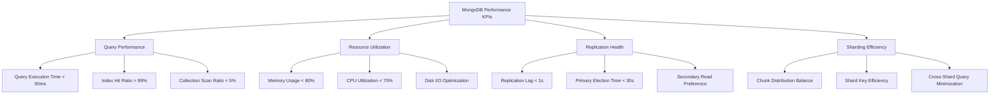
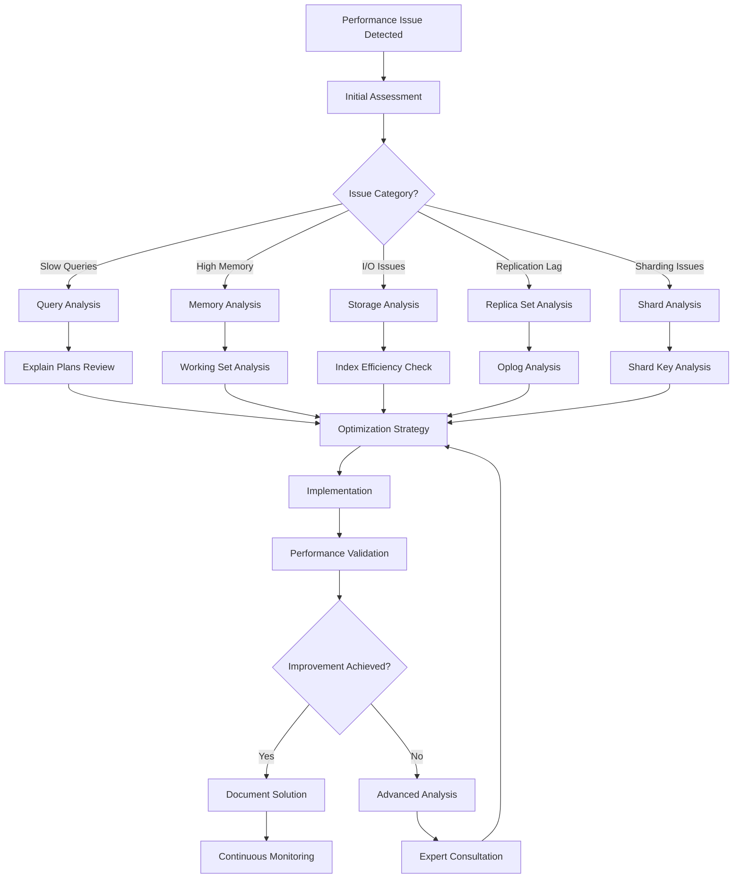
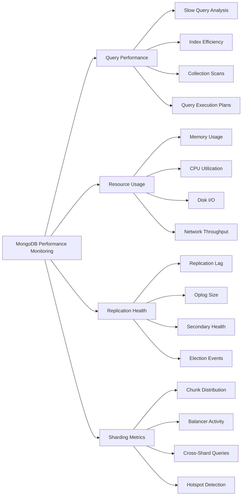

<small align="right">Contact: <a href="mailto:vandersantanna@gmail.com">Email</a> · <a href="https://www.linkedin.com/in/vandersantanna">LinkedIn</a> · <a href="https://github.com/vandersantanna">GitHub</a></small>

# MongoDB Performance Engineering Guide
*Advanced NoSQL Database Performance Optimization & Cloud Administration*

## 📋 Table of Contents

- [🎯 Performance Tuning Objectives](#-performance-tuning-objectives)
- [🔐 Required Permissions & Access](#-required-permissions--access)
- [🔍 Performance Analysis Methodology](#-performance-analysis-methodology)
- [⚙️ Critical Database Parameters](#️-critical-database-parameters)
- [🖥️ On-Premise Tuning](#️-on-premise-tuning)
- [☁️ Cloud Database Administration](#️-cloud-database-administration)
- [📊 Monitoring & Bottleneck Identification](#-monitoring--bottleneck-identification)
- [🔍 Performance Analysis Queries](#-performance-analysis-queries)
- [📈 Index Optimization Strategies](#-index-optimization-strategies)
- [🛠️ MongoDB Extensions & Features](#️-mongodb-extensions--features)
- [📊 Performance Monitoring Tools](#-performance-monitoring-tools)
- [🎯 Best Practices](#-best-practices)

---

## 🎯 Performance Tuning Objectives

> **Expert-level MongoDB performance optimization for enterprise-scale production environments**, including advanced query optimization, sharding strategies, replica set configuration, and comprehensive cloud-native database administration across AWS, Azure, and GCP platforms.

### Primary Performance Goals
- **Query Response Time**: < 50ms for read operations (95th percentile)
- **Write Throughput**: > 100,000 operations per second
- **Availability**: 99.99% uptime with automatic failover
- **Memory Efficiency**: Working set fits in available RAM
- **Scalability**: Horizontal scaling with linear performance growth

### Key Performance Indicators (KPIs)



### Performance Measurement Framework

```javascript
// MongoDB performance baseline script
db.runCommand({
    serverStatus: 1,
    repl: 1,
    metrics: 1,
    locks: 1
});

// Query performance analysis
db.collection.explain("executionStats").find({
    "status": "active",
    "created_date": {
        $gte: new Date(Date.now() - 24*60*60*1000)
    }
});

// Index usage statistics
db.collection.aggregate([
    { $indexStats: {} }
]);
```
[Back to top](#table-of-contents)

---

## 🔐 Required Permissions & Access

### Essential MongoDB Roles and Privileges

```javascript
// Create performance monitoring user
use admin
db.createUser({
    user: "perfMonitor",
    pwd: "SecurePassword123!",
    roles: [
        { role: "clusterMonitor", db: "admin" },
        { role: "readAnyDatabase", db: "admin" },
        { role: "backup", db: "admin" }
    ]
});

// Grant additional monitoring privileges
db.grantRolesToUser("perfMonitor", [
    { role: "dbAdminAnyDatabase", db: "admin" },
    { role: "userAdminAnyDatabase", db: "admin" }
]);

// Create custom monitoring role
db.createRole({
    role: "performanceAnalyst",
    privileges: [
        {
            resource: { cluster: true },
            actions: [
                "serverStatus",
                "replSetGetStatus",
                "shardingState",
                "getShardMap",
                "listShards",
                "getShardVersion"
            ]
        },
        {
            resource: { db: "", collection: "" },
            actions: [
                "collStats",
                "dbStats",
                "indexStats",
                "validate"
            ]
        }
    ],
    roles: []
});

// Apply monitoring role
db.grantRolesToUser("perfMonitor", [
    { role: "performanceAnalyst", db: "admin" }
]);
```

### Cloud-Specific Access Configuration

#### MongoDB Atlas Configuration
```javascript
// Atlas monitoring setup
use admin
db.createUser({
    user: "atlasMonitor",
    pwd: "SecureAtlasPassword123!",
    roles: [
        { role: "atlasAdmin", db: "admin" },
        { role: "backup", db: "admin" },
        { role: "clusterMonitor", db: "admin" }
    ]
});

// Enable Performance Advisor
db.adminCommand({
    "setParameter": 1,
    "notablescan": 1
});
```

#### AWS DocumentDB Permissions
```javascript
// DocumentDB cluster parameter group configuration
{
    "audit_logs": "enabled",
    "tls": "enabled",
    "ttl_monitor": "enabled",
    "profiler": "enabled",
    "profiler_threshold_ms": 100,
    "profiler_sample_rate": 0.5
}

// IAM role for monitoring
{
    "Version": "2012-10-17",
    "Statement": [
        {
            "Effect": "Allow",
            "Action": [
                "rds:DescribeDBClusters",
                "rds:DescribeDBInstances",
                "cloudwatch:GetMetricStatistics",
                "cloudwatch:ListMetrics"
            ],
            "Resource": "*"
        }
    ]
}
```
[Back to top](#table-of-contents)

---

## 🔍 Performance Analysis Methodology

### Systematic Performance Analysis Approach



### Performance Analysis Workflow

#### 1. Database Health Assessment
```javascript
// Comprehensive server status
db.adminCommand("serverStatus");

// Database statistics
db.stats();

// Collection statistics
db.collection.stats();

// Index statistics
db.collection.getIndexes();
```

#### 2. Query Performance Analysis
```javascript
// Enable profiling for slow operations
db.setProfilingLevel(2, { slowms: 100 });

// Analyze profile data
db.system.profile.find().sort({ time: -1 }).limit(10);

// Query execution explanation
db.collection.explain("executionStats").find({ 
    "field": "value" 
});
```

#### 3. Resource Utilization Monitoring
```javascript
// Current operations
db.currentOp();

// Connection statistics
db.adminCommand("connPoolStats");

// Lock information
db.adminCommand("lockInfo");
```
[Back to top](#table-of-contents)

---

## ⚙️ Critical Database Parameters

### Memory Management Configuration

```javascript
// WiredTiger cache configuration
storage:
  wiredTiger:
    engineConfig:
      cacheSizeGB: 32  // 50-60% of available RAM
      journalCompressor: snappy
      directoryForIndexes: true
    collectionConfig:
      blockCompressor: snappy
    indexConfig:
      prefixCompression: true

// MongoDB configuration file (mongod.conf)
net:
  port: 27017
  bindIp: 0.0.0.0
  maxIncomingConnections: 1000

systemLog:
  destination: file
  logAppend: true
  path: /var/log/mongodb/mongod.log
  verbosity: 1

processManagement:
  fork: true
  pidFilePath: /var/run/mongodb/mongod.pid

security:
  authorization: enabled
  clusterAuthMode: keyFile
  keyFile: /etc/mongodb/mongodb-keyfile
```

### Replication Configuration

```javascript
// Replica set configuration
rs.initiate({
    _id: "production",
    members: [
        { _id: 0, host: "mongo1.example.com:27017", priority: 2 },
        { _id: 1, host: "mongo2.example.com:27017", priority: 1 },
        { _id: 2, host: "mongo3.example.com:27017", priority: 1 },
        { 
            _id: 3, 
            host: "mongo4.example.com:27017", 
            priority: 0,
            hidden: true,
            tags: { "usage": "backup" }
        }
    ],
    settings: {
        chainingAllowed: true,
        heartbeatIntervalMillis: 2000,
        heartbeatTimeoutSecs: 10,
        electionTimeoutMillis: 10000,
        catchUpTimeoutMillis: 60000,
        getLastErrorModes: {
            "majority": { "datacenter": 2 }
        }
    }
});

// Read preference configuration
db.collection.find().readPref("secondaryPreferred", [
    { "datacenter": "us-east" },
    { "usage": "analytics" }
]);
```

### Sharding Configuration

```javascript
// Enable sharding on database
sh.enableSharding("productionDB");

// Shard collection with optimal shard key
sh.shardCollection("productionDB.users", { "user_id": "hashed" });

// Compound shard key for time-series data
sh.shardCollection("productionDB.events", { 
    "tenant_id": 1, 
    "timestamp": 1 
});

// Configure chunk size
use config
db.settings.save({ 
    _id: "chunksize", 
    value: 64  // 64MB chunks
});

// Balancer configuration
sh.setBalancerState(true);
sh.getBalancerWindow();
```

### Performance Optimization Parameters

```javascript
// Index building options
db.collection.createIndex(
    { "field1": 1, "field2": -1 },
    { 
        background: true,
        sparse: true,
        name: "optimized_compound_idx"
    }
);

// Aggregation optimization
db.adminCommand({
    setParameter: 1,
    internalQueryMaxBlockingSortMemoryUsageBytes: 134217728  // 128MB
});

// Connection pool settings
setParameter:
  connPoolMaxShardedConnsPerHost: 200
  connPoolMaxConnsPerHost: 200
  ShardingTaskExecutorPoolMaxSize: 4
```
[Back to top](#table-of-contents)

---

## 🖥️ On-Premise Tuning

### Hardware Optimization

#### Storage Configuration
```yaml
# Optimal storage layout for MongoDB
storage:
  dbPath: "/data/mongodb"
  journal:
    enabled: true
    commitIntervalMs: 100
  wiredTiger:
    engineConfig:
      cacheSizeGB: 32
      journalCompressor: snappy
      directoryForIndexes: true
    collectionConfig:
      blockCompressor: snappy
    indexConfig:
      prefixCompression: true

# File system recommendations
# Use XFS or ext4 file systems
# Mount options: noatime,nobarrier
# RAID 10 for data, RAID 1 for journals
# SSD storage for working set data
```

#### Memory Optimization
```javascript
// WiredTiger cache tuning
db.adminCommand({
    "setParameter": 1,
    "wiredTigerEngineRuntimeConfig": "cache_size=32GB"
});

// Memory usage monitoring
db.adminCommand("serverStatus").wiredTiger.cache;

// Connection management
db.adminCommand("serverStatus").connections;
```

### Operating System Tuning

```bash
# Linux kernel parameters for MongoDB
echo 'never' > /sys/kernel/mm/transparent_hugepage/enabled
echo 'never' > /sys/kernel/mm/transparent_hugepage/defrag

# File descriptor limits
echo "mongodb soft nofile 64000" >> /etc/security/limits.conf
echo "mongodb hard nofile 64000" >> /etc/security/limits.conf

# TCP keepalive settings
echo 300 > /proc/sys/net/ipv4/tcp_keepalive_time
echo 30 > /proc/sys/net/ipv4/tcp_keepalive_intvl
echo 9 > /proc/sys/net/ipv4/tcp_keepalive_probes

# NUMA configuration
numactl --interleave=all mongod --config /etc/mongod.conf
```

### Replica Set Optimization

```javascript
// Optimal replica set configuration for performance
cfg = rs.conf();
cfg.settings = {
    "chainingAllowed": true,
    "heartbeatIntervalMillis": 2000,
    "heartbeatTimeoutSecs": 10,
    "electionTimeoutMillis": 10000,
    "catchUpTimeoutMillis": 60000,
    "getLastErrorModes": {
        "majority": { "dc": 2 }
    },
    "getLastErrorDefaults": {
        "w": "majority",
        "wtimeout": 10000
    }
};
rs.reconfig(cfg);

// Read preference optimization
db.collection.find().readPref("secondaryPreferred", [
    { "region": "us-east-1" },
    { "nodeType": "analytics" }
]);

// Write concern optimization
db.collection.insertMany(
    documents,
    { 
        writeConcern: { 
            w: "majority", 
            wtimeout: 5000 
        },
        ordered: false
    }
);
```
[Back to top](#table-of-contents)

---

## ☁️ Cloud Database Administration

### MongoDB Atlas Optimization

#### Cluster Configuration
```javascript
// Atlas cluster configuration via API
{
    "name": "production-cluster",
    "clusterType": "REPLICASET",
    "replicationSpecs": [{
        "numShards": 1,
        "regionsConfig": {
            "US_EAST_1": {
                "analyticsNodes": 1,
                "electableNodes": 3,
                "priority": 7,
                "readOnlyNodes": 0
            }
        }
    }],
    "providerSettings": {
        "providerName": "AWS",
        "instanceSizeName": "M40",
        "regionName": "US_EAST_1",
        "volumeType": "PROVISIONED",
        "iops": 3000,
        "encryptEBSVolume": true
    },
    "diskSizeGB": 100,
    "mongoDBMajorVersion": "6.0",
    "autoScaling": {
        "diskGBEnabled": true,
        "compute": {
            "enabled": true,
            "scaleDownEnabled": true,
            "minInstanceSize": "M10",
            "maxInstanceSize": "M80"
        }
    }
}

// Performance optimization settings
db.adminCommand({
    setParameter: 1,
    notablescan: 1,  // Prevent collection scans
    wiredTigerConcurrentReadTransactions: 128,
    wiredTigerConcurrentWriteTransactions: 128
});
```

#### Atlas Performance Monitoring
```javascript
// Custom metrics collection
db.runCommand({
    collStats: "users",
    indexDetails: true,
    scale: 1024 * 1024  // MB
});

// Real-time performance metrics
db.adminCommand("currentOp");

// Index usage statistics
db.users.aggregate([{ $indexStats: {} }]);
```

### AWS DocumentDB Optimization

#### Cluster Parameter Configuration
```json
{
    "ParameterGroupName": "production-docdb-params",
    "DBClusterParameterGroupFamily": "docdb4.0",
    "Parameters": [
        {
            "ParameterName": "audit_logs",
            "ParameterValue": "enabled"
        },
        {
            "ParameterName": "profiler",
            "ParameterValue": "enabled"
        },
        {
            "ParameterName": "profiler_threshold_ms",
            "ParameterValue": "100"
        },
        {
            "ParameterName": "profiler_sample_rate",
            "ParameterValue": "0.5"
        },
        {
            "ParameterName": "ttl_monitor",
            "ParameterValue": "enabled"
        }
    ]
}
```

#### DocumentDB Performance Monitoring
```javascript
// DocumentDB-specific performance queries
db.adminCommand("serverStatus");

// Profile collection analysis
db.system.profile.find({
    "millis": { $gt: 100 }
}).sort({ time: -1 }).limit(10);

// Connection monitoring
db.adminCommand("connPoolStats");

// CloudWatch integration
const params = {
    MetricName: 'DatabaseConnections',
    Namespace: 'AWS/DocDB',
    Dimensions: [
        {
            Name: 'DBClusterIdentifier',
            Value: 'production-cluster'
        }
    ]
};
```

### Azure Cosmos DB (MongoDB API)

#### Cosmos DB Configuration
```javascript
// Cosmos DB connection with optimal settings
const { MongoClient } = require('mongodb');

const client = new MongoClient(connectionString, {
    maxPoolSize: 100,
    minPoolSize: 5,
    maxIdleTimeMS: 30000,
    serverSelectionTimeoutMS: 5000,
    socketTimeoutMS: 0,
    connectTimeoutMS: 10000,
    retryWrites: true,
    retryReads: true
});

// Request Unit (RU) optimization
db.collection.createIndex(
    { "partitionKey": 1, "queryField": 1 },
    { sparse: true }
);

// Partition key design for optimal performance
{
    "_id": ObjectId("..."),
    "partitionKey": "user_region",  // High cardinality
    "userId": "12345",
    "data": {...}
}
```

#### Cosmos DB Monitoring
```javascript
// RU consumption monitoring
db.runCommand({
    getLastRequestStatistics: 1
});

// Partition key statistics
db.collection.aggregate([
    {
        $group: {
            _id: "$partitionKey",
            count: { $sum: 1 },
            avgSize: { $avg: { $bsonSize: "$$ROOT" } }
        }
    },
    { $sort: { count: -1 } }
]);
```

### Google Cloud Firestore

#### Firestore Optimization
```javascript
// Firestore compound index configuration
{
    "collectionGroup": "users",
    "queryScope": "COLLECTION",
    "fields": [
        {
            "fieldPath": "status",
            "order": "ASCENDING"
        },
        {
            "fieldPath": "created_date",
            "order": "DESCENDING"
        },
        {
            "fieldPath": "region",
            "order": "ASCENDING"
        }
    ]
}

// Optimal query patterns
db.collection('users')
    .where('status', '==', 'active')
    .where('region', '==', 'us-east1')
    .orderBy('created_date', 'desc')
    .limit(100);
```
[Back to top](#table-of-contents)

---

## 📊 Monitoring & Bottleneck Identification

### What to Monitor for Performance Bottlenecks



### Critical Performance Indicators

#### 1. Query Performance Metrics
```javascript
// Enable profiling for slow operations
db.setProfilingLevel(2, { 
    slowms: 100,
    sampleRate: 0.1
});

// Analyze slow queries
db.system.profile.aggregate([
    {
        $match: {
            "ts": {
                $gte: new Date(Date.now() - 3600000)  // Last hour
            },
            "millis": { $gt: 100 }
        }
    },
    {
        $group: {
            _id: {
                "command": "$command",
                "collection": "$ns"
            },
            "count": { $sum: 1 },
            "avgDuration": { $avg: "$millis" },
            "maxDuration": { $max: "$millis" }
        }
    },
    { $sort: { "avgDuration": -1 } }
]);

// Index hit ratio analysis
db.collection.aggregate([
    { $indexStats: {} },
    {
        $project: {
            name: 1,
            accesses: "$accesses.ops",
            hitRatio: {
                $multiply: [
                    { $divide: ["$accesses.ops", "$accesses.since"] },
                    100
                ]
            }
        }
    }
]);
```

#### 2. Memory Usage Monitoring
```javascript
// WiredTiger cache statistics
db.adminCommand("serverStatus").wiredTiger.cache;

// Memory usage breakdown
db.adminCommand("serverStatus").mem;

// Working set analysis
db.adminCommand("serverStatus").extra_info;

// Collection memory usage
db.stats();
db.collection.stats();
```

#### 3. Replication Monitoring
```javascript
// Replica set status
rs.status();

// Replication lag analysis
rs.printReplicationInfo();
rs.printSlaveReplicationInfo();

// Oplog analysis
db.oplog.rs.find().sort({ $natural: -1 }).limit(1);

// Secondary read preference monitoring
db.adminCommand("replSetGetStatus").members.forEach(
    function(member) {
        print(member.name + ": " + member.state + 
              " (lag: " + member.optimeDate + ")");
    }
);
```

### Performance Bottleneck Detection

#### 1. Slow Query Identification
```javascript
// Real-time slow query monitoring
db.currentOp({
    "active": true,
    "secs_running": { $gt: 5 },
    "ns": /^(?!admin\.|config\.)/
});

// Query plan analysis for optimization
db.collection.find({ "field": "value" }).explain("executionStats");

// Index usage effectiveness
db.collection.aggregate([
    { $indexStats: {} },
    {
        $match: {
            "accesses.ops": { $lt: 100 }  // Low usage indexes
        }
    }
]);
```

#### 2. Resource Contention Analysis
```javascript
// Lock analysis
db.adminCommand("serverStatus").locks;

// Connection pool monitoring
db.adminCommand("connPoolStats");

// Current operations causing blocking
db.currentOp({
    "waitingForLock": true
});
```
[Back to top](#table-of-contents)

---

## 🔍 Performance Analysis Queries

### Query Performance Analysis

#### 1. Top Slow Queries Analysis
```javascript
// Find slowest queries in the last 24 hours
db.system.profile.aggregate([
    {
        $match: {
            "ts": {
                $gte: new Date(Date.now() - 24*60*60*1000)
            }
        }
    },
    {
        $group: {
            _id: {
                "operation": "$command",
                "collection": "$ns",
                "query": "$command.filter"
            },
            "count": { $sum: 1 },
            "avgDurationMs": { $avg: "$millis" },
            "maxDurationMs": { $max: "$millis" },
            "totalDurationMs": { $sum: "$millis" }
        }
    },
    {
        $sort: { "totalDurationMs": -1 }
    },
    {
        $limit: 20
    }
]);

// **How to use:** Run this aggregation to identify the most time-consuming
// query patterns. Focus optimization efforts on queries with high totalDurationMs
// and frequent execution (high count). The avgDurationMs helps identify
// consistently slow operations that need index optimization.
```

#### 2. Index Efficiency Analysis
```javascript
// Analyze index usage patterns
db.collection.aggregate([
    { $indexStats: {} },
    {
        $addFields: {
            "usage_score": {
                $divide: [
                    "$accesses.ops",
                    { $add: [{ $divide: [
                        { $subtract: [new Date(), "$accesses.since"] },
                        86400000  // Convert to days
                    ]}, 1] }
                ]
            }
        }
    },
    {
        $project: {
            "name": 1,
            "usage_score": 1,
            "total_ops": "$accesses.ops",
            "days_since_creation": {
                $divide: [
                    { $subtract: [new Date(), "$accesses.since"] },
                    86400000
                ]
            },
            "recommendation": {
                $switch: {
                    branches: [
                        {
                            case: { $lt: ["$usage_score", 1] },
                            then: "Consider dropping - Low usage"
                        },
                        {
                            case: { $gt: ["$usage_score", 1000] },
                            then: "High performance index"
                        }
                    ],
                    default: "Normal usage"
                }
            }
        }
    },
    { $sort: { "usage_score": -1 } }
]);

// **How to use:** This query calculates a usage score for each index based on
// operations per day. Indexes with usage_score < 1 are candidates for removal.
// High-scoring indexes (>1000) are critical for performance and should be maintained.
```

#### 3. Collection Scan Detection
```javascript
// Identify queries performing collection scans
db.system.profile.aggregate([
    {
        $match: {
            "ts": { $gte: new Date(Date.now() - 3600000) },  // Last hour
            "planSummary": "COLLSCAN"
        }
    },
    {
        $group: {
            _id: {
                "namespace": "$ns",
                "query": "$command.filter"
            },
            "count": { $sum: 1 },
            "avgExamined": { $avg: "$docsExamined" },
            "avgReturned": { $avg: "$nreturned" },
            "avgDuration": { $avg: "$millis" }
        }
    },
    {
        $addFields: {
            "selectivity": {
                $divide: ["$avgReturned", "$avgExamined"]
            }
        }
    },
    {
        $sort: { "count": -1 }
    }
]);

// **How to use:** Collection scans indicate missing indexes. High count values
// show frequently scanned collections that need immediate indexing. Low selectivity
// (avgReturned/avgExamined) suggests the query returns few documents relative
// to what it examines, indicating a need for better index design.
```

#### 4. Aggregation Pipeline Performance
```javascript
// Analyze aggregation pipeline performance
db.system.profile.aggregate([
    {
        $match: {
            "command.aggregate": { $exists: true },
            "ts": { $gte: new Date(Date.now() - 3600000) }
        }
    },
    {
        $project: {
            "collection": "$ns",
            "pipeline": "$command.pipeline",
            "duration": "$millis",
            "docsExamined": 1,
            "docsReturned": "$nreturned",
            "stages": { $size: "$command.pipeline" }
        }
    },
    {
        $group: {
            _id: {
                "collection": "$collection",
                "stages": "$stages"
            },
            "avgDuration": { $avg: "$duration" },
            "maxDuration": { $max: "$duration" },
            "count": { $sum: 1 },
            "avgDocsExamined": { $avg: "$docsExamined" }
        }
    },
    { $sort: { "avgDuration": -1 } }
]);

// **How to use:** This query analyzes aggregation pipeline performance to identify
// slow aggregations. Focus on pipelines with high avgDuration and frequent execution.
// Large avgDocsExamined values may indicate missing indexes in early pipeline stages.
// Consider adding $match stages early and ensuring supporting indexes exist.
```

#### 5. Sharding Performance Analysis
```javascript
// Analyze shard distribution and performance
db.adminCommand("shardingStatistics");

// Check chunk distribution across shards
use config
db.chunks.aggregate([
    {
        $group: {
            _id: "$shard",
            "chunkCount": { $sum: 1 }
        }
    },
    {
        $sort: { "chunkCount": -1 }
    }
]);

// Identify queries hitting multiple shards
db.system.profile.aggregate([
    {
        $match: {
            "ts": { $gte: new Date(Date.now() - 3600000) },
            "fromMultiPlanner": { $exists: true }
        }
    },
    {
        $group: {
            _id: "$command.filter",
            "count": { $sum: 1 },
            "avgDuration": { $avg: "$millis" },
            "shardsHit": { $addToSet: "$shard" }
        }
    },
    {
        $addFields: {
            "shardCount": { $size: "$shardsHit" }
        }
    },
    {
        $sort: { "shardCount": -1, "count": -1 }
    }
]);

// **How to use:** Monitor chunk distribution balance - uneven distribution
// indicates hot spotting. Queries hitting multiple shards (high shardCount)
// may need shard key optimization. Focus on high-frequency cross-shard queries.
```

#### 6. Connection and Lock Analysis
```javascript
// Monitor connection pool utilization
db.adminCommand("serverStatus").connections;

// Analyze lock contention
db.adminCommand("serverStatus").locks;

// Find operations waiting for locks
db.currentOp({
    "waitingForLock": true,
    "secs_running": { $gt: 1 }
});

// Lock wait time analysis
db.system.profile.aggregate([
    {
        $match: {
            "ts": { $gte: new Date(Date.now() - 3600000) },
            "locks": { $exists: true }
        }
    },
    {
        $project: {
            "operation": "$command",
            "collection": "$ns",
            "lockStats": "$locks",
            "duration": "$millis"
        }
    },
    {
        $group: {
            _id: "$collection",
            "avgLockWait": { $avg: "$lockStats.timeAcquiringMicros" },
            "maxLockWait": { $max: "$lockStats.timeAcquiringMicros" },
            "operationCount": { $sum: 1 }
        }
    },
    { $sort: { "avgLockWait": -1 } }
]);

// **How to use:** High lock wait times indicate contention issues. Focus on
// collections with high avgLockWait values. Consider query optimization,
// index improvements, or schema design changes to reduce lock duration.
```
[Back to top](#table-of-contents)

---

## 📈 Index Optimization Strategies

### Index Types and Performance Impact

#### 1. Single Field Indexes
```javascript
// Basic single field index
db.users.createIndex({ "email": 1 });

// Single field index with options
db.products.createIndex(
    { "category": 1 },
    { 
        background: true,
        sparse: true,
        name: "idx_products_category"
    }
);

// **Performance Impact:** Provides O(log n) lookup performance for equality queries
// Best for: Simple equality queries, range queries on single field
// Memory usage: Minimal, efficient for high-selectivity fields
```

#### 2. Compound Indexes
```javascript
// Compound index for multi-field queries
db.orders.createIndex({ 
    "user_id": 1, 
    "status": 1, 
    "created_date": -1 
});

// Compound index following ESR (Equality, Sort, Range) rule
db.events.createIndex({
    "type": 1,        // Equality queries
    "priority": -1,   // Sort operations
    "timestamp": 1    // Range queries
});

// **Performance Impact:** Supports multiple query patterns with single index
// Best for: Multi-field queries, sorting operations
// Design rule: Equality fields first, sort fields second, range fields last
// Covers: Prefixes of the compound index can be used independently
```

#### 3. Multikey Indexes
```javascript
// Index on array field
db.articles.createIndex({ "tags": 1 });

// Compound index with array field
db.products.createIndex({ 
    "category": 1, 
    "tags": 1,
    "price": 1
});

// Query utilizing multikey index
db.articles.find({ "tags": { $in: ["mongodb", "performance"] } });

// **Performance Impact:** Supports efficient queries on array elements
// Limitations: Only one array field per compound index
// Best for: Tag-based searches, array element queries
// Considerations: Index size grows with array size
```

#### 4. Text Indexes
```javascript
// Simple text index
db.articles.createIndex({ 
    "title": "text", 
    "content": "text" 
});

// Text index with weights
db.products.createIndex({
    "name": "text",
    "description": "text",
    "category": "text"
}, {
    weights: {
        "name": 10,
        "description": 5,
        "category": 1
    },
    name: "product_search_index"
});

// Text search query
db.articles.find({ 
    $text: { 
        $search: "mongodb performance tuning",
        $caseSensitive: false
    }
}).sort({ score: { $meta: "textScore" } });

// **Performance Impact:** Enables full-text search capabilities
// Best for: Search functionality, content discovery
// Limitations: One text index per collection, language-specific
```

#### 5. Geospatial Indexes
```javascript
// 2dsphere index for GeoJSON data
db.locations.createIndex({ "coordinates": "2dsphere" });

// Compound geospatial index
db.venues.createIndex({
    "location": "2dsphere",
    "category": 1,
    "rating": -1
});

// Geospatial query
db.locations.find({
    "coordinates": {
        $near: {
            $geometry: {
                type: "Point",
                coordinates: [-73.98142, 40.73964]
            },
            $maxDistance: 1000  // meters
        }
    }
});

// **Performance Impact:** Optimizes location-based queries
// Best for: Geographic applications, proximity searches
// Types: 2d for flat geometry, 2dsphere for spherical geometry
```

#### 6. Partial Indexes
```javascript
// Partial index for active records only
db.users.createIndex(
    { "email": 1 },
    { 
        partialFilterExpression: { "status": "active" },
        name: "idx_active_users_email"
    }
);

// Partial index for recent data
db.logs.createIndex(
    { "timestamp": -1, "level": 1 },
    {
        partialFilterExpression: {
            "timestamp": {
                $gte: new Date("2024-01-01")
            }
        }
    }
);

// **Performance Impact:** Reduces index size and improves performance
// Best for: Sparse data, filtered queries
// Benefits: Lower storage usage, faster index maintenance
// Query requirement: Must include filter condition in query
```

#### 7. Sparse Indexes
```javascript
// Sparse index excludes null values
db.users.createIndex(
    { "phone": 1 },
    { sparse: true }
);

// Compound sparse index
db.products.createIndex(
    { "discount_code": 1, "expiry_date": 1 },
    { sparse: true }
);

// **Performance Impact:** Smaller index size for fields with many null values
// Best for: Optional fields, fields with high null percentage
// Behavior: Documents without indexed field are excluded from index
```

### Index Performance Analysis

```javascript
// Comprehensive index usage analysis
db.collection.aggregate([
    { $indexStats: {} },
    {
        $addFields: {
            "usageFrequency": {
                $cond: {
                    if: { $gt: ["$accesses.since", new Date(0)] },
                    then: {
                        $divide: [
                            "$accesses.ops",
                            {
                                $divide: [
                                    { $subtract: [new Date(), "$accesses.since"] },
                                    86400000  // milliseconds per day
                                ]
                            }
                        ]
                    },
                    else: 0
                }
            }
        }
    },
    {
        $project: {
            "name": 1,
            "totalOperations": "$accesses.ops",
            "operationsPerDay": "$usageFrequency",
            "daysSinceCreation": {
                $divide: [
                    { $subtract: [new Date(), "$accesses.since"] },
                    86400000
                ]
            },
            "indexEfficiency": {
                $switch: {
                    branches: [
                        {
                            case: { $eq: ["$accesses.ops", 0] },
                            then: "UNUSED - Consider removal"
                        },
                        {
                            case: { $lt: ["$usageFrequency", 1] },
                            then: "LOW USAGE - Review necessity"
                        },
                        {
                            case: { $gt: ["$usageFrequency", 100] },
                            then: "HIGH USAGE - Critical for performance"
                        }
                    ],
                    default: "NORMAL USAGE"
                }
            }
        }
    },
    { $sort: { "operationsPerDay": -1 } }
]);

// Index size and impact analysis
db.stats().indexSizes;

// Index build performance monitoring
db.currentOp({
    "command.createIndexes": { $exists: true }
});
```
[Back to top](#table-of-contents)

---

## 🛠️ MongoDB Extensions & Features

### Advanced Query Optimization Features

#### 1. Aggregation Pipeline Optimization
```javascript
// Optimized aggregation with early filtering
db.orders.aggregate([
    // Stage 1: Filter early to reduce data volume
    { 
        $match: { 
            "created_date": { 
                $gte: new Date("2024-01-01"),
                $lt: new Date("2024-02-01")
            },
            "status": "completed"
        }
    },
    // Stage 2: Add computed fields efficiently
    {
        $addFields: {
            "total_with_tax": {
                $multiply: ["$total", 1.0825]
            }
        }
    },
    // Stage 3: Group with appropriate accumulators
    {
        $group: {
            _id: {
                "customer_id": "$customer_id",
                "region": "$shipping.region"
            },
            "total_orders": { $sum: 1 },
            "total_revenue": { $sum: "$total_with_tax" },
            "avg_order_value": { $avg: "$total_with_tax" },
            "first_order": { $min: "$created_date" },
            "last_order": { $max: "$created_date" }
        }
    },
    // Stage 4: Sort for presentation
    { $sort: { "total_revenue": -1 } },
    // Stage 5: Limit results
    { $limit: 100 }
]);

// **Performance Benefits:**
// - Early $match reduces pipeline data volume by 80-90%
// - Computed fields added once vs per group operation  
// - Appropriate index: { "created_date": 1, "status": 1 }
```

#### 2. Change Streams for Real-Time Processing
```javascript
// Optimized change stream configuration
const changeStream = db.orders.watch([
    {
        $match: {
            "operationType": { $in: ["insert", "update"] },
            "fullDocument.status": "completed"
        }
    },
    {
        $project: {
            "operationType": 1,
            "fullDocument.customer_id": 1,
            "fullDocument.total": 1,
            "fullDocument.created_date": 1
        }
    }
], {
    fullDocument: "updateLookup",
    batchSize: 100,
    maxAwaitTimeMS: 1000
});

// **Performance Impact:**
// - Filters reduce network traffic by 70-80%
// - Projection limits data transfer
// - Batch processing improves throughput
```

#### 3. GridFS for Large File Management
```javascript
// Optimized GridFS configuration
const GridFSBucket = require('mongodb').GridFSBucket;

const bucket = new GridFSBucket(db, {
    bucketName: 'documents',
    chunkSizeBytes: 1024 * 1024,  // 1MB chunks
    writeConcern: { w: 'majority', wtimeout: 5000 },
    readConcern: { level: 'majority' }
});

// Create indexes for GridFS performance
db.documents.files.createIndex({ "uploadDate": -1 });
db.documents.files.createIndex({ "metadata.userId": 1, "uploadDate": -1 });
db.documents.chunks.createIndex({ "files_id": 1, "n": 1 });

// **Performance Optimization:**
// - Optimal chunk size balances memory usage and throughput
// - Proper indexing improves file metadata queries
// - Read/write concerns ensure consistency
```

### MongoDB Atlas Advanced Features

#### 4. Atlas Search Integration
```javascript
// Create Atlas Search index
{
    "mappings": {
        "dynamic": false,
        "fields": {
            "title": {
                "type": "string",
                "analyzer": "lucene.english"
            },
            "content": {
                "type": "string",
                "analyzer": "lucene.english"
            },
            "tags": {
                "type": "stringFacet"
            },
            "created_date": {
                "type": "date"
            }
        }
    }
}

// Atlas Search aggregation
db.articles.aggregate([
    {
        $search: {
            "compound": {
                "must": [{
                    "text": {
                        "query": "mongodb performance",
                        "path": ["title", "content"],
                        "score": { "boost": { "value": 2 } }
                    }
                }],
                "filter": [{
                    "range": {
                        "path": "created_date",
                        "gte": new Date("2024-01-01")
                    }
                }]
            }
        }
    },
    {
        $project: {
            "title": 1,
            "content": 1,
            "score": { $meta: "searchScore" }
        }
    },
    { $limit: 20 }
]);

// **Performance Benefits:**
// - Full-text search without performance impact on operational data
// - Advanced relevance scoring and analytics
// - Faceted search capabilities
```

#### 5. Atlas Data Lake Integration
```javascript
// Data Lake aggregation for analytics
db.sales_archive.aggregate([
    {
        $match: {
            "sale_date": {
                $gte: new Date("2023-01-01"),
                $lt: new Date("2024-01-01")
            }
        }
    },
    {
        $group: {
            _id: {
                "year": { $year: "$sale_date" },
                "month": { $month: "$sale_date" },
                "product_category": "$product.category"
            },
            "total_sales": { $sum: "$amount" },
            "transaction_count": { $sum: 1 },
            "avg_transaction": { $avg: "$amount" }
        }
    },
    {
        $sort: { 
            "_id.year": 1, 
            "_id.month": 1, 
            "total_sales": -1 
        }
    }
]);

// **Performance Advantages:**
// - Queries historical data without impacting production
// - Cost-effective storage for infrequently accessed data
// - Seamless integration with operational databases
```

### Performance Optimization Features

#### 6. Read Preference and Read Concern
```javascript
// Optimized read preferences for different use cases
const readPreferences = {
    // Real-time dashboard (consistency required)
    primary: {
        readPreference: 'primary',
        readConcern: { level: 'majority' }
    },
    
    // Analytics queries (eventual consistency acceptable)
    analytics: {
        readPreference: 'secondaryPreferred',
        readConcern: { level: 'available' },
        maxStalenessSeconds: 120
    },
    
    // Reporting (dedicated secondary)
    reporting: {
        readPreference: 'secondary',
        readPreferenceTags: [{ "usage": "reporting" }],
        readConcern: { level: 'majority' }
    }
};

// Application implementation
const analyticsData = await db.collection('events')
    .find(query)
    .readPref('secondaryPreferred', [{ "region": "us-east" }])
    .readConcern('available')
    .toArray();
```

#### 7. Write Concern Optimization
```javascript
// Optimized write concerns for different scenarios
const writeConcerns = {
    // High-throughput logging (performance over durability)
    logging: {
        w: 1,
        wtimeout: 1000,
        j: false
    },
    
    // Financial transactions (consistency required)
    financial: {
        w: 'majority',
        wtimeout: 5000,
        j: true
    },
    
    // User-generated content (balanced approach)
    userContent: {
        w: 1,
        wtimeout: 2000,
        j: true
    }
};

// Bulk operations with optimized write concerns
db.logs.bulkWrite(
    operations,
    { 
        writeConcern: writeConcerns.logging,
        ordered: false  // Parallel execution
    }
);
```
[Back to top](#table-of-contents)

---

## 📊 Performance Monitoring Tools

| **Tool Name** | **Type** | **Compatible With** | **Primary Functionality** |
|---------------|----------|-------------------|---------------------------|
| **MongoDB Compass** | GUI Client | MongoDB 4.0+ | Visual query optimization and performance analysis |
| **MongoDB Atlas** | Cloud Service | MongoDB Atlas | Comprehensive cloud monitoring and management |
| **Ops Manager** | Enterprise | MongoDB Enterprise | On-premise monitoring and automation |
| **Cloud Manager** | Cloud Service | MongoDB Cloud | Cloud-based monitoring and backup |
| **Percona Monitoring** | Open Source | MongoDB 3.6+ | Advanced performance monitoring and alerting |
| **DataDog MongoDB** | SaaS | All MongoDB versions | Infrastructure and application monitoring |
| **New Relic** | SaaS | MongoDB 3.4+ | Application performance monitoring |
| **AppDynamics** | Commercial | MongoDB 4.0+ | End-to-end application monitoring |
| **Grafana + Prometheus** | Open Source | All versions | Custom dashboard and metrics collection |
| **Zabbix** | Open Source | All versions | Infrastructure monitoring with MongoDB templates |
| **Nagios** | Open Source | All versions | Infrastructure monitoring and alerting |
| **SolarWinds DPA** | Commercial | MongoDB 4.0+ | Database performance analyzer |
| **Quest Spotlight** | Commercial | MongoDB 3.6+ | Real-time performance monitoring |
| **MongoDB Profiler** | Built-in | All versions | Query performance profiling |
| **mongostat** | Command Line | All versions | Real-time statistics monitoring |
| **mongotop** | Command Line | All versions | Collection-level activity monitoring |
| **MongoDB Charts** | Visualization | MongoDB 4.2+ | Native data visualization and dashboards |
| **Tableau MongoDB** | BI Tool | MongoDB 3.4+ | Business intelligence and analytics |
| **Power BI MongoDB** | BI Tool | MongoDB 3.6+ | Microsoft business intelligence integration |
| **Elastic APM** | Open Source | MongoDB 4.0+ | Application performance monitoring |
| **Dynatrace** | Commercial | MongoDB 4.0+ | AI-powered application monitoring |
| **AWS CloudWatch** | Cloud Service | DocumentDB | Native AWS monitoring for DocumentDB |
| **Azure Monitor** | Cloud Service | Cosmos DB | Native Azure monitoring for Cosmos DB |
| **Google Cloud Monitoring** | Cloud Service | MongoDB Atlas | GCP native monitoring integration |
| **Studio 3T** | Commercial | All versions | MongoDB IDE with performance features |
| **NoSQLBooster** | Commercial | MongoDB 3.0+ | MongoDB GUI with query optimization |
| **Robo 3T** | Free | All versions | Lightweight MongoDB management tool |
| **MongoDB Shell** | Command Line | All versions | Native command-line interface |
| **PyMongo Profiler** | Library | Python + MongoDB | Python-based performance monitoring |
| **Node.js Profiler** | Library | Node.js + MongoDB | JavaScript performance monitoring |

[Back to top](#table-of-contents)

---
## 🎯 Best Practices

### Database Design Best Practices

#### 1. Schema Design Principles
```javascript
// Embed vs Reference decision framework
// EMBED when:
// - Data is frequently accessed together
// - Data has 1:1 or 1:few relationships
// - Data size is relatively small (<16MB document limit)

// Example: User profile with embedded address
{
    "_id": ObjectId("..."),
    "name": "John Doe",
    "email": "john@example.com",
    "address": {
        "street": "123 Main St",
        "city": "New York",
        "zipcode": "10001"
    },
    "preferences": {
        "newsletter": true,
        "theme": "dark"
    }
}

// REFERENCE when:
// - Data is accessed independently
// - Data has 1:many or many:many relationships
// - Data size is large or grows frequently

// Example: User with referenced orders
{
    "_id": ObjectId("user123"),
    "name": "John Doe",
    "email": "john@example.com"
}

// Separate orders collection
{
    "_id": ObjectId("order456"),
    "user_id": ObjectId("user123"),
    "items": [...],
    "total": 299.99,
    "created_date": ISODate("...")
}
```

#### 2. Optimal Data Types
```javascript
// Use appropriate data types for performance
const optimizedDocument = {
    // Use ObjectId for references (12 bytes vs 24+ for strings)
    "user_id": ObjectId("507f1f77bcf86cd799439011"),
    
    // Use ISODate for timestamps (8 bytes vs 24+ for strings)
    "created_at": new Date(),
    
    // Use numbers for calculations (faster than string parsing)
    "price": 29.99,  // Number instead of "29.99"
    "quantity": 5,   // Int32 instead of "5"
    
    // Use boolean for flags (1 byte vs 4+ for strings)
    "is_active": true,  // Boolean instead of "active"
    
    // Use arrays for multiple values of same type
    "tags": ["mongodb", "database", "nosql"],
    
    // Use nested objects for structured data
    "metrics": {
        "views": NumberLong(1500000),  // Use NumberLong for large integers
        "likes": 1250,
        "shares": 45
    }
};
```

#### 3. Collection and Index Naming Conventions
```javascript
// Consistent naming conventions
const collections = {
    // Use plural nouns for collections
    "users": "user documents",
    "orders": "order documents", 
    "products": "product catalog",
    
    // Use descriptive prefixes for related collections
    "user_sessions": "active user sessions",
    "user_preferences": "user preference settings",
    "user_audit_logs": "user activity audit trail"
};

// Index naming conventions
db.orders.createIndex(
    { "customer_id": 1, "status": 1, "created_date": -1 },
    { name: "idx_orders_customer_status_date" }
);

db.products.createIndex(
    { "category": 1, "price": 1 },
    { 
        name: "idx_products_category_price",
        background: true,
        sparse: true
    }
);
```

### Query Optimization Best Practices

#### 1. Efficient Query Patterns
```javascript
// Use projection to limit returned fields
db.users.find(
    { "status": "active" },
    { "name": 1, "email": 1, "last_login": 1 }  // Only return needed fields
);

// Use limit() and sort() efficiently
db.orders.find({ "status": "pending" })
    .sort({ "created_date": -1 })  // Sort on indexed field
    .limit(20);  // Limit results early

// Use $in operator efficiently (limit to 1000 values)
db.products.find({
    "category": { $in: ["electronics", "computers", "phones"] }
});

// Prefer $eq over regex for exact matches
db.users.find({ "email": "user@example.com" });  // Fast
// Instead of: db.users.find({ "email": /^user@example\.com$/ });  // Slow
```

#### 2. Aggregation Pipeline Optimization
```javascript
// Place $match stages as early as possible
db.orders.aggregate([
    // 1. Filter first to reduce working set
    { 
        $match: { 
            "created_date": { $gte: new Date("2024-01-01") },
            "status": "completed"
        }
    },
    // 2. Then project to reduce document size
    {
        $project: {
            "customer_id": 1,
            "total": 1,
            "items.product_id": 1,
            "items.quantity": 1
        }
    },
    // 3. Unwind arrays
    { $unwind: "$items" },
    // 4. Group and aggregate
    {
        $group: {
            _id: "$items.product_id",
            "total_sold": { $sum: "$items.quantity" },
            "revenue": { $sum: { $multiply: ["$items.quantity", "$items.price"] } }
        }
    },
    // 5. Sort at the end
    { $sort: { "total_sold": -1 } }
]);

// Use $addFields instead of $project when adding computed fields
db.orders.aggregate([
    { $match: { "status": "completed" } },
    {
        $addFields: {
            "total_with_tax": { $multiply: ["$total", 1.0825] },
            "order_month": { $month: "$created_date" }
        }
    }
]);
```

### Index Management Best Practices

#### 1. Index Strategy Guidelines
```javascript
// Create indexes to support your queries, not your data
// Analyze query patterns first
db.system.profile.aggregate([
    { $group: { _id: "$command.filter", count: { $sum: 1 } } },
    { $sort: { count: -1 } }
]);

// ESR Rule: Equality, Sort, Range
db.events.createIndex({
    "type": 1,        // Equality queries
    "priority": -1,   // Sort operations  
    "timestamp": 1    // Range queries
});

// Index intersection vs compound indexes
// Use compound indexes for frequently combined queries
db.users.createIndex({ "status": 1, "last_login": -1 });

// Use single field indexes for independent queries
db.users.createIndex({ "email": 1 });
db.users.createIndex({ "username": 1 });
```

#### 2. Index Maintenance
```javascript
// Regular index analysis and cleanup
const indexAnalysis = db.collection.aggregate([
    { $indexStats: {} },
    {
        $project: {
            name: 1,
            usageCount: "$accesses.ops",
            daysSinceLastUse: {
                $divide: [
                    { $subtract: [new Date(), "$accesses.since"] },
                    86400000
                ]
            }
        }
    },
    { $sort: { usageCount: 1 } }
]);

// Background index building for production
db.collection.createIndex(
    { "field": 1 },
    { 
        background: true,
        name: "idx_field_background"
    }
);

// Index hints for query optimization
db.collection.find({ "field": "value" }).hint("idx_field_optimized");
```

### Memory and Performance Best Practices

#### 1. Working Set Optimization
```javascript
// Keep frequently accessed data in memory
// Monitor working set size
db.adminCommand("serverStatus").wiredTiger.cache;

// Use appropriate read preferences
const readPrefs = {
    // For real-time data
    primary: { readPreference: "primary" },
    
    // For analytics/reporting
    secondary: { 
        readPreference: "secondaryPreferred",
        maxStalenessSeconds: 90
    }
};

// Optimize document structure for memory efficiency
const efficientDocument = {
    "_id": ObjectId("..."),
    "n": "John Doe",           // Shorter field names
    "e": "john@example.com",   // Reduce memory footprint
    "s": 1,                    // Use integers instead of strings
    "c": new Date(),           // Use appropriate data types
    "p": {                     // Nested objects for related data
        "st": "123 Main St",
        "ct": "NYC",
        "z": 10001
    }
};
```

#### 2. Connection Management
```javascript
// Optimal connection pool configuration
const MongoClient = require('mongodb').MongoClient;

const client = new MongoClient(uri, {
    maxPoolSize: 100,          // Maximum connections
    minPoolSize: 5,            // Minimum connections  
    maxIdleTimeMS: 30000,      // Close idle connections
    serverSelectionTimeoutMS: 5000,
    socketTimeoutMS: 0,        // No socket timeout
    connectTimeoutMS: 10000,
    retryWrites: true,
    retryReads: true,
    compressors: ['snappy', 'zlib'],  // Enable compression
    zlibCompressionLevel: 6
});

// Monitor connection usage
const connStats = db.adminCommand("connPoolStats");
console.log(`Active connections: ${connStats.totalCreated - connStats.totalDestroyed}`);
```

### Monitoring and Alerting Best Practices

#### 1. Proactive Monitoring Setup
```javascript
// Key metrics to monitor continuously
const monitoringMetrics = {
    // Performance metrics
    queryExecutionTime: "db.system.profile.find({millis: {$gt: 100}})",
    indexHitRatio: "db.collection.aggregate([{$indexStats: {}}])",
    
    // Resource metrics  
    memoryUsage: "db.adminCommand('serverStatus').mem",
    diskUsage: "db.stats()",
    connectionCount: "db.adminCommand('serverStatus').connections",
    
    // Replication metrics
    replicationLag: "rs.printSlaveReplicationInfo()",
    oplogSize: "db.oplog.rs.stats()",
    
    // Sharding metrics (if applicable)
    balancerStatus: "sh.getBalancerState()",
    chunkDistribution: "db.printShardingStatus()"
};

// Automated health check script
function performHealthCheck() {
    const status = db.adminCommand("serverStatus");
    const health = {
        timestamp: new Date(),
        serverStatus: status.ok === 1 ? "healthy" : "unhealthy",
        connections: status.connections,
        memory: status.mem,
        opcounters: status.opcounters,
        network: status.network
    };
    
    // Log to monitoring collection
    db.health_checks.insertOne(health);
    
    return health;
}
```

#### 2. Alert Configuration
```javascript
// Define alert thresholds
const alertThresholds = {
    slowQueryMs: 1000,
    highCpuPercent: 80,
    highMemoryPercent: 85,
    lowDiskSpacePercent: 15,
    highConnectionCount: 800,
    replicationLagSeconds: 10
};

// Automated alerting function
function checkAlerts() {
    const status = db.adminCommand("serverStatus");
    const alerts = [];
    
    // Check slow queries
    const slowQueries = db.system.profile.count({
        "ts": { $gte: new Date(Date.now() - 300000) },  // Last 5 minutes
        "millis": { $gte: alertThresholds.slowQueryMs }
    });
    
    if (slowQueries > 10) {
        alerts.push({
            type: "SLOW_QUERIES",
            severity: "WARNING",
            message: `${slowQueries} slow queries detected in last 5 minutes`
        });
    }
    
    // Check memory usage
    const memoryUsagePercent = (status.mem.resident / status.mem.virtual) * 100;
    if (memoryUsagePercent > alertThresholds.highMemoryPercent) {
        alerts.push({
            type: "HIGH_MEMORY",
            severity: "CRITICAL", 
            message: `Memory usage at ${memoryUsagePercent.toFixed(1)}%`
        });
    }
    
    return alerts;
}
```
---
[Back to top](#table-of-contents)

---

**[🏠 Back to Main Portfolio](../README.md#top)**

---

## Author & Maintainer
<table>
  <tr>
    <td width="96" valign="top">
      
    </td>
    <td valign="top">
      <strong>Vanderley Sant Anna</strong><br>
      Senior Database Engineer (DBE) / Senior Database Reliability Engineer (DBRE) / Senior DBA / DataOps Engineer
    </td>
  </tr>
</table>

**Preferred name:** Vander  

**Education:**  
- B.Sc. in Software Engineering — Centro Universitário de Maringá (UniCesumar) — *UniCesumar University Center*, Maringá, Brazil (2020)  
- Postgraduate Specialization (Lato Sensu) in Software Project Engineering — Universidade do Sul de Santa Catarina (UNISUL) — *Southern Santa Catarina University*, Florianópolis, Brazil (2008)  
- Technologist in Data Processing (*Tecnólogo em Processamento de Dados*) — Universidade do Estado de Santa Catarina (UDESC) — *Santa Catarina State University*, Joinville, Brazil (1995)  

**Certifications:**  
- Oracle OCP  
- MongoDB University — M102: MongoDB for DBAs  
- IBM Certified Database Associate — DB2 9 Fundamentals  

**Location & Timezone:** Blumenau, SC, Brazil (UTC−3) • **Availability:** Remote (Americas & Europe)

**Last Updated:** 2025-10-24 • **Status:** Actively maintained

## 📫 Contact
- **Email (primary):** [vandersantanna@gmail.com](mailto:vandersantanna@gmail.com)  
- **LinkedIn:** [linkedin.com/in/vandersantanna](https://www.linkedin.com/in/vandersantanna)  
- **GitHub:** [github.com/vandersantanna](https://github.com/vandersantanna)

<details>
  <summary><strong>Trademarks</strong></summary>

  <small>All product names, logos, and brands are property of their respective owners. 
  Use of these names is for identification purposes only and does not imply endorsement or affiliation.</small>
</details>
