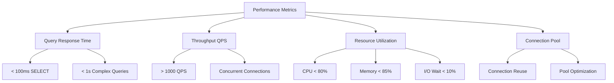
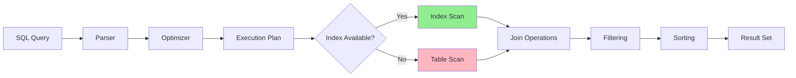
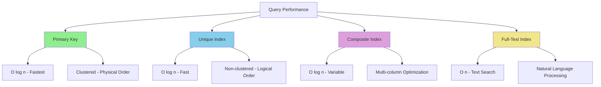
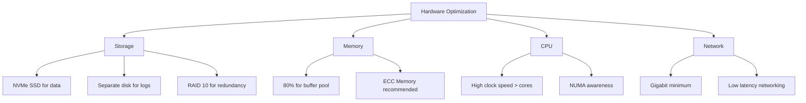
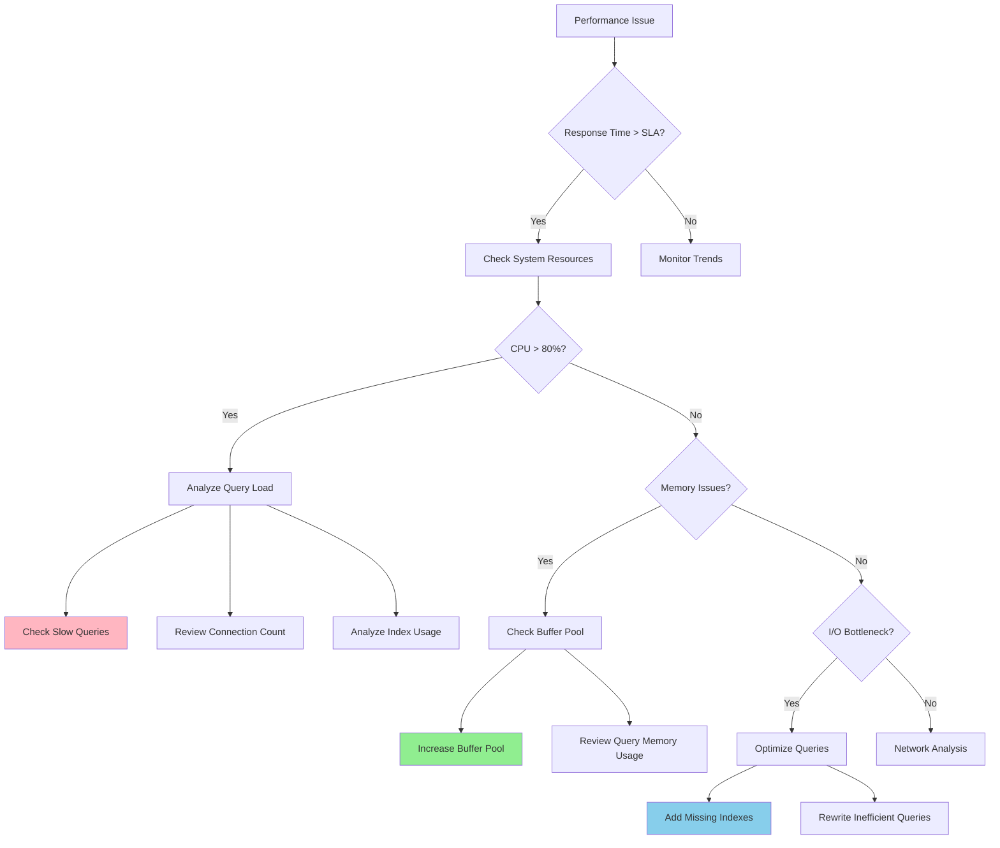

<small align="right">Contact: <a href="mailto:vandersantanna@gmail.com">Email</a> · <a href="https://www.linkedin.com/in/vandersantanna">LinkedIn</a> · <a href="https://github.com/vandersantanna">GitHub</a></small>

# 🚀 MySQL Performance Engineering Guide
*From parameters and indexing to workload baselines—measurable, Slow Query Log, and Performance Schema—diagnose, optimize, verify.*

## 📋 Table of Contents

- [Introduction](#-introduction)
- [Tuning Objectives](#-tuning-objectives)
- [Minimum Permissions](#-minimum-permissions-for-analysis)
- [Important Parameters](#️-important-parameters-for-performance)
- [Query Analysis](#-query-analysis)
- [Queries to Identify Bottlenecks](#-sql-queries-to-identify-bottlenecks)
- [Index Types](#-index-types-and-optimization)
- [Best Practices](#-tuning-best-practices)
- [Monitoring](#-monitoring-tools-and-techniques)
- [On-Premise Tuning](#️-on-premise-tuning)
- [Cloud Tuning](#☁️-cloud-tuning)
- [MySQL Forks](#-mysql-forks)
- [Tuning Tools](#-tuning-tools)
- [Real Examples](#-real-optimization-examples)

---

## 🎯 Introduction

This comprehensive guide presents methodologies, techniques, and best practices for MySQL performance optimization and its main forks (MariaDB and Percona). It covers everything from on-premise environments to cloud implementations (AWS RDS, Azure MySQL, Google Cloud SQL).

**Target Audience:** DBAs, Developers, Data Engineers, and DataOps professionals.

[Back to top](#table-of-contents)
---

## 🎯 Tuning Objectives

### Primary Goals

- **Reduce query response time**
- **Increase system throughput**
- **Optimize resource usage** (CPU, memory, I/O)
- **Improve concurrency** and reduce locks
- **Prevent bottlenecks** before they impact production
- **Reduce infrastructure costs**

### Performance KPIs


[Back to top](#table-of-contents)

---

## 🔐 Minimum Permissions for Analysis

### Performance Analysis User

```sql
-- Create dedicated user for tuning
CREATE USER 'tuning_analyst'@'%' IDENTIFIED BY 'secure_password_here';

-- Essential permissions for analysis
GRANT SELECT ON performance_schema.* TO 'tuning_analyst'@'%';
GRANT SELECT ON information_schema.* TO 'tuning_analyst'@'%';
GRANT SELECT ON mysql.* TO 'tuning_analyst'@'%';
GRANT PROCESS ON *.* TO 'tuning_analyst'@'%';
GRANT REPLICATION CLIENT ON *.* TO 'tuning_analyst'@'%';

-- Permissions for specific query analysis
GRANT SELECT ON sys.* TO 'tuning_analyst'@'%';
GRANT SHOW DATABASES ON *.* TO 'tuning_analyst'@'%';

-- For slow query analysis
GRANT FILE ON *.* TO 'tuning_analyst'@'%';

FLUSH PRIVILEGES;
```

### Permission Verification

```sql
-- Verify user permissions
SHOW GRANTS FOR 'tuning_analyst'@'%';

-- Test access to important schemas
SELECT COUNT(*) FROM information_schema.tables;
SELECT COUNT(*) FROM performance_schema.events_statements_summary_by_digest;
```
[Back to top](#table-of-contents)

---

## ⚙️ Important Parameters for Performance

### Critical MySQL Parameters

| Parameter | Description | Suggested Value | Impact |
|-----------|-------------|-----------------|---------|
| `innodb_buffer_pool_size` | InnoDB data cache | 70-80% of RAM | High |
| `innodb_log_file_size` | Transaction log size | 1-2GB | High |
| `innodb_flush_log_at_trx_commit` | Durability vs Performance | 1 (prod), 2 (performance) | High |
| `query_cache_size` | Result cache (MySQL < 8.0) | Disabled | Medium |
| `max_connections` | Simultaneous connections | Based on workload | High |
| `innodb_io_capacity` | Storage I/O capacity | 200 (HDD), 2000+ (SSD) | High |
| `tmp_table_size` | Max temporary table size | 64MB-256MB | Medium |
| `sort_buffer_size` | Buffer for sort operations | 2MB-16MB | Medium |
| `join_buffer_size` | Buffer for joins without indexes | 1MB-8MB | Medium |
| `innodb_thread_concurrency` | Simultaneous InnoDB threads | 0 (automatic) | Medium |

### Optimized Configuration Example

```ini
# my.cnf - Optimized configuration for 16GB RAM server
[mysqld]
# === BUFFER POOL ===
innodb_buffer_pool_size = 12G
innodb_buffer_pool_instances = 8
innodb_page_cleaners = 8

# === LOG FILES ===
innodb_log_file_size = 2G
innodb_log_files_in_group = 2
innodb_flush_log_at_trx_commit = 1

# === I/O CONFIGURATION ===
innodb_io_capacity = 2000
innodb_io_capacity_max = 4000
innodb_read_io_threads = 8
innodb_write_io_threads = 8

# === CONNECTION HANDLING ===
max_connections = 500
thread_cache_size = 50
table_open_cache = 4000

# === QUERY OPTIMIZATION ===
tmp_table_size = 256M
max_heap_table_size = 256M
sort_buffer_size = 4M
join_buffer_size = 4M

# === MONITORING ===
slow_query_log = 1
slow_query_log_file = /var/log/mysql/slow.log
long_query_time = 1
log_queries_not_using_indexes = 1
```
[Back to top](#table-of-contents)

---

## 🔍 Query Analysis

### Performance Schema - Main Queries

```sql
-- Top 10 slowest queries
SELECT 
    SUBSTRING(sql_text, 1, 100) as query_preview,
    count_star as executions,
    avg_timer_wait/1000000000000 as avg_duration_sec,
    sum_timer_wait/1000000000000 as total_duration_sec,
    avg_rows_sent,
    avg_rows_examined
FROM performance_schema.events_statements_summary_by_digest 
ORDER BY avg_timer_wait DESC 
LIMIT 10;
```

### Explain Plan Analysis

```sql
-- Detailed analysis example
EXPLAIN FORMAT=JSON 
SELECT u.name, COUNT(o.id) as order_count
FROM users u 
LEFT JOIN orders o ON u.id = o.user_id 
WHERE u.created_at > '2024-01-01'
GROUP BY u.id, u.name
HAVING COUNT(o.id) > 5
ORDER BY order_count DESC;

-- Cost analysis
EXPLAIN FORMAT=TREE
SELECT * FROM products p
JOIN categories c ON p.category_id = c.id
WHERE p.price > 100 AND c.name = 'Electronics';
```

### Visual Explain Flow


[Back to top](#table-of-contents)

---

## 🔎 SQL Queries to Identify Bottlenecks

### 1. Slowest Queries

```sql
-- Identify queries with highest execution time
SELECT 
    query,
    exec_count,
    avg_time,
    total_time,
    lock_time,
    rows_sent,
    rows_examined
FROM (
    SELECT 
        SUBSTRING(sql_text, 1, 200) as query,
        count_star as exec_count,
        ROUND(avg_timer_wait/1000000000000, 3) as avg_time,
        ROUND(sum_timer_wait/1000000000000, 3) as total_time,
        ROUND(avg_lock_time/1000000000000, 3) as lock_time,
        avg_rows_sent,
        avg_rows_examined
    FROM performance_schema.events_statements_summary_by_digest 
    WHERE avg_timer_wait > 0
    ORDER BY avg_timer_wait DESC 
    LIMIT 20
) as slow_queries;
```

**How to use:** Execute this query to identify queries that consume the most time. Focus on queries with `avg_time` > 1 second.

### 2. Unused Index Analysis

```sql
-- Indexes that have never been used
SELECT 
    s.table_schema,
    s.table_name,
    s.index_name,
    s.column_name
FROM information_schema.statistics s
LEFT JOIN performance_schema.table_io_waits_summary_by_index_usage p 
    ON s.table_schema = p.object_schema 
    AND s.table_name = p.object_name 
    AND s.index_name = p.index_name
WHERE p.index_name IS NULL 
    AND s.table_schema NOT IN ('mysql', 'information_schema', 'performance_schema')
    AND s.index_name != 'PRIMARY'
ORDER BY s.table_schema, s.table_name;
```

**How to use:** This query shows indexes that can be removed for not being used, freeing space and improving INSERT/UPDATE performance.

### 3. Tables with Most Table Scans

```sql
-- Tables with most full table scans
SELECT 
    object_schema,
    object_name,
    count_read as total_reads,
    count_read - IFNULL(count_index_read, 0) as full_table_scans,
    ROUND(((count_read - IFNULL(count_index_read, 0)) / count_read) * 100, 2) as pct_table_scans
FROM performance_schema.table_io_waits_summary_by_table
WHERE object_schema NOT IN ('mysql', 'information_schema', 'performance_schema')
    AND count_read > 1000
    AND (count_read - IFNULL(count_index_read, 0)) > 0
ORDER BY full_table_scans DESC
LIMIT 15;
```

**How to use:** Identifies tables with many table scans. Percentage > 10% indicates need for new indexes.

### 4. Connections and Locks

```sql
-- Analysis of active connections and locks
SELECT 
    p.id,
    p.user,
    p.host,
    p.db,
    p.command,
    p.time,
    p.state,
    LEFT(p.info, 100) as query_preview
FROM information_schema.processlist p
WHERE p.command != 'Sleep'
    AND p.time > 5
ORDER BY p.time DESC;

-- Identify recent deadlocks
SELECT 
    object_schema,
    object_name,
    index_name,
    lock_type,
    lock_mode,
    lock_status,
    lock_data
FROM performance_schema.data_locks
WHERE lock_status = 'WAITING';
```

**How to use:** Execute to identify long queries that might be causing locks or consuming excessive resources.

### 5. Memory and Buffer Analysis

```sql
-- Temporary buffer usage
SELECT 
    LEFT(sql_text, 100) as query_preview,
    count_star as executions,
    sum_created_tmp_tables as tmp_tables_created,
    sum_created_tmp_disk_tables as tmp_disk_tables,
    ROUND((sum_created_tmp_disk_tables/sum_created_tmp_tables)*100, 2) as pct_disk_tmp
FROM performance_schema.events_statements_summary_by_digest
WHERE sum_created_tmp_tables > 0
ORDER BY sum_created_tmp_disk_tables DESC
LIMIT 15;
```

**How to use:** Queries with high percentage of disk temporary tables (pct_disk_tmp > 25%) need optimization or increase in `tmp_table_size`.

[Back to top](#table-of-contents)

---

## 📊 Index Types and Optimization

### Main MySQL Index Types

### 1. Primary Index (Primary Key)

```sql
-- Create table with optimized primary key
CREATE TABLE users (
    id INT UNSIGNED AUTO_INCREMENT,
    username VARCHAR(50) NOT NULL,
    email VARCHAR(100) NOT NULL,
    created_at TIMESTAMP DEFAULT CURRENT_TIMESTAMP,
    PRIMARY KEY (id)
) ENGINE=InnoDB;

-- Impact: O(log n) access, physical data organization
-- Best practice: Use INT UNSIGNED AUTO_INCREMENT for uniform distribution
```

### 2. Unique Index

```sql
-- Ensure uniqueness and accelerate queries
ALTER TABLE users 
ADD UNIQUE INDEX idx_email (email);

ALTER TABLE users 
ADD UNIQUE INDEX idx_username (username);

-- Optimized usage example
SELECT id, username FROM users WHERE email = 'user@example.com';
-- Result: Index scan instead of table scan
```

### 3. Composite Index

```sql
-- Index for multi-condition queries
CREATE TABLE orders (
    id INT PRIMARY KEY,
    user_id INT,
    status ENUM('pending', 'processing', 'completed', 'cancelled'),
    created_at TIMESTAMP,
    total_amount DECIMAL(10,2)
);

-- Optimized index for frequent queries
ALTER TABLE orders 
ADD INDEX idx_user_status_date (user_id, status, created_at);

-- Query optimized by the index
SELECT * FROM orders 
WHERE user_id = 123 
    AND status = 'completed' 
    AND created_at > '2024-01-01';
```

**Composite Index Rule:** Column order matters (most selective → less selective)

### 4. Partial/Functional Index

```sql
-- MySQL 8.0+: Functional indexes
ALTER TABLE products 
ADD INDEX idx_name_lower ((LOWER(name)));

-- Optimized query
SELECT * FROM products WHERE LOWER(name) = 'smartphone';

-- Index on JSON expressions (MySQL 5.7+)
ALTER TABLE user_profiles 
ADD INDEX idx_json_age ((CAST(profile->'$.age' AS UNSIGNED)));
```

### 5. Full-Text Index

```sql
-- For advanced text searches
ALTER TABLE articles 
ADD FULLTEXT INDEX idx_content (title, content);

-- Optimized search
SELECT * FROM articles 
WHERE MATCH(title, content) AGAINST('database performance tuning' IN BOOLEAN MODE);

-- With relevance score
SELECT *, MATCH(title, content) AGAINST('mysql optimization') as relevance
FROM articles 
WHERE MATCH(title, content) AGAINST('mysql optimization')
ORDER BY relevance DESC;
```

### 6. Covering Index

```sql
-- Index that "covers" the entire query (no table access)
ALTER TABLE products 
ADD INDEX idx_category_price_name (category_id, price, name);

-- Query using only the index
SELECT name, price FROM products 
WHERE category_id = 10 AND price > 100
ORDER BY price;
-- Result: "Using index" in EXPLAIN
```

### Performance Comparison by Index Type


[Back to top](#table-of-contents)

---

## ✅ Tuning Best Practices

### 1. Indexing Strategy

```sql
-- ❌ AVOID: Many unnecessary indexes
ALTER TABLE products ADD INDEX idx_name (name);
ALTER TABLE products ADD INDEX idx_price (price);
ALTER TABLE products ADD INDEX idx_category (category_id);

-- ✅ BETTER: Composite index based on real queries
ALTER TABLE products ADD INDEX idx_category_price (category_id, price);
-- Serves queries: category_id, category_id+price
```

### 2. Query Optimization

```sql
-- ❌ AVOID: SELECT *
SELECT * FROM users WHERE active = 1;

-- ✅ BETTER: Select only necessary fields
SELECT id, username, email FROM users WHERE active = 1;

-- ❌ AVOID: Functions in WHERE
SELECT * FROM orders WHERE YEAR(created_at) = 2024;

-- ✅ BETTER: Use ranges
SELECT * FROM orders 
WHERE created_at >= '2024-01-01' AND created_at < '2025-01-01';
```

### 3. Parameter Configuration

```sql
-- Check current configurations
SHOW VARIABLES LIKE 'innodb_buffer_pool_size';
SHOW VARIABLES LIKE 'innodb_log_file_size';

-- Calculate buffer pool hit rate
SELECT 
    (1 - (Innodb_buffer_pool_reads / Innodb_buffer_pool_read_requests)) * 100 
    as buffer_pool_hit_rate
FROM (
    SELECT 
        VARIABLE_VALUE as Innodb_buffer_pool_reads 
    FROM performance_schema.global_status 
    WHERE VARIABLE_NAME = 'Innodb_buffer_pool_reads'
) reads,
(
    SELECT 
        VARIABLE_VALUE as Innodb_buffer_pool_read_requests 
    FROM performance_schema.global_status 
    WHERE VARIABLE_NAME = 'Innodb_buffer_pool_read_requests'
) requests;
-- Target: > 95%
```

### 4. Partitioning

```sql
-- Range partitioning (dates)
CREATE TABLE sales_data (
    id INT PRIMARY KEY,
    sale_date DATE,
    amount DECIMAL(10,2),
    customer_id INT
)
PARTITION BY RANGE (YEAR(sale_date)) (
    PARTITION p2022 VALUES LESS THAN (2023),
    PARTITION p2023 VALUES LESS THAN (2024),
    PARTITION p2024 VALUES LESS THAN (2025),
    PARTITION p_future VALUES LESS THAN MAXVALUE
);

-- Optimized queries by partition
SELECT * FROM sales_data 
WHERE sale_date BETWEEN '2024-01-01' AND '2024-12-31';
-- Accesses only p2024 partition
```
[Back to top](#table-of-contents)

---

## 📊 Monitoring Tools and Techniques

### Essential Metrics to Monitor

| Metric | Query/Command | Ideal Value | Action if Out of Range |
|--------|---------------|-------------|----------------------|
| Buffer Pool Hit Rate | `SELECT (1 - Innodb_buffer_pool_reads/Innodb_buffer_pool_read_requests)*100` | > 95% | Increase `innodb_buffer_pool_size` |
| Active Connections | `SHOW STATUS LIKE 'Threads_connected'` | < 80% of `max_connections` | Check connection pooling |
| Query Cache Hit Rate | `SELECT Qcache_hits/(Qcache_hits+Com_select)*100` | > 90% (MySQL < 8.0) | Adjust `query_cache_size` |
| Slow Queries | `SHOW STATUS LIKE 'Slow_queries'` | < 5% of total | Analyze slow query log |
| Table Locks | `SHOW STATUS LIKE 'Table_locks_waited'` | Close to 0 | Check indexes and MyISAM tables |

### Monitoring Scripts

```sql
-- Complete health check script
SELECT 'Buffer Pool Hit Rate' as metric,
       CONCAT(ROUND((1 - Innodb_buffer_pool_reads/Innodb_buffer_pool_read_requests)*100, 2), '%') as value
FROM (SELECT VARIABLE_VALUE as Innodb_buffer_pool_reads FROM performance_schema.global_status WHERE VARIABLE_NAME = 'Innodb_buffer_pool_reads') a,
     (SELECT VARIABLE_VALUE as Innodb_buffer_pool_read_requests FROM performance_schema.global_status WHERE VARIABLE_NAME = 'Innodb_buffer_pool_read_requests') b

UNION ALL

SELECT 'Connection Usage' as metric,
       CONCAT(ROUND((SELECT VARIABLE_VALUE FROM performance_schema.global_status WHERE VARIABLE_NAME = 'Threads_connected') / 
                   (SELECT VARIABLE_VALUE FROM performance_schema.global_variables WHERE VARIABLE_NAME = 'max_connections') * 100, 2), '%') as value

UNION ALL

SELECT 'QPS (Queries Per Second)' as metric,
       (SELECT VARIABLE_VALUE FROM performance_schema.global_status WHERE VARIABLE_NAME = 'Questions') as value;
```

### Automated Alerts

```bash
#!/bin/bash
# Automated monitoring script

# Check buffer pool hit rate
BUFFER_HIT=$(mysql -e "SELECT ROUND((1 - Innodb_buffer_pool_reads/Innodb_buffer_pool_read_requests)*100, 2) FROM (SELECT VARIABLE_VALUE as Innodb_buffer_pool_reads FROM performance_schema.global_status WHERE VARIABLE_NAME = 'Innodb_buffer_pool_reads') a, (SELECT VARIABLE_VALUE as Innodb_buffer_pool_read_requests FROM performance_schema.global_status WHERE VARIABLE_NAME = 'Innodb_buffer_pool_read_requests') b;" -s -N)

if (( $(echo "$BUFFER_HIT < 90" | bc -l) )); then
    echo "ALERT: Low Buffer Pool Hit Rate: $BUFFER_HIT%"
    # Send notification (Slack, email, etc.)
fi
```
[Back to top](#table-of-contents)

---

## 🖥️ On-Premise Tuning

### Hardware Configuration



### Optimized my.cnf On-Premise

```ini
# my.cnf for dedicated 64GB RAM server
[mysqld]
# === BASIC SETTINGS ===
user = mysql
port = 3306
bind-address = 0.0.0.0
skip-name-resolve

# === INNODB SETTINGS ===
default-storage-engine = InnoDB
innodb_buffer_pool_size = 48G
innodb_buffer_pool_instances = 16
innodb_log_file_size = 4G
innodb_log_files_in_group = 2
innodb_flush_log_at_trx_commit = 1
innodb_flush_method = O_DIRECT

# === I/O OPTIMIZATION ===
innodb_io_capacity = 4000
innodb_io_capacity_max = 8000
innodb_read_io_threads = 16
innodb_write_io_threads = 16
innodb_page_cleaners = 16

# === CONNECTION HANDLING ===
max_connections = 1000
thread_cache_size = 100
table_open_cache = 8000
table_definition_cache = 2000

# === QUERY OPTIMIZATION ===
tmp_table_size = 512M
max_heap_table_size = 512M
sort_buffer_size = 8M
join_buffer_size = 8M
read_buffer_size = 2M
read_rnd_buffer_size = 4M

# === BINARY LOGGING ===
log-bin = mysql-bin
binlog_format = ROW
expire_logs_days = 7
max_binlog_size = 1G

# === SLOW QUERY LOG ===
slow_query_log = 1
slow_query_log_file = /var/log/mysql/slow.log
long_query_time = 1
log_queries_not_using_indexes = 1
log_slow_admin_statements = 1

# === PERFORMANCE SCHEMA ===
performance_schema = ON
performance-schema-instrument = 'statement/%=ON'
```

### Linux System Commands

```bash
# OS optimization for MySQL
echo 'vm.swappiness = 1' >> /etc/sysctl.conf
echo 'vm.dirty_ratio = 15' >> /etc/sysctl.conf
echo 'vm.dirty_background_ratio = 5' >> /etc/sysctl.conf

# I/O Scheduler for SSD
echo noop > /sys/block/nvme0n1/queue/scheduler

# File limits
echo 'mysql soft nofile 65535' >> /etc/security/limits.conf
echo 'mysql hard nofile 65535' >> /etc/security/limits.conf
```
[Back to top](#table-of-contents)

---

## ☁️ Cloud Tuning

### AWS RDS MySQL

#### Parameter Group Configuration

```bash
# Create custom parameter group
aws rds create-db-parameter-group \
    --db-parameter-group-name mysql-tuned-8-0 \
    --db-parameter-group-family mysql8.0 \
    --description "MySQL 8.0 tuned parameters"

# Key parameters to optimize
aws rds modify-db-parameter-group \
    --db-parameter-group-name mysql-tuned-8-0 \
    --parameters \
        ParameterName=innodb_buffer_pool_size,ParameterValue="{DBInstanceClassMemory*3/4}" \
        ParameterName=slow_query_log,ParameterValue=1 \
        ParameterName=long_query_time,ParameterValue=1 \
        ParameterName=innodb_flush_log_at_trx_commit,ParameterValue=1
```

#### CloudWatch Monitoring

```python
# Python script for custom metrics
import boto3
import mysql.connector

def publish_custom_metrics():
    cloudwatch = boto3.client('cloudwatch')
    
    # Connect to MySQL RDS
    conn = mysql.connector.connect(
        host='your-rds-endpoint',
        user='monitoring_user',
        password='password',
        database='information_schema'
    )
    
    cursor = conn.cursor()
    
    # Buffer Pool Hit Rate
    cursor.execute("""
        SELECT ROUND((1 - Innodb_buffer_pool_reads/Innodb_buffer_pool_read_requests)*100, 2)
        FROM (SELECT VARIABLE_VALUE as Innodb_buffer_pool_reads 
              FROM performance_schema.global_status 
              WHERE VARIABLE_NAME = 'Innodb_buffer_pool_reads') a,
             (SELECT VARIABLE_VALUE as Innodb_buffer_pool_read_requests 
              FROM performance_schema.global_status 
              WHERE VARIABLE_NAME = 'Innodb_buffer_pool_read_requests') b
    """)
    
    hit_rate = cursor.fetchone()[0]
    
    cloudwatch.put_metric_data(
        Namespace='MySQL/Performance',
        MetricData=[
            {
                'MetricName': 'BufferPoolHitRate',
                'Value': hit_rate,
                'Unit': 'Percent',
                'Dimensions': [
                    {
                        'Name': 'DBInstanceIdentifier',
                        'Value': 'your-db-instance'
                    }
                ]
            }
        ]
    )
```

#### Performance Insights

```sql
-- Queries to use with Performance Insights
-- Top SQL by execution time
SELECT sql_id, plan_hash_value, executions, 
       avg_etime, buffer_gets, disk_reads
FROM performance_insights.sql_stats 
ORDER BY avg_etime DESC LIMIT 10;

-- Most frequent waits
SELECT wait_event, wait_count, wait_time
FROM performance_insights.wait_events 
ORDER BY wait_time DESC;
```

### Azure Database for MySQL

#### Configuration via Azure CLI

```bash
# Create server with optimized settings
az mysql server create \
    --resource-group myResourceGroup \
    --name mydemoserver \
    --location westeurope \
    --admin-user myadmin \
    --admin-password mypassword \
    --sku-name GP_Gen5_8 \
    --storage-size 512000 \
    --storage-auto-grow Enabled

# Configure server parameters
az mysql server configuration set \
    --name slow_query_log \
    --resource-group myResourceGroup \
    --server mydemoserver \
    --value ON

az mysql server configuration set \
    --name long_query_time \
    --resource-group myResourceGroup \
    --server mydemoserver \
    --value 2

az mysql server configuration set \
    --name log_queries_not_using_indexes \
    --resource-group myResourceGroup \
    --server mydemoserver \
    --value ON
```

#### Azure Monitor Monitoring

```json
{
    "alertRule": {
        "name": "High CPU Usage",
        "description": "Alert when CPU usage is above 80%",
        "isEnabled": true,
        "condition": {
            "dataSource": {
                "resourceUri": "/subscriptions/{subscription}/resourceGroups/{rg}/providers/Microsoft.DBforMySQL/servers/{server}",
                "metricName": "cpu_percent"
            },
            "operator": "GreaterThan",
            "threshold": 80,
            "windowSize": "PT5M",
            "timeAggregation": "Average"
        },
        "actions": [
            {
                "sendToServiceOwners": true,
                "customEmails": ["admin@company.com"]
            }
        ]
    }
}
```

### Google Cloud SQL for MySQL

#### Configuration via gcloud

```bash
# Create optimized instance
gcloud sql instances create mysql-production \
    --database-version=MYSQL_8_0 \
    --tier=db-n1-highmem-8 \
    --region=us-central1 \
    --storage-type=SSD \
    --storage-size=500GB \
    --storage-auto-increase \
    --backup-start-time=03:00 \
    --maintenance-window-day=SUN \
    --maintenance-window-hour=04

# Configure flags (parameters)
gcloud sql instances patch mysql-production \
    --database-flags=slow_query_log=on,long_query_time=1,innodb_buffer_pool_size=75%
```

#### Stackdriver Monitoring

```python
# Custom metrics for Cloud SQL
from google.cloud import monitoring_v3
from google.cloud import sql_v1

def create_custom_metric():
    client = monitoring_v3.MetricServiceClient()
    project_name = f"projects/{project_id}"
    
    descriptor = monitoring_v3.MetricDescriptor()
    descriptor.type = "custom.googleapis.com/mysql/buffer_pool_hit_rate"
    descriptor.metric_kind = monitoring_v3.MetricDescriptor.MetricKind.GAUGE
    descriptor.value_type = monitoring_v3.MetricDescriptor.ValueType.DOUBLE
    descriptor.description = "MySQL Buffer Pool Hit Rate"
    
    descriptor = client.create_metric_descriptor(
        name=project_name, metric_descriptor=descriptor
    )
```
[Back to top](#table-of-contents)

---

## 🔧 MySQL Forks

### MariaDB Specific

#### Unique MariaDB Features

```sql
-- Exclusive MariaDB Storage Engines
CREATE TABLE test_columnstore (
    id INT PRIMARY KEY,
    data VARCHAR(100)
) ENGINE=ColumnStore;

-- Virtual/invisible indexes
ALTER TABLE users ADD INDEX idx_email_invisible (email) INVISIBLE;
-- Test performance without affecting production

-- Sequences (alternative to AUTO_INCREMENT)
CREATE SEQUENCE user_id_seq START WITH 1000 INCREMENT BY 1;
CREATE TABLE users_seq (
    id INT DEFAULT NEXTVAL(user_id_seq),
    name VARCHAR(100)
);
```

#### MariaDB Optimized my.cnf

```ini
# MariaDB specific optimizations
[mysqld]
# === MARIADB SPECIFIC ===
optimizer_use_condition_selectivity = 4
optimizer_switch = 'extended_keys=on,exists_to_in=on'
use_stat_tables = preferably
histogram_size = 100

# === THREADPOOL (MariaDB specific) ===
thread_handling = pool-of-threads
thread_pool_size = 16
thread_pool_max_threads = 2000

# === GALERA CLUSTER (if applicable) ===
wsrep_provider = /usr/lib/galera/libgalera_smm.so
wsrep_cluster_address = "gcomm://node1,node2,node3"
wsrep_node_address = "192.168.1.10"
wsrep_sst_method = rsync
```

#### MariaDB Tools

```bash
# MariaDB query optimizer
mysql -e "ANALYZE TABLE users PERSISTENT FOR ALL;"

# Engine statistics
mysql -e "SELECT * FROM information_schema.engine_cost;"

# MariaDB specific health check
mysql -e "SELECT * FROM information_schema.table_statistics WHERE table_schema='mydb';"
```

### Percona Server Specific

#### Unique Percona Features

```sql
-- Query Response Time Plugin
INSTALL PLUGIN QUERY_RESPONSE_TIME SONAME 'query_response_time.so';
SET GLOBAL query_response_time_stats = ON;

-- Query response time statistics
SELECT * FROM information_schema.QUERY_RESPONSE_TIME;

-- Audit Log Plugin
INSTALL PLUGIN audit_log SONAME 'audit_log.so';
SET GLOBAL audit_log_policy = ALL;

-- TokuDB (compression engine)
CREATE TABLE logs_compressed (
    id INT PRIMARY KEY,
    message TEXT,
    created_at TIMESTAMP
) ENGINE=TokuDB;
```

#### Percona Optimized my.cnf

```ini
# Percona Server specific optimizations
[mysqld]
# === PERCONA SPECIFIC ===
# Query Response Time
plugin-load = query_response_time.so
query_response_time_stats = ON
query_response_time_range_base = 10

# Enhanced slow log
log_slow_verbosity = full
log_slow_rate_limit = 1000
log_slow_rate_type = query

# Thread Pool
thread_handling = pool-of-threads
thread_pool_size = 16
thread_pool_oversubscribe = 3

# XtraDB specific
innodb_adaptive_checkpoint = estimate
innodb_flush_neighbor_pages = area
innodb_read_ahead = linear
```

#### Percona Tools

```bash
# pt-query-digest for slow log analysis
pt-query-digest /var/log/mysql/slow.log > slow_analysis.txt

# pt-online-schema-change for DDL without downtime
pt-online-schema-change \
    --alter "ADD INDEX idx_status (status)" \
    --execute h=localhost,D=mydb,t=orders

# pt-table-checksum for replication verification
pt-table-checksum h=master --replicate=percona.checksums

# PMM (Percona Monitoring and Management)
pmm-admin add mysql mysql-main --host=localhost --port=3306
```
[Back to top](#table-of-contents)

---

## 🛠️ Tuning Tools

| Tool Name | Type | Compatible with | Main Functionality |
|-----------|------|----------------|-------------------|
| MySQL Workbench | GUI | MySQL, MariaDB | Complete IDE with Performance Dashboard |
| phpMyAdmin | Web | MySQL, MariaDB | Basic web administration |
| Adminer | Web | MySQL, MariaDB, Percona | Lightweight and functional web interface |
| pt-query-digest | CLI | MySQL, MariaDB, Percona | Detailed slow query analysis |
| MySQLTuner | CLI | MySQL, MariaDB, Percona | Automated configuration analysis |
| Percona Monitoring (PMM) | Web/CLI | MySQL, MariaDB, Percona | Advanced monitoring and metrics |
| MySQL Enterprise Monitor | Commercial | MySQL | Oracle's official monitoring |
| SolarWinds DPA | Commercial | Multi-DB | Multi-platform performance analysis |
| Quest Toad | Commercial | Multi-DB | Advanced development IDE |
| Navicat | Commercial | Multi-DB | Cross-platform visual client |
| DBeaver | GUI | Multi-DB | Universal free client |
| HeidiSQL | GUI | MySQL, MariaDB | Popular Windows client |
| Sequel Pro | GUI | MySQL | Popular macOS client |
| TablePlus | Commercial | Multi-DB | Modern cross-platform client |
| DataGrip | Commercial | Multi-DB | JetBrains IDE for databases |
| MySQL Shell | CLI | MySQL | Official shell with JavaScript/Python features |
| pt-stalk | CLI | MySQL, MariaDB, Percona | Collects data during problems |
| mytop | CLI | MySQL, MariaDB | Real-time 'top'-like monitor |
| innotop | CLI | MySQL, MariaDB, Percona | InnoDB specialized monitor |
| Grafana + Prometheus | Monitoring | All | Customizable dashboards and alerts |
| Zabbix | Monitoring | All | Enterprise monitoring |
| Nagios | Monitoring | All | Alert system |
| New Relic | SaaS | All | APM with database insights |
| DataDog | SaaS | All | Cloud monitoring |
| Amazon RDS Performance Insights | Cloud | AWS RDS | AWS native analysis |
| Azure Database Insights | Cloud | Azure MySQL | Azure native analysis |
| Google Cloud SQL Insights | Cloud | Cloud SQL | GCP native analysis |

[Back to top](#table-of-contents)

---

## 💼 Real Optimization Examples

### Case 1: High Volume E-commerce

**Problem:** Slow product query (5+ seconds)

```sql
-- Original problematic query
SELECT p.*, c.name as category_name, AVG(r.rating) as avg_rating
FROM products p
JOIN categories c ON p.category_id = c.id
LEFT JOIN reviews r ON p.id = r.product_id
WHERE p.active = 1 AND p.price > 50
GROUP BY p.id
ORDER BY avg_rating DESC, p.created_at DESC
LIMIT 20;
```

**Implemented Solution:**

```sql
-- 1. Create optimized indexes
ALTER TABLE products ADD INDEX idx_active_price_created (active, price, created_at);
ALTER TABLE reviews ADD INDEX idx_product_rating (product_id, rating);

-- 2. Optimized query with subquery
SELECT p.*, c.name as category_name, 
       COALESCE(r.avg_rating, 0) as avg_rating
FROM products p
JOIN categories c ON p.category_id = c.id
LEFT JOIN (
    SELECT product_id, AVG(rating) as avg_rating
    FROM reviews 
    GROUP BY product_id
) r ON p.id = r.product_id
WHERE p.active = 1 AND p.price > 50
ORDER BY r.avg_rating DESC, p.created_at DESC
LIMIT 20;

-- 3. Alternative with materialized view (cache)
CREATE VIEW product_ratings AS
SELECT product_id, AVG(rating) as avg_rating, COUNT(*) as review_count
FROM reviews 
GROUP BY product_id;

-- Periodic view refresh (scheduled job)
```

**Result:** 5.2s → 0.3s (94% improvement)

### Case 2: Financial System - Deadlocks

**Problem:** Frequent deadlocks in transfers

```sql
-- Problematic code
START TRANSACTION;
UPDATE accounts SET balance = balance - 100 WHERE id = 1;
UPDATE accounts SET balance = balance + 100 WHERE id = 2;
COMMIT;

-- Simultaneously another process:
START TRANSACTION;
UPDATE accounts SET balance = balance - 50 WHERE id = 2;
UPDATE accounts SET balance = balance + 50 WHERE id = 1;
COMMIT;
```

**Solution:**

```sql
-- Standardize access order (smaller ID first)
DELIMITER $
CREATE PROCEDURE transfer_money(
    IN from_account INT,
    IN to_account INT,
    IN amount DECIMAL(10,2)
)
BEGIN
    DECLARE first_id, second_id INT;
    DECLARE first_amount, second_amount DECIMAL(10,2);
    
    -- Sort IDs to avoid deadlock
    IF from_account < to_account THEN
        SET first_id = from_account, second_id = to_account;
        SET first_amount = -amount, second_amount = amount;
    ELSE
        SET first_id = to_account, second_id = from_account;
        SET first_amount = amount, second_amount = -amount;
    END IF;
    
    START TRANSACTION;
    UPDATE accounts SET balance = balance + first_amount WHERE id = first_id;
    UPDATE accounts SET balance = balance + second_amount WHERE id = second_id;
    COMMIT;
END$
DELIMITER ;
```

**Result:** 95% reduction in deadlocks

### Case 3: Analytics Dashboard - Slow Query

**Problem:** Report dashboard with timeout

```sql
-- Original query (45+ seconds)
SELECT 
    DATE(created_at) as date,
    COUNT(*) as orders,
    SUM(total_amount) as revenue,
    AVG(total_amount) as avg_order,
    COUNT(DISTINCT customer_id) as unique_customers
FROM orders o
WHERE created_at >= DATE_SUB(CURDATE(), INTERVAL 90 DAY)
GROUP BY DATE(created_at)
ORDER BY date DESC;
```

**Solution with Aggregation Table:**

```sql
-- 1. Create daily summary table
CREATE TABLE daily_order_summary (
    summary_date DATE PRIMARY KEY,
    total_orders INT,
    total_revenue DECIMAL(12,2),
    avg_order_value DECIMAL(10,2),
    unique_customers INT,
    created_at TIMESTAMP DEFAULT CURRENT_TIMESTAMP,
    INDEX idx_date (summary_date)
);

-- 2. Procedure to update summary
DELIMITER $
CREATE PROCEDURE update_daily_summary(IN target_date DATE)
BEGIN
    INSERT INTO daily_order_summary 
    (summary_date, total_orders, total_revenue, avg_order_value, unique_customers)
    SELECT 
        DATE(created_at) as date,
        COUNT(*) as orders,
        SUM(total_amount) as revenue,
        AVG(total_amount) as avg_order,
        COUNT(DISTINCT customer_id) as customers
    FROM orders 
    WHERE DATE(created_at) = target_date
    GROUP BY DATE(created_at)
    ON DUPLICATE KEY UPDATE
        total_orders = VALUES(total_orders),
        total_revenue = VALUES(total_revenue),
        avg_order_value = VALUES(avg_order_value),
        unique_customers = VALUES(unique_customers);
END$
DELIMITER ;

-- 3. Optimized query for dashboard
SELECT * FROM daily_order_summary 
WHERE summary_date >= DATE_SUB(CURDATE(), INTERVAL 90 DAY)
ORDER BY summary_date DESC;

-- 4. Scheduled job for incremental update
CREATE EVENT daily_summary_update
ON SCHEDULE EVERY 1 HOUR
DO CALL update_daily_summary(CURDATE());
```

**Result:** 45s → 0.05s (99.9% improvement)

---

## 🎯 What to Monitor for Performance Bottlenecks

### Diagnostic Flow



### Critical Metrics by Category

#### 1. Operating System
```bash
# CPU and Load Average
top -p $(pgrep mysqld)
iostat -x 1

# Memory
free -h
cat /proc/$(pgrep mysqld)/status | grep -E "(VmRSS|VmSize)"

# I/O
iotop -p $(pgrep mysqld)
```

#### 2. MySQL Internal
```sql
-- Connections and threads
SELECT 
    (SELECT VARIABLE_VALUE FROM performance_schema.global_status WHERE VARIABLE_NAME = 'Threads_connected') as connected,
    (SELECT VARIABLE_VALUE FROM performance_schema.global_variables WHERE VARIABLE_NAME = 'max_connections') as max_conn,
    (SELECT VARIABLE_VALUE FROM performance_schema.global_status WHERE VARIABLE_NAME = 'Threads_running') as running;

-- InnoDB Status
SELECT 
    VARIABLE_NAME,
    VARIABLE_VALUE
FROM performance_schema.global_status 
WHERE VARIABLE_NAME IN (
    'Innodb_buffer_pool_read_requests',
    'Innodb_buffer_pool_reads',
    'Innodb_row_lock_waits',
    'Innodb_deadlocks'
);
```

#### 3. Query Performance
```sql
-- Top queries by total time
SELECT 
    LEFT(digest_text, 80) as query_preview,
    count_star as executions,
    ROUND(avg_timer_wait/1000000000000, 3) as avg_seconds,
    ROUND(sum_timer_wait/1000000000000, 3) as total_seconds,
    ROUND((sum_timer_wait/1000000000000) / (SELECT SUM(sum_timer_wait)/1000000000000 FROM performance_schema.events_statements_summary_by_digest) * 100, 2) as pct_total_time
FROM performance_schema.events_statements_summary_by_digest 
ORDER BY sum_timer_wait DESC 
LIMIT 10;
```
---
[Back to top](#table-of-contents)

---

**[🏠 Back to Main Portfolio](../README.md#top)**

---

## Author & Maintainer
<table>
  <tr>
    <td width="96" valign="top">
      
    </td>
    <td valign="top">
      <strong>Vanderley Sant Anna</strong><br>
      Senior Database Engineer (DBE) / Senior Database Reliability Engineer (DBRE) / Senior DBA / DataOps Engineer
    </td>
  </tr>
</table>

**Preferred name:** Vander  

**Education:**  
- B.Sc. in Software Engineering — Centro Universitário de Maringá (UniCesumar) — *UniCesumar University Center*, Maringá, Brazil (2020)  
- Postgraduate Specialization (Lato Sensu) in Software Project Engineering — Universidade do Sul de Santa Catarina (UNISUL) — *Southern Santa Catarina University*, Florianópolis, Brazil (2008)  
- Technologist in Data Processing (*Tecnólogo em Processamento de Dados*) — Universidade do Estado de Santa Catarina (UDESC) — *Santa Catarina State University*, Joinville, Brazil (1995)  

**Certifications:**  
- Oracle OCP  
- MongoDB University — M102: MongoDB for DBAs  
- IBM Certified Database Associate — DB2 9 Fundamentals  

**Location & Timezone:** Blumenau, SC, Brazil (UTC−3) • **Availability:** Remote (Americas & Europe)

**Last Updated:** 2025-10-24 • **Status:** Actively maintained

## 📫 Contact
- **Email (primary):** [vandersantanna@gmail.com](mailto:vandersantanna@gmail.com)  
- **LinkedIn:** [linkedin.com/in/vandersantanna](https://www.linkedin.com/in/vandersantanna)  
- **GitHub:** [github.com/vandersantanna](https://github.com/vandersantanna)

<details>
  <summary><strong>Trademarks</strong></summary>

  <small>All product names, logos, and brands are property of their respective owners. 
  Use of these names is for identification purposes only and does not imply endorsement or affiliation.</small>
</details>

