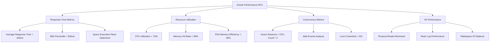
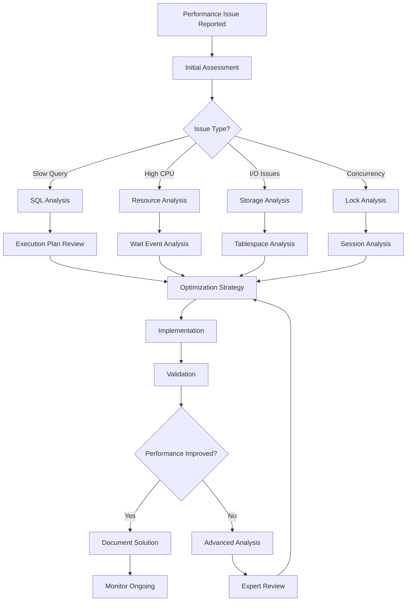
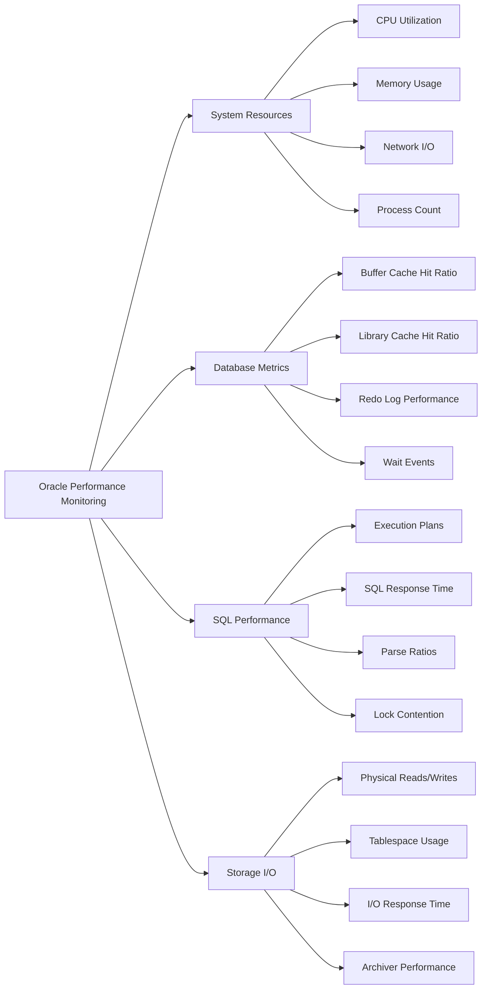

<small align="right">Contact: <a href="mailto:vandersantanna@gmail.com">Email</a> · <a href="https://www.linkedin.com/in/vandersantanna">LinkedIn</a> · <a href="https://github.com/vandersantanna">GitHub</a></small>

# 🔶 Oracle Database Performance Tuning - Professional Portfolio
*Advanced Database Performance Optimization & Cloud Administration*

---

## 📋 Table of Contents

- [🎯 Performance Tuning Objectives](#-performance-tuning-objectives)
- [🔐 Required Permissions](#-required-permissions)
- [🔍 Performance Analysis Methodology](#-performance-analysis-methodology)
- [⚙️ Critical Database Parameters](#️-critical-database-parameters)
- [🖥️ On-Premise Tuning](#️-on-premise-tuning)
- [☁️ Cloud Database Administration](#️-cloud-database-administration)
- [🚀 Oracle Cloud Infrastructure (OCI)](#-oracle-cloud-infrastructure-oci)
- [📊 Monitoring & Bottleneck Identification](#-monitoring--bottleneck-identification)
- [🔍 Performance Analysis Queries](#-performance-analysis-queries)
- [📈 Index Optimization Strategies](#-index-optimization-strategies)
- [🛠️ Oracle Extensions & Features](#️-oracle-extensions--features)
- [📊 Performance Monitoring Tools](#-performance-monitoring-tools)
- [🎯 Best Practices](#-best-practices)


---

## 🎯 Performance Tuning Objectives

### Primary Performance Goals
- **Response Time**: < 100ms for OLTP queries (95th percentile)
- **Throughput**: > 50,000 TPS for high-volume systems
- **Availability**: 99.99% uptime with automatic failover
- **Resource Utilization**: < 70% CPU, optimal memory allocation
- **Scalability**: Linear performance scaling with load increases

### Key Performance Indicators (KPIs)



### Performance Measurement Framework

```sql
-- Comprehensive performance baseline query
SELECT 
    'Database Performance Baseline' AS metric_category,
    ROUND(AVG(value), 2) AS avg_response_time_ms,
    ROUND(MAX(value), 2) AS max_response_time_ms,
    COUNT(*) AS total_executions
FROM v$sql_monitor 
WHERE last_change_time > SYSDATE - 1
UNION ALL
SELECT 
    'Buffer Cache Hit Ratio' AS metric_category,
    ROUND((1 - (phy.value / (cur.value + con.value))) * 100, 2) AS hit_ratio_percent,
    NULL AS max_value,
    NULL AS total_count
FROM v$sysstat cur, v$sysstat con, v$sysstat phy
WHERE cur.name = 'db block gets'
    AND con.name = 'consistent gets'
    AND phy.name = 'physical reads';
```

[Back to top](#table-of-contents)

---

## 🔐 Required Permissions

### Essential Database Roles and Privileges

```sql
-- Create dedicated performance monitoring user
CREATE USER perf_monitor IDENTIFIED BY "SecurePassword123!";

-- Grant essential system privileges
GRANT CREATE SESSION TO perf_monitor;
GRANT SELECT_CATALOG_ROLE TO perf_monitor;
GRANT SELECT ANY DICTIONARY TO perf_monitor;

-- Grant specific object privileges for performance monitoring
GRANT SELECT ON v_$session TO perf_monitor;
GRANT SELECT ON v_$sql TO perf_monitor;
GRANT SELECT ON v_$sql_plan TO perf_monitor;
GRANT SELECT ON v_$sql_plan_statistics_all TO perf_monitor;
GRANT SELECT ON v_$active_session_history TO perf_monitor;
GRANT SELECT ON v_$system_event TO perf_monitor;
GRANT SELECT ON v_$session_event TO perf_monitor;
GRANT SELECT ON v_$sysstat TO perf_monitor;
GRANT SELECT ON v_$parameter TO perf_monitor;
GRANT SELECT ON v_$sgastat TO perf_monitor;
GRANT SELECT ON v_$pgastat TO perf_monitor;
GRANT SELECT ON v_$osstat TO perf_monitor;
GRANT SELECT ON v_$waitstat TO perf_monitor;
GRANT SELECT ON v_$latch TO perf_monitor;
GRANT SELECT ON v_$lock TO perf_monitor;
GRANT SELECT ON v_$sql_monitor TO perf_monitor;
GRANT SELECT ON dba_objects TO perf_monitor;
GRANT SELECT ON dba_indexes TO perf_monitor;
GRANT SELECT ON dba_tables TO perf_monitor;
GRANT SELECT ON dba_segments TO perf_monitor;
GRANT SELECT ON dba_tablespaces TO perf_monitor;
GRANT SELECT ON dba_free_space TO perf_monitor;

-- AWR and ADDM privileges
GRANT SELECT ON dba_hist_snapshot TO perf_monitor;
GRANT SELECT ON dba_hist_sqlstat TO perf_monitor;
GRANT SELECT ON dba_hist_active_sess_history TO perf_monitor;
GRANT SELECT ON dba_advisor_recommendations TO perf_monitor;

-- Advanced monitoring privileges
GRANT ADVISOR TO perf_monitor;
GRANT SELECT ON v_$database TO perf_monitor;
GRANT SELECT ON v_$instance TO perf_monitor;
GRANT SELECT ON v_$datafile TO perf_monitor;
GRANT SELECT ON v_$log TO perf_monitor;
GRANT SELECT ON v_$logfile TO perf_monitor;
GRANT SELECT ON v_$archived_log TO perf_monitor;

-- Create monitoring role for standardization
CREATE ROLE oracle_performance_monitor;

-- Grant all monitoring privileges to role
GRANT SELECT_CATALOG_ROLE TO oracle_performance_monitor;
GRANT ADVISOR TO oracle_performance_monitor;
GRANT SELECT ANY DICTIONARY TO oracle_performance_monitor;

-- Apply role to monitoring user
GRANT oracle_performance_monitor TO perf_monitor;
```

### Cloud-Specific Permissions

#### AWS RDS Oracle Permissions
```sql
-- AWS RDS specific monitoring setup
EXEC rdsadmin.rdsadmin_util.grant_sys_object('V_$SESSION', 'PERF_MONITOR');
EXEC rdsadmin.rdsadmin_util.grant_sys_object('V_$SQL', 'PERF_MONITOR');
EXEC rdsadmin.rdsadmin_util.grant_sys_object('V_$ACTIVE_SESSION_HISTORY', 'PERF_MONITOR');

-- Enable Performance Insights
EXEC rdsadmin.rdsadmin_util.set_configuration('performance_insights_retention', '7');
```

#### Oracle Cloud Infrastructure (OCI) Permissions
```sql
-- OCI Autonomous Database specific grants
GRANT DWROLE TO perf_monitor;
GRANT OML_DEVELOPER TO perf_monitor;

-- Cloud monitoring specific views
GRANT SELECT ON cloud_autonomous_database_metrics TO perf_monitor;
GRANT SELECT ON dba_cloud_config TO perf_monitor;
```

[Back to top](#table-of-contents)

---

## 🔍 Performance Analysis Methodology

### Systematic Performance Analysis Approach



### Performance Analysis Workflow

#### 1. Initial System Assessment
```sql
-- System-wide performance snapshot
SELECT 
    instance_name,
    host_name,
    startup_time,
    status,
    database_status,
    active_state
FROM v$instance;

-- Current system load
SELECT 
    metric_name,
    value,
    metric_unit
FROM v$sysmetric
WHERE metric_name IN (
    'Database CPU Time Ratio',
    'Database Wait Time Ratio',
    'Memory Sorts Ratio',
    'Buffer Cache Hit Ratio',
    'Soft Parse Ratio'
)
AND intsize_csec = (SELECT MAX(intsize_csec) FROM v$sysmetric);
```

#### 2. Active Session Analysis
```sql
-- Real-time session analysis
SELECT 
    s.sid,
    s.serial#,
    s.username,
    s.program,
    s.machine,
    s.status,
    s.event,
    s.wait_class,
    s.seconds_in_wait,
    s.state,
    sql.sql_text
FROM v$session s
LEFT JOIN v$sql sql ON s.sql_id = sql.sql_id
WHERE s.type = 'USER'
    AND s.status = 'ACTIVE'
ORDER BY s.seconds_in_wait DESC;
```

#### 3. Top Wait Events Identification
```sql
-- Top wait events (last hour)
SELECT 
    event,
    wait_class,
    total_waits,
    total_timeouts,
    time_waited_micro / 1000000 AS time_waited_sec,
    average_wait_micro / 1000 AS average_wait_ms
FROM v$system_event
WHERE wait_class != 'Idle'
    AND total_waits > 0
ORDER BY time_waited_micro DESC
FETCH FIRST 20 ROWS ONLY;
```

[Back to top](#table-of-contents)

---

## ⚙️ Critical Database Parameters

### Memory Management Parameters

```sql
-- Essential memory parameters for performance
ALTER SYSTEM SET sga_target = 8G SCOPE=SPFILE;
ALTER SYSTEM SET pga_aggregate_target = 2G SCOPE=SPFILE;
ALTER SYSTEM SET memory_target = 0 SCOPE=SPFILE;  -- Disable AMM for better control
ALTER SYSTEM SET memory_max_target = 0 SCOPE=SPFILE;

-- Buffer cache optimization
ALTER SYSTEM SET db_cache_size = 6G SCOPE=SPFILE;
ALTER SYSTEM SET shared_pool_size = 1G SCOPE=SPFILE;
ALTER SYSTEM SET large_pool_size = 512M SCOPE=SPFILE;

-- Advanced memory settings
ALTER SYSTEM SET db_keep_cache_size = 256M SCOPE=SPFILE;  -- For frequently accessed objects
ALTER SYSTEM SET db_recycle_cache_size = 128M SCOPE=SPFILE;  -- For large table scans
```

### CPU and Process Management

```sql
-- CPU and process optimization
ALTER SYSTEM SET cpu_count = 16 SCOPE=SPFILE;  -- Match physical CPU cores
ALTER SYSTEM SET parallel_max_servers = 32 SCOPE=SPFILE;
ALTER SYSTEM SET parallel_degree_policy = MANUAL SCOPE=SPFILE;
ALTER SYSTEM SET parallel_force_local = TRUE SCOPE=SPFILE;

-- Process management
ALTER SYSTEM SET processes = 1000 SCOPE=SPFILE;
ALTER SYSTEM SET sessions = 1500 SCOPE=SPFILE;  -- Typically 1.5x processes
ALTER SYSTEM SET open_cursors = 1000 SCOPE=SPFILE;
```

### I/O and Storage Optimization

```sql
-- I/O optimization parameters
ALTER SYSTEM SET db_file_multiblock_read_count = 64 SCOPE=SPFILE;
ALTER SYSTEM SET disk_asynch_io = TRUE SCOPE=SPFILE;
ALTER SYSTEM SET filesystemio_options = 'SETALL' SCOPE=SPFILE;

-- Redo and archive optimization
ALTER SYSTEM SET log_buffer = 64M SCOPE=SPFILE;
ALTER SYSTEM SET archive_lag_target = 1800 SCOPE=SPFILE;  -- 30 minutes
ALTER SYSTEM SET log_checkpoint_interval = 0 SCOPE=SPFILE;
ALTER SYSTEM SET log_checkpoint_timeout = 1800 SCOPE=SPFILE;

-- Advanced I/O settings
ALTER SYSTEM SET db_writer_processes = 4 SCOPE=SPFILE;
ALTER SYSTEM SET db_file_direct_io_count = 1048576 SCOPE=SPFILE;  -- 1MB
```

### Query Optimization Parameters

```sql
-- Optimizer settings
ALTER SYSTEM SET optimizer_mode = ALL_ROWS SCOPE=SPFILE;
ALTER SYSTEM SET optimizer_dynamic_sampling = 4 SCOPE=SPFILE;
ALTER SYSTEM SET optimizer_index_cost_adj = 25 SCOPE=SPFILE;
ALTER SYSTEM SET optimizer_index_caching = 90 SCOPE=SPFILE;

-- Statistics and CBO settings
ALTER SYSTEM SET cursor_sharing = EXACT SCOPE=SPFILE;
ALTER SYSTEM SET statistics_level = TYPICAL SCOPE=SPFILE;
ALTER SYSTEM SET timed_statistics = TRUE SCOPE=SPFILE;

-- Advanced optimizer features
ALTER SYSTEM SET "_optimizer_use_feedback" = TRUE SCOPE=SPFILE;
ALTER SYSTEM SET "_optimizer_adaptive_cursor_sharing" = TRUE SCOPE=SPFILE;
```

### Auto-Configuration Script

```sql
-- Dynamic parameter configuration based on system resources
DECLARE
    v_cpu_count NUMBER;
    v_memory_gb NUMBER;
    v_sga_size VARCHAR2(20);
    v_pga_size VARCHAR2(20);
    v_processes NUMBER;
BEGIN
    -- Get system information
    SELECT value INTO v_cpu_count FROM v$parameter WHERE name = 'cpu_count';
    
    -- Calculate memory (example: 75% of 16GB = 12GB for SGA)
    v_memory_gb := 16;  -- Adjust based on actual system memory
    v_sga_size := ROUND(v_memory_gb * 0.75) || 'G';
    v_pga_size := ROUND(v_memory_gb * 0.25) || 'G';
    
    -- Calculate processes (100 per CPU core)
    v_processes := v_cpu_count * 100;
    
    -- Apply configurations
    EXECUTE IMMEDIATE 'ALTER SYSTEM SET sga_target = ' || v_sga_size || ' SCOPE=SPFILE';
    EXECUTE IMMEDIATE 'ALTER SYSTEM SET pga_aggregate_target = ' || v_pga_size || ' SCOPE=SPFILE';
    EXECUTE IMMEDIATE 'ALTER SYSTEM SET processes = ' || v_processes || ' SCOPE=SPFILE';
    EXECUTE IMMEDIATE 'ALTER SYSTEM SET parallel_max_servers = ' || (v_cpu_count * 2) || ' SCOPE=SPFILE';
    
    DBMS_OUTPUT.PUT_LINE('Configuration completed:');
    DBMS_OUTPUT.PUT_LINE('SGA Target: ' || v_sga_size);
    DBMS_OUTPUT.PUT_LINE('PGA Target: ' || v_pga_size);
    DBMS_OUTPUT.PUT_LINE('Processes: ' || v_processes);
END;
/
```
---

[Back to top](#table-of-contents)

---
## 🖥️ On-Premise Tuning

### Hardware Optimization

#### Storage Configuration
```sql
-- Optimal tablespace configuration for performance
CREATE TABLESPACE data_tbs
DATAFILE '/u01/oradata/prod/data01.dbf' SIZE 10G AUTOEXTEND ON NEXT 1G MAXSIZE 100G,
         '/u02/oradata/prod/data02.dbf' SIZE 10G AUTOEXTEND ON NEXT 1G MAXSIZE 100G,
         '/u03/oradata/prod/data03.dbf' SIZE 10G AUTOEXTEND ON NEXT 1G MAXSIZE 100G
EXTENT MANAGEMENT LOCAL AUTOALLOCATE
SEGMENT SPACE MANAGEMENT AUTO;

-- Index tablespace on separate storage
CREATE TABLESPACE index_tbs
DATAFILE '/u04/oradata/prod/index01.dbf' SIZE 5G AUTOEXTEND ON NEXT 512M MAXSIZE 50G,
         '/u05/oradata/prod/index02.dbf' SIZE 5G AUTOEXTEND ON NEXT 512M MAXSIZE 50G
EXTENT MANAGEMENT LOCAL AUTOALLOCATE
SEGMENT SPACE MANAGEMENT AUTO;

-- Temporary tablespace optimization
CREATE TEMPORARY TABLESPACE temp_tbs
TEMPFILE '/u06/oradata/prod/temp01.dbf' SIZE 2G AUTOEXTEND ON NEXT 512M MAXSIZE 20G,
         '/u07/oradata/prod/temp02.dbf' SIZE 2G AUTOEXTEND ON NEXT 512M MAXSIZE 20G
EXTENT MANAGEMENT LOCAL UNIFORM SIZE 1M;
```

#### Redo Log Optimization
```sql
-- Add optimally sized redo log groups
ALTER DATABASE ADD LOGFILE GROUP 4 
('/u08/oradata/prod/redo04a.log', '/u09/oradata/prod/redo04b.log') SIZE 1G;

ALTER DATABASE ADD LOGFILE GROUP 5 
('/u08/oradata/prod/redo05a.log', '/u09/oradata/prod/redo05b.log') SIZE 1G;

ALTER DATABASE ADD LOGFILE GROUP 6 
('/u08/oradata/prod/redo06a.log', '/u09/oradata/prod/redo06b.log') SIZE 1G;

-- Drop original small redo logs (after ensuring they're not current)
-- ALTER DATABASE DROP LOGFILE GROUP 1;
-- ALTER DATABASE DROP LOGFILE GROUP 2;
-- ALTER DATABASE DROP LOGFILE GROUP 3;
```

### Database Structure Optimization

#### Partitioning Strategy
```sql
-- Range partitioning for large tables
CREATE TABLE sales_data (
    sale_id NUMBER PRIMARY KEY,
    sale_date DATE NOT NULL,
    customer_id NUMBER,
    product_id NUMBER,
    amount NUMBER(10,2),
    created_date DATE DEFAULT SYSDATE
)
PARTITION BY RANGE (sale_date) (
    PARTITION sales_2023_q1 VALUES LESS THAN (DATE '2023-04-01') TABLESPACE data_tbs,
    PARTITION sales_2023_q2 VALUES LESS THAN (DATE '2023-07-01') TABLESPACE data_tbs,
    PARTITION sales_2023_q3 VALUES LESS THAN (DATE '2023-10-01') TABLESPACE data_tbs,
    PARTITION sales_2023_q4 VALUES LESS THAN (DATE '2024-01-01') TABLESPACE data_tbs,
    PARTITION sales_2024_q1 VALUES LESS THAN (DATE '2024-04-01') TABLESPACE data_tbs
);

-- Hash partitioning for even distribution
CREATE TABLE customer_data (
    customer_id NUMBER PRIMARY KEY,
    first_name VARCHAR2(50),
    last_name VARCHAR2(50),
    email VARCHAR2(100),
    created_date DATE
)
PARTITION BY HASH (customer_id) PARTITIONS 8 STORE IN (data_tbs);

-- Composite partitioning for complex scenarios
CREATE TABLE order_details (
    order_id NUMBER,
    product_id NUMBER,
    order_date DATE,
    quantity NUMBER,
    unit_price NUMBER(10,2)
)
PARTITION BY RANGE (order_date)
SUBPARTITION BY HASH (product_id) SUBPARTITIONS 4 (
    PARTITION orders_2023 VALUES LESS THAN (DATE '2024-01-01'),
    PARTITION orders_2024 VALUES LESS THAN (DATE '2025-01-01')
);
```

### System Resource Monitoring

```sql
-- Create comprehensive monitoring views
CREATE OR REPLACE VIEW v_performance_dashboard AS
SELECT 
    'CPU Usage' AS metric,
    ROUND(value, 2) AS current_value,
    '70' AS threshold_warning,
    'Percentage' AS unit
FROM v$sysmetric 
WHERE metric_name = 'Host CPU Utilization (%)'
AND intsize_csec = (SELECT MAX(intsize_csec) FROM v$sysmetric)
UNION ALL
SELECT 
    'Memory Usage',
    ROUND((1 - (bytes_free / bytes_total)) * 100, 2),
    '85',
    'Percentage'
FROM (
    SELECT 
        SUM(bytes) AS bytes_total,
        SUM(CASE WHEN operation = 'freeable' THEN bytes ELSE 0 END) AS bytes_free
    FROM v$sgainfo
)
UNION ALL
SELECT 
    'Buffer Cache Hit Ratio',
    ROUND((1 - (phy.value / (cur.value + con.value))) * 100, 2),
    '95',
    'Percentage'
FROM v$sysstat cur, v$sysstat con, v$sysstat phy
WHERE cur.name = 'db block gets'
    AND con.name = 'consistent gets'
    AND phy.name = 'physical reads';
```
---

[Back to top](#table-of-contents)

---

## ☁️ Cloud Database Administration

### AWS RDS Oracle Optimization

#### RDS Parameter Groups
```sql
-- Create optimized parameter group for RDS Oracle
-- (AWS CLI command)
-- aws rds create-db-parameter-group \
--     --db-parameter-group-name oracle-prod-optimized \
--     --db-parameter-group-family oracle-ee-19 \
--     --description "Production Oracle optimized parameters"

-- Modify critical parameters
-- aws rds modify-db-parameter-group \
--     --db-parameter-group-name oracle-prod-optimized \
--     --parameters "ParameterName=shared_pool_size,ParameterValue=1073741824,ApplyMethod=pending-reboot" \
--                  "ParameterName=db_cache_size,ParameterValue=4294967296,ApplyMethod=pending-reboot" \
--                  "ParameterName=pga_aggregate_target,ParameterValue=2147483648,ApplyMethod=pending-reboot"

-- RDS-specific performance monitoring
SELECT 
    engine,
    engine_version,
    db_instance_class,
    allocated_storage,
    max_allocated_storage,
    storage_type,
    iops,
    multi_az,
    publicly_accessible
FROM information_schema.rds_instances;
```

#### Performance Insights Queries
```sql
-- Top SQL statements by CPU (Performance Insights equivalent)
SELECT 
    sql_id,
    plan_hash_value,
    executions,
    cpu_time / 1000000 AS cpu_seconds,
    elapsed_time / 1000000 AS elapsed_seconds,
    buffer_gets,
    disk_reads,
    rows_processed,
    SUBSTR(sql_text, 1, 100) AS sql_snippet
FROM v$sql
WHERE last_active_time > SYSDATE - 1/24  -- Last hour
    AND cpu_time > 0
ORDER BY cpu_time DESC
FETCH FIRST 20 ROWS ONLY;

-- AWS CloudWatch metrics correlation
SELECT 
    'DatabaseConnections' AS metric_name,
    COUNT(*) AS current_value
FROM v$session
WHERE type = 'USER' AND status = 'ACTIVE'
UNION ALL
SELECT 
    'CPUUtilization',
    ROUND(value, 2)
FROM v$sysmetric
WHERE metric_name = 'Host CPU Utilization (%)'
    AND intsize_csec = (SELECT MAX(intsize_csec) FROM v$sysmetric);
```

### Microsoft Azure Database for Oracle

#### Azure-Specific Configuration
```sql
-- Azure Database for Oracle optimization
-- (Azure CLI commands for setup)
-- az oracle database create \
--     --resource-group myResourceGroup \
--     --server-name myOracleServer \
--     --name myDatabase \
--     --edition Standard \
--     --service-objective S2

-- Azure monitoring integration
SELECT 
    'Azure_CPU_Percent' AS metric,
    ROUND(value, 2) AS value
FROM v$sysmetric
WHERE metric_name = 'Database CPU Time Ratio'
UNION ALL
SELECT 
    'Azure_Memory_Percent',
    ROUND(100 - (freeable_mem.bytes / total_mem.bytes * 100), 2)
FROM 
    (SELECT SUM(bytes) bytes FROM v$sgainfo WHERE name = 'Total SGA Size') total_mem,
    (SELECT SUM(bytes) bytes FROM v$sgainfo WHERE name = 'Free SGA Memory Available') freeable_mem;

-- Azure Log Analytics integration query
SELECT 
    TO_CHAR(sample_time, 'YYYY-MM-DD HH24:MI:SS') AS timestamp,
    'Oracle_Wait_Event' AS event_type,
    event AS wait_event,
    wait_class,
    time_waited / 100 AS time_waited_centiseconds
FROM v$active_session_history
WHERE sample_time > SYSDATE - 1/24
    AND event IS NOT NULL
ORDER BY sample_time DESC;
```

### Google Cloud Platform (GCP)

#### Cloud SQL for Oracle Configuration
```sql
-- GCP Cloud SQL Oracle optimization
-- (gcloud command for instance creation)
-- gcloud sql instances create oracle-prod \
--     --database-version=ORACLE_19 \
--     --tier=db-custom-8-32768 \
--     --storage-size=500GB \
--     --storage-type=SSD \
--     --storage-auto-increase \
--     --backup-start-time=03:00 \
--     --maintenance-window-day=SUN \
--     --maintenance-window-hour=4

-- GCP-specific monitoring queries
SELECT 
    'GCP_Database_CPU' AS metric_name,
    ROUND(value, 2) AS metric_value,
    'Percentage' AS unit
FROM v$sysmetric
WHERE metric_name = 'Database CPU Time Ratio'
    AND intsize_csec = (SELECT MAX(intsize_csec) FROM v$sysmetric)
UNION ALL
SELECT 
    'GCP_Database_Memory',
    ROUND(((total_mb - free_mb) / total_mb) * 100, 2),
    'Percentage'
FROM (
    SELECT 
        SUM(CASE WHEN name LIKE '%Size%' THEN bytes/1024/1024 ELSE 0 END) AS total_mb,
        SUM(CASE WHEN name LIKE '%Free%' THEN bytes/1024/1024 ELSE 0 END) AS free_mb
    FROM v$sgainfo
);

-- Stackdriver Monitoring integration
CREATE OR REPLACE VIEW gcp_oracle_metrics AS
SELECT 
    SYSTIMESTAMP AS timestamp,
    'oracle.googleapis.com/database/cpu/utilization' AS metric_type,
    value AS metric_value
FROM v$sysmetric
WHERE metric_name = 'Database CPU Time Ratio'
UNION ALL
SELECT 
    SYSTIMESTAMP,
    'oracle.googleapis.com/database/memory/utilization',
    ROUND(((total_bytes - free_bytes) / total_bytes) * 100, 2)
FROM (
    SELECT 
        SUM(CASE WHEN name NOT LIKE '%Free%' THEN bytes ELSE 0 END) AS total_bytes,
        SUM(CASE WHEN name LIKE '%Free%' THEN bytes ELSE 0 END) AS free_bytes
    FROM v$sgainfo
);
```
[Back to top](#table-of-contents)

---

## 🚀 Oracle Cloud Infrastructure (OCI)

### Autonomous Database Optimization

#### Autonomous Database Service Configuration
```sql
-- Autonomous Database workload configuration
-- (OCI CLI command for creation)
-- oci db autonomous-database create \
--     --compartment-id ocid1.compartment.oc1..example \
--     --db-name "PRODATP" \
--     --display-name "Production ATP" \
--     --cpu-core-count 8 \
--     --storage-size-in-tbs 10 \
--     --admin-password "SecurePassword123!" \
--     --db-workload "OLTP" \
--     --is-auto-scaling-enabled true \
--     --is-dedicated false

-- Auto-scaling configuration monitoring
SELECT 
    'Autonomous_CPU_Utilization' AS metric,
    ROUND(value, 2) AS current_value,
    'Auto-scaling enabled' AS status
FROM v$sysmetric
WHERE metric_name = 'Database CPU Time Ratio'
UNION ALL
SELECT 
    'Autonomous_Storage_Usage',
    ROUND((used_space / allocated_space) * 100, 2),
    'Auto-extend enabled'
FROM (
    SELECT 
        SUM(bytes) AS allocated_space,
        SUM(bytes - NVL(free_bytes, 0)) AS used_space
    FROM dba_data_files df
    LEFT JOIN (
        SELECT tablespace_name, SUM(bytes) AS free_bytes
        FROM dba_free_space
        GROUP BY tablespace_name
    ) fs ON df.tablespace_name = fs.tablespace_name
);

-- Autonomous Database specific features
EXEC DBMS_AUTO_INDEX.CONFIGURE('AUTO_INDEX_MODE', 'IMPLEMENT');
EXEC DBMS_AUTO_INDEX.CONFIGURE('AUTO_INDEX_SCHEMA', 'MYSCHEMA');
EXEC DBMS_AUTO_INDEX.CONFIGURE('AUTO_INDEX_DEFAULT_TABLESPACE', 'DATA_TBS');

-- Monitor Auto Index recommendations
SELECT 
    owner,
    table_name,
    index_name,
    status,
    auto_drop,
    creation_time,
    last_used
FROM dba_auto_index_ind_actions
WHERE creation_time > SYSDATE - 7
ORDER BY creation_time DESC;
```

#### OCI Database Cloud Service (ExaCC/ExaCS)

```sql
-- Exadata-specific optimizations
ALTER SYSTEM SET cell_offload_processing = TRUE SCOPE=SPFILE;
ALTER SYSTEM SET "_serial_direct_read" = TRUE SCOPE=SPFILE;
ALTER SYSTEM SET "_very_large_object_threshold" = 500 SCOPE=SPFILE;

-- Smart Scan monitoring
SELECT 
    sql_id,
    child_number,
    io_cell_offload_eligible_bytes / 1024 / 1024 AS offload_eligible_mb,
    io_interconnect_bytes / 1024 / 1024 AS interconnect_mb,
    io_cell_offload_returned_bytes / 1024 / 1024 AS offload_returned_mb,
    ROUND((io_cell_offload_eligible_bytes - io_interconnect_bytes) / 
          io_cell_offload_eligible_bytes * 100, 2) AS offload_efficiency_pct
FROM v$sql
WHERE io_cell_offload_eligible_bytes > 0
    AND last_active_time > SYSDATE - 1
ORDER BY offload_efficiency_pct DESC;

-- Storage Index effectiveness
SELECT 
    owner,
    segment_name,
    segment_type,
    storage_indexes_saved_reads,
    storage_indexes_total_reads,
    ROUND(storage_indexes_saved_reads / 
          NULLIF(storage_indexes_total_reads, 0) * 100, 2) AS storage_index_efficiency
FROM v$segment_statistics
WHERE storage_indexes_total_reads > 0
ORDER BY storage_index_efficiency DESC;
```

#### OCI Infrastructure as Code (Terraform)

```hcl
# Terraform configuration for OCI Oracle Database
resource "oci_database_db_system" "oracle_prod" {
  compartment_id      = var.compartment_id
  availability_domain = var.availability_domain
  subnet_id          = var.subnet_id
  
  database_edition   = "ENTERPRISE_EDITION_EXTREME_PERFORMANCE"
  db_home {
    database {
      admin_password = var.db_admin_password
      db_name        = "PRODDB"
      character_set  = "AL32UTF8"
      ncharacter_set = "AL16UTF16"
      
      db_backup_config {
        auto_backup_enabled = true
        auto_backup_window  = "SLOT_TWO"
        recovery_window_in_days = 30
      }
    }
    db_version   = "19.0.0.0"
    display_name = "Production Database Home"
  }
  
  shape                = "VM.Standard2.8"  # 8 OCPUs, 120GB RAM
  ssh_public_keys      = [var.ssh_public_key]
  display_name         = "Oracle Production DB"
  hostname             = "oracle-prod-db"
  
  data_storage_size_in_gb = 2048
  license_model           = "BRING_YOUR_OWN_LICENSE"
  
  tags = {
    Environment = "Production"
    Team        = "Database"
    Purpose     = "OLTP"
  }
}

# Autonomous Database alternative
resource "oci_database_autonomous_database" "oracle_atp" {
  compartment_id           = var.compartment_id
  cpu_core_count          = 8
  data_storage_size_in_tbs = 10
  db_name                 = "PRODATP"
  display_name            = "Production ATP"
  
  admin_password          = var.atp_admin_password
  db_workload            = "OLTP"
  is_auto_scaling_enabled = true
  is_dedicated           = false
  
  whitelisted_ips = ["0.0.0.0/0"]  # Configure appropriately for production
  
  tags = {
    Environment = "Production"
    Service     = "ATP"
  }
}
```

### OCI Performance Monitoring

```sql
-- OCI-specific performance metrics
CREATE OR REPLACE VIEW oci_performance_metrics AS
SELECT 
    'OCI_CPU_Usage' AS metric_name,
    ROUND(value, 2) AS metric_value,
    SYSTIMESTAMP AS collection_time
FROM v$sysmetric
WHERE metric_name = 'Host CPU Utilization (%)'
    AND intsize_csec = (SELECT MAX(intsize_csec) FROM v$sysmetric)
UNION ALL
SELECT 
    'OCI_Database_Throughput',
    ROUND(value, 2),
    SYSTIMESTAMP
FROM v$sysmetric
WHERE metric_name = 'User Transaction Per Sec'
    AND intsize_csec = (SELECT MAX(intsize_csec) FROM v$sysmetric)
UNION ALL
SELECT 
    'OCI_Response_Time',
    ROUND(value, 2),
    SYSTIMESTAMP
FROM v$sysmetric
WHERE metric_name = 'SQL Service Response Time'
    AND intsize_csec = (SELECT MAX(intsize_csec) FROM v$sysmetric);

-- OCI Monitoring Service integration
SELECT 
    'oci.oracle.database.cpu.utilization' AS metric_namespace,
    ROUND(value, 2) AS value,
    TO_CHAR(SYSTIMESTAMP, 'YYYY-MM-DD"T"HH24:MI:SS"Z"') AS timestamp
FROM v$sysmetric
WHERE metric_name = 'Database CPU Time Ratio';
```

[Back to top](#table-of-contents)

---

## 📊 Monitoring & Bottleneck Identification

### What to Monitor for Performance Bottlenecks



### Critical Performance Indicators

#### 1. Memory Performance Indicators
```sql
-- Buffer Cache Hit Ratio (Target: > 99%)
SELECT 
    name,
    ROUND((1 - (physical_reads / (db_block_gets + consistent_gets))) * 100, 2) AS hit_ratio
FROM v$buffer_pool_statistics
WHERE name = 'DEFAULT';

-- Library Cache Hit Ratio (Target: > 95%)
SELECT 
    namespace,
    ROUND((1 - (reloads / pins)) * 100, 2) AS hit_ratio
FROM v$librarycache
WHERE pins > 0;

-- PGA Memory Efficiency
SELECT 
    name,
    ROUND(value / 1024 / 1024, 2) AS value_mb
FROM v$pgastat
WHERE name IN ('total PGA allocated', 'total PGA used by SQL workareas');
```

#### 2. CPU and Process Monitoring
```sql
-- CPU utilization trend
SELECT 
    TO_CHAR(begin_time, 'YYYY-MM-DD HH24:MI') AS time_period,
    ROUND(value, 2) AS cpu_usage_percent
FROM v$sysmetric_history
WHERE metric_name = 'Host CPU Utilization (%)'
    AND begin_time > SYSDATE - 2
ORDER BY begin_time;

-- Active session count vs CPU cores
SELECT 
    COUNT(*) AS active_sessions,
    (SELECT value FROM v$parameter WHERE name = 'cpu_count') AS cpu_cores,
    ROUND(COUNT(*) / (SELECT value FROM v$parameter WHERE name = 'cpu_count'), 2) AS sessions_per_core
FROM v$session
WHERE status = 'ACTIVE'
    AND type = 'USER';
```

#### 3. I/O Performance Monitoring
```sql
-- I/O statistics by tablespace
SELECT 
    df.tablespace_name,
    SUM(fs.phyrds) AS physical_reads,
    SUM(fs.phywrts) AS physical_writes,
    SUM(fs.readtim) AS read_time_centisecs,
    SUM(fs.writetim) AS write_time_centisecs,
    ROUND(SUM(fs.readtim) / NULLIF(SUM(fs.phyrds), 0) * 10, 2) AS avg_read_time_ms,
    ROUND(SUM(fs.writetim) / NULLIF(SUM(fs.phywrts), 0) * 10, 2) AS avg_write_time_ms
FROM v$filestat fs
JOIN dba_data_files df ON fs.file# = df.file_id
GROUP BY df.tablespace_name
ORDER BY physical_reads DESC;

-- Redo log performance
SELECT 
    'Redo Log Switch Frequency' AS metric,
    COUNT(*) AS switches_per_hour
FROM v$log_history
WHERE first_time > SYSDATE - 1/24
UNION ALL
SELECT 
    'Average Redo Size per Switch',
    ROUND(AVG(bytes) / 1024 / 1024, 2)
FROM v$log;
```

### Wait Event Analysis

#### Top Wait Events Analysis
```sql
-- Current top wait events
SELECT 
    event,
    wait_class,
    total_waits,
    total_timeouts,
    ROUND(time_waited / 100, 2) AS time_waited_seconds,
    ROUND(average_wait / 100, 2) AS average_wait_centiseconds,
    ROUND(time_waited * 100 / SUM(time_waited) OVER(), 2) AS percent_of_total
FROM v$system_event
WHERE wait_class != 'Idle'
    AND total_waits > 0
ORDER BY time_waited DESC
FETCH FIRST 15 ROWS ONLY;

-- Historical wait events (AWR based)
SELECT 
    snap_id,
    event_name,
    wait_class,
    total_waits,
    ROUND(time_waited_micro / 1000000, 2) AS time_waited_seconds,
    ROUND(avg_wait_time_micro / 1000, 2) AS avg_wait_time_ms
FROM dba_hist_system_event
WHERE snap_id > (SELECT MAX(snap_id) - 24 FROM dba_hist_snapshot)  -- Last 24 hours
    AND wait_class != 'Idle'
    AND total_waits > 0
ORDER BY time_waited_micro DESC;
```

#### Session-Level Wait Analysis
```sql
-- Active sessions with wait information
SELECT 
    s.sid,
    s.serial#,
    s.username,
    s.program,
    s.machine,
    s.event,
    s.wait_class,
    s.state,
    s.seconds_in_wait,
    s.wait_time_micro / 1000 AS wait_time_ms,
    sql.sql_text
FROM v$session s
LEFT JOIN v$sql sql ON s.sql_id = sql.sql_id
WHERE s.type = 'USER'
    AND s.status = 'ACTIVE'
    AND s.wait_class != 'Idle'
ORDER BY s.seconds_in_wait DESC;
```

[Back to top](#table-of-contents)

---

## 🔍 Performance Analysis Queries

### SQL Performance Analysis

#### 1. Top Resource-Consuming Queries
```sql
-- Top SQL by CPU time (last 24 hours)
WITH sql_stats AS (
    SELECT 
        sql_id,
        plan_hash_value,
        SUM(executions_delta) AS executions,
        SUM(cpu_time_delta) / 1000000 AS cpu_seconds,
        SUM(elapsed_time_delta) / 1000000 AS elapsed_seconds,
        SUM(buffer_gets_delta) AS buffer_gets,
        SUM(disk_reads_delta) AS disk_reads,
        SUM(rows_processed_delta) AS rows_processed
    FROM dba_hist_sqlstat
    WHERE snap_id > (SELECT MAX(snap_id) - 24 FROM dba_hist_snapshot)
    GROUP BY sql_id, plan_hash_value
)
SELECT 
    ss.sql_id,
    ss.plan_hash_value,
    ss.executions,
    ROUND(ss.cpu_seconds, 2) AS cpu_seconds,
    ROUND(ss.elapsed_seconds, 2) AS elapsed_seconds,
    ROUND(ss.cpu_seconds / NULLIF(ss.executions, 0), 4) AS avg_cpu_per_exec,
    ss.buffer_gets,
    ss.disk_reads,
    ss.rows_processed,
    SUBSTR(st.sql_text, 1, 100) AS sql_snippet
FROM sql_stats ss
JOIN dba_hist_sqltext st ON ss.sql_id = st.sql_id
WHERE ss.executions > 0
ORDER BY ss.cpu_seconds DESC
FETCH FIRST 20 ROWS ONLY;

-- **How to use:** Run this query to identify the most CPU-intensive SQL statements
-- in the last 24 hours. Focus optimization efforts on queries with high CPU time
-- and frequent executions. The avg_cpu_per_exec column helps identify 
-- inefficient queries that may need index tuning or query rewriting.
```

#### 2. I/O Intensive Queries Analysis
```sql
-- Queries with highest logical reads
SELECT 
    sql_id,
    plan_hash_value,
    executions,
    buffer_gets,
    ROUND(buffer_gets / NULLIF(executions, 0), 0) AS buffer_gets_per_exec,
    disk_reads,
    ROUND(disk_reads / NULLIF(executions, 0), 2) AS disk_reads_per_exec,
    ROUND((disk_reads / NULLIF(buffer_gets, 0)) * 100, 2) AS physical_read_pct,
    SUBSTR(sql_text, 1, 150) AS sql_snippet
FROM v$sql
WHERE executions > 10
    AND buffer_gets > 100000
ORDER BY buffer_gets DESC
FETCH FIRST 25 ROWS ONLY;

-- **How to use:** This query identifies queries performing excessive logical reads.
-- High buffer_gets_per_exec values (>10,000) often indicate missing indexes or
-- inefficient table scans. Focus on queries with high physical_read_pct as they
-- may benefit from better indexing or query optimization.
```

#### 3. Parse-Heavy SQL Identification
```sql
-- Hard parse ratio analysis
SELECT 
    sql_id,
    child_number,
    plan_hash_value,
    executions,
    parse_calls,
    ROUND((parse_calls / NULLIF(executions, 0)) * 100, 2) AS parse_to_exec_ratio,
    loads,
    invalidations,
    version_count,
    SUBSTR(sql_text, 1, 100) AS sql_snippet
FROM v$sql
WHERE executions > 0
    AND parse_calls / executions > 0.1  -- More than 10% parse ratio
ORDER BY parse_calls DESC
FETCH FIRST 20 ROWS ONLY;

-- **How to use:** High parse_to_exec_ratio indicates potential cursor_sharing issues
-- or lack of bind variables. Values > 50% suggest the application is not reusing
-- execution plans effectively. Consider implementing bind variables or reviewing
-- cursor_sharing parameter settings.
```

#### 4. Execution Plan Analysis
```sql
-- Expensive operations in execution plans
SELECT 
    sp.sql_id,
    sp.plan_hash_value,
    sp.id,
    sp.operation,
    sp.options,
    sp.object_name,
    sp.cost,
    sp.cardinality,
    sp.bytes,
    sp.cpu_cost,
    sp.io_cost,
    CASE 
        WHEN sp.operation = 'TABLE ACCESS' AND sp.options = 'FULL' THEN 'Full Table Scan - Consider Index'
        WHEN sp.operation = 'INDEX' AND sp.options = 'FAST FULL SCAN' THEN 'Index Fast Full Scan - Check Selectivity'
        WHEN sp.operation = 'NESTED LOOPS' AND sp.cost > 1000 THEN 'Expensive Nested Loop - Consider Hash Join'
        WHEN sp.operation = 'SORT' AND sp.options IN ('GROUP BY', 'ORDER BY') THEN 'Sort Operation - Check for Index'
        ELSE 'Normal Operation'
    END AS optimization_hint
FROM v$sql_plan sp
JOIN v$sql s ON sp.sql_id = s.sql_id AND sp.child_number = s.child_number
WHERE s.executions > 100
    AND sp.cost > 100
ORDER BY s.buffer_gets DESC, sp.cost DESC
FETCH FIRST 50 ROWS ONLY;

-- **How to use:** This query identifies expensive operations in execution plans.
-- Focus on full table scans on large tables, expensive sorts, and high-cost
-- nested loops. The optimization_hint column provides specific recommendations
-- for each operation type.
```

#### 5. Lock Contention Analysis
```sql
-- Current blocking sessions
SELECT 
    blocking.sid AS blocking_session,
    blocking.serial# AS blocking_serial,
    blocking.username AS blocking_user,
    blocking.program AS blocking_program,
    blocked.sid AS blocked_session,
    blocked.serial# AS blocked_serial,
    blocked.username AS blocked_user,
    blocked.program AS blocked_program,
    blocked.wait_class,
    blocked.event,
    blocked.seconds_in_wait,
    lo.object_name,
    lo.locked_mode
FROM v$session blocking
JOIN v$session blocked ON blocking.sid = blocked.blocking_session
LEFT JOIN v$locked_object lo ON blocked.sid = lo.session_id
LEFT JOIN dba_objects obj ON lo.object_id = obj.object_id
WHERE blocked.blocking_session IS NOT NULL
ORDER BY blocked.seconds_in_wait DESC;

-- **How to use:** Run this during peak hours to identify blocking sessions.
-- Long-running blocking sessions (seconds_in_wait > 30) require immediate
-- attention. Consider killing blocking sessions if they're holding unnecessary locks.
```

#### 6. Historical Performance Trends
```sql
-- SQL performance degradation analysis
WITH baseline AS (
    SELECT 
        sql_id,
        plan_hash_value,
        AVG(elapsed_time_delta / NULLIF(executions_delta, 0)) AS avg_elapsed_baseline
    FROM dba_hist_sqlstat
    WHERE snap_id BETWEEN 
        (SELECT MAX(snap_id) - 168 FROM dba_hist_snapshot) AND  -- 7 days ago
        (SELECT MAX(snap_id) - 144 FROM dba_hist_snapshot)      -- 6 days ago
    GROUP BY sql_id, plan_hash_value
    HAVING SUM(executions_delta) > 100
),
recent AS (
    SELECT 
        sql_id,
        plan_hash_value,
        AVG(elapsed_time_delta / NULLIF(executions_delta, 0)) AS avg_elapsed_recent
    FROM dba_hist_sqlstat
    WHERE snap_id > (SELECT MAX(snap_id) - 24 FROM dba_hist_snapshot)  -- Last 24 hours
    GROUP BY sql_id, plan_hash_value
    HAVING SUM(executions_delta) > 100
)
SELECT 
    b.sql_id,
    b.plan_hash_value,
    ROUND(b.avg_elapsed_baseline / 1000, 2) AS baseline_ms,
    ROUND(r.avg_elapsed_recent / 1000, 2) AS recent_ms,
    ROUND((r.avg_elapsed_recent - b.avg_elapsed_baseline) / b.avg_elapsed_baseline * 100, 2) AS degradation_pct,
    SUBSTR(st.sql_text, 1, 100) AS sql_snippet
FROM baseline b
JOIN recent r ON b.sql_id = r.sql_id AND b.plan_hash_value = r.plan_hash_value
JOIN dba_hist_sqltext st ON b.sql_id = st.sql_id
WHERE (r.avg_elapsed_recent - b.avg_elapsed_baseline) / b.avg_elapsed_baseline > 0.5  -- 50% degradation
ORDER BY degradation_pct DESC;

-- **How to use:** This query identifies SQL statements that have degraded in performance
-- compared to their historical baseline. degradation_pct > 100% indicates significant
-- performance regression requiring immediate investigation.
```

[Back to top](#table-of-contents)

---

## 📈 Index Optimization Strategies

### Index Types and Performance Impact

#### 1. B-Tree Indexes (Standard)
```sql
-- Standard B-tree index creation
CREATE INDEX idx_customers_email 
ON customers (email) 
TABLESPACE index_tbs
COMPUTE STATISTICS;

-- Composite index for multi-column queries
CREATE INDEX idx_orders_customer_date 
ON orders (customer_id, order_date) 
TABLESPACE index_tbs
COMPUTE STATISTICS;

-- **Performance Impact:** B-tree indexes provide O(log n) lookup performance
-- Best for: Equality searches, range scans, sorting operations
-- Maintenance overhead: Low to moderate during DML operations
```

#### 2. Bitmap Indexes
```sql
-- Bitmap index for low-cardinality columns
CREATE BITMAP INDEX idx_products_category 
ON products (category_id) 
TABLESPACE index_tbs;

-- Bitmap index on status columns
CREATE BITMAP INDEX idx_orders_status 
ON orders (status) 
TABLESPACE index_tbs;

-- **Performance Impact:** Extremely efficient for data warehousing queries
-- with multiple WHERE conditions on low-cardinality columns
-- Best for: OLAP systems, read-heavy workloads
-- Avoid in: OLTP systems due to high DML locking overhead
```

#### 3. Function-Based Indexes
```sql
-- Function-based index for case-insensitive searches
CREATE INDEX idx_customers_upper_lastname 
ON customers (UPPER(last_name)) 
TABLESPACE index_tbs;

-- Function-based index for calculated columns
CREATE INDEX idx_orders_total_with_tax 
ON orders (order_total * 1.0825) 
TABLESPACE index_tbs;

-- Function-based index for date functions
CREATE INDEX idx_employees_hire_year 
ON employees (EXTRACT(YEAR FROM hire_date)) 
TABLESPACE index_tbs;

-- **Performance Impact:** Enables index usage for function-based queries
-- Best for: Queries using functions in WHERE clauses
-- Considerations: Additional storage space, must match exact function syntax
```

#### 4. Partial Indexes (with WHERE clause)
```sql
-- Partial index for active records only
CREATE INDEX idx_customers_active_email 
ON customers (email) 
TABLESPACE index_tbs
WHERE status = 'ACTIVE';

-- Partial index for recent data
CREATE INDEX idx_orders_recent_total 
ON orders (order_total) 
TABLESPACE index_tbs
WHERE order_date >= DATE '2024-01-01';

-- **Performance Impact:** Smaller index size, faster maintenance
-- Best for: Filtering queries that consistently use the WHERE condition
-- Benefits: Reduced storage, improved performance for filtered queries
```

#### 5. Reverse Key Indexes
```sql
-- Reverse key index to reduce hot blocks
CREATE INDEX idx_orders_id_reverse 
ON orders (order_id) 
REVERSE 
TABLESPACE index_tbs;

-- **Performance Impact:** Distributes index entries across leaf blocks
-- Best for: Sequences or monotonically increasing values in RAC environments
-- Benefits: Reduces index block contention in multi-instance environments
-- Drawbacks: Cannot be used for range scans
```

#### 6. Compressed Indexes
```sql
-- Compressed index for space savings
CREATE INDEX idx_customers_name_compressed 
ON customers (last_name, first_name) 
COMPRESS 2 
TABLESPACE index_tbs;

-- Advanced compression
CREATE INDEX idx_sales_compressed 
ON sales_history (product_id, sale_date, customer_id) 
COMPRESS 3 
TABLESPACE index_tbs;

-- **Performance Impact:** Significant space savings (30-70% reduction)
-- Best for: Large indexes with repeating key prefixes
-- Trade-offs: Slightly higher CPU usage, excellent I/O reduction
```

#### 7. Partitioned Indexes
```sql
-- Local partitioned index (matches table partitioning)
CREATE INDEX idx_sales_local_date 
ON sales_data (sale_date) 
LOCAL 
TABLESPACE index_tbs;

-- Global partitioned index
CREATE INDEX idx_sales_global_customer 
ON sales_data (customer_id) 
GLOBAL 
PARTITION BY HASH (customer_id) PARTITIONS 8 
TABLESPACE index_tbs;

-- **Performance Impact:** Parallel processing, partition elimination
-- Best for: Large partitioned tables
-- Local indexes: Easier maintenance, automatic partition alignment
-- Global indexes: Better performance for non-partition key queries
```

### Index Usage Analysis

```sql
-- Index usage statistics
SELECT 
    i.owner,
    i.index_name,
    i.table_name,
    i.index_type,
    i.uniqueness,
    i.status,
    ius.total_access_count,
    ius.total_exec_count,
    ius.total_rows_returned,
    ROUND(ius.total_rows_returned / NULLIF(ius.total_access_count, 0), 2) AS avg_rows_per_access,
    CASE 
        WHEN ius.total_access_count = 0 THEN 'UNUSED - Consider dropping'
        WHEN ius.total_access_count < 100 THEN 'LOW USAGE - Review necessity'
        WHEN ius.total_rows_returned / NULLIF(ius.total_access_count, 0) > 1000 THEN 'HIGH SELECTIVITY - Verify efficiency'
        ELSE 'NORMAL USAGE'
    END AS usage_assessment
FROM dba_indexes i
LEFT JOIN dba_index_usage ius ON i.owner = ius.owner AND i.index_name = ius.name
WHERE i.owner NOT IN ('SYS', 'SYSTEM')
    AND i.table_name NOT LIKE 'BIN$%'
ORDER BY ius.total_access_count DESC NULLS LAST;

-- **How to use:** This query identifies unused or inefficient indexes.
-- Drop indexes with total_access_count = 0 if they're not needed for constraints.
-- Review indexes with low usage or high selectivity for optimization opportunities.
```

### Index Maintenance Strategies

```sql
-- Index fragmentation analysis
SELECT 
    owner,
    index_name,
    blevel,
    leaf_blocks,
    distinct_keys,
    clustering_factor,
    num_rows,
    ROUND(clustering_factor / NULLIF(num_rows, 0), 4) AS cluster_ratio,
    CASE 
        WHEN blevel > 4 THEN 'REBUILD - High B-level'
        WHEN clustering_factor > num_rows * 2 THEN 'REBUILD - Poor clustering'
        WHEN leaf_blocks < distinct_keys * 0.7 THEN 'COALESCE - Sparse blocks'
        ELSE 'OK'
    END AS maintenance_action
FROM dba_indexes
WHERE owner NOT IN ('SYS', 'SYSTEM')
    AND table_name NOT LIKE 'BIN$%'
    AND num_rows > 0
ORDER BY cluster_ratio DESC;

-- Automated index rebuilding script
DECLARE
    CURSOR idx_cursor IS
        SELECT owner, index_name, tablespace_name
        FROM dba_indexes
        WHERE blevel > 4
            OR clustering_factor > num_rows * 2
            AND owner NOT IN ('SYS', 'SYSTEM');
    
    v_sql VARCHAR2(4000);
BEGIN
    FOR idx_rec IN idx_cursor LOOP
        v_sql := 'ALTER INDEX ' || idx_rec.owner || '.' || idx_rec.index_name || 
                 ' REBUILD TABLESPACE ' || idx_rec.tablespace_name || ' ONLINE';
        
        EXECUTE IMMEDIATE v_sql;
        DBMS_OUTPUT.PUT_LINE('Rebuilt: ' || idx_rec.owner || '.' || idx_rec.index_name);
    END LOOP;
END;
/
```

[Back to top](#table-of-contents)

---

## 🛠️ Oracle Extensions & Features

### Advanced Security Features

#### 1. Transparent Data Encryption (TDE)
```sql
-- Set up TDE keystore
ADMINISTER KEY MANAGEMENT 
SET KEYSTORE OPEN IDENTIFIED BY "WalletPassword123!" 
CONTAINER = CURRENT;

-- Create master encryption key
ADMINISTER KEY MANAGEMENT 
SET KEY IDENTIFIED BY "WalletPassword123!" 
WITH BACKUP CONTAINER = CURRENT;

-- Enable column encryption
ALTER TABLE sensitive_data 
MODIFY (ssn ENCRYPT USING 'AES256', 
        credit_card ENCRYPT USING 'AES256');

-- Enable tablespace encryption
CREATE TABLESPACE encrypted_tbs 
DATAFILE '/u01/oradata/prod/encrypted01.dbf' SIZE 1G 
ENCRYPTION USING 'AES256' 
DEFAULT STORAGE (ENCRYPT);

-- **Performance Impact:** 
-- CPU overhead: 5-15% for encrypted operations
-- Best practices: Use for sensitive data only, monitor CPU usage
```

#### 2. Virtual Private Database (VPD)
```sql
-- Create security policy function
CREATE OR REPLACE FUNCTION sales_security_policy(
    schema_name VARCHAR2,
    table_name VARCHAR2
) RETURN VARCHAR2 AS
    v_predicate VARCHAR2(4000);
BEGIN
    IF USER = 'SALES_MANAGER' THEN
        v_predicate := '1=1';  -- Full access
    ELSIF USER LIKE 'SALES_%' THEN
        v_predicate := 'sales_rep_id = SYS_CONTEXT(''USERENV'', ''SESSION_USER'')';
    ELSE
        v_predicate := '1=0';  -- No access
    END IF;
    
    RETURN v_predicate;
END;
/

-- Apply security policy
BEGIN
    DBMS_RLS.ADD_POLICY(
        object_schema   => 'SALES',
        object_name     => 'ORDERS',
        policy_name     => 'SALES_ACCESS_POLICY',
        function_schema => 'SECURITY',
        policy_function => 'SALES_SECURITY_POLICY',
        statement_types => 'SELECT, INSERT, UPDATE, DELETE'
    );
END;
/

-- **Performance Impact:**
-- Minimal overhead for simple predicates (<5%)
-- Monitor execution plans for predicate pushdown effectiveness
```

### Performance Features

#### 3. In-Memory Column Store
```sql
-- Enable In-Memory for frequently accessed tables
ALTER TABLE sales_data INMEMORY PRIORITY HIGH;
ALTER TABLE customer_data INMEMORY PRIORITY MEDIUM;

-- Configure In-Memory options
ALTER TABLE products INMEMORY 
    MEMCOMPRESS FOR QUERY LOW 
    PRIORITY CRITICAL;

-- Monitor In-Memory usage
SELECT 
    owner,
    segment_name,
    bytes / 1024 / 1024 AS size_mb,
    inmemory_size / 1024 / 1024 AS inmemory_mb,
    inmemory_compression,
    populate_status
FROM v$im_segments
WHERE owner NOT IN ('SYS', 'SYSTEM')
ORDER BY inmemory_size DESC;

-- **Performance Impact:**
-- Analytical queries: 10-100x performance improvement
-- Memory requirement: 2-10x table size depending on compression
-- Best for: Frequently scanned large tables in analytics workloads
```

#### 4. Automatic SQL Tuning
```sql
-- Create SQL Tuning Set
DECLARE
    sts_name VARCHAR2(30) := 'PRODUCTION_STS';
BEGIN
    DBMS_SQLTUNE.CREATE_SQLSET(
        sqlset_name => sts_name,
        description => 'Production workload for tuning'
    );
    
    -- Load top SQL from AWR
    DBMS_SQLTUNE.LOAD_SQLSET(
        sqlset_name => sts_name,
        populate_cursor => DBMS_SQLTUNE.SELECT_WORKLOAD_REPOSITORY(
            begin_snap => (SELECT MAX(snap_id) - 24 FROM dba_hist_snapshot),
            end_snap => (SELECT MAX(snap_id) FROM dba_hist_snapshot),
            basic_filter => 'sql_id != NULL'
        )
    );
END;
/

-- Run Automatic SQL Tuning Advisor
DECLARE
    task_name VARCHAR2(30) := 'AUTO_TUNE_TASK';
BEGIN
    task_name := DBMS_SQLTUNE.CREATE_TUNING_TASK(
        sqlset_name => 'PRODUCTION_STS',
        task_name => task_name,
        description => 'Automatic tuning of production workload'
    );
    
    DBMS_SQLTUNE.EXECUTE_TUNING_TASK(task_name);
END;
/

-- Review tuning recommendations
SELECT 
    task_name,
    status,
    recommendation_count,
    execution_start,
    execution_end
FROM dba_advisor_tasks
WHERE task_name = 'AUTO_TUNE_TASK';
```

#### 5. Database Resource Manager
```sql
-- Create resource plan
BEGIN
    DBMS_RESOURCE_MANAGER.CLEAR_PENDING_AREA();
    DBMS_RESOURCE_MANAGER.CREATE_PENDING_AREA();
    
    -- Create resource plan
    DBMS_RESOURCE_MANAGER.CREATE_PLAN(
        plan => 'PRODUCTION_PLAN',
        comment => 'Production workload management'
    );
    
    -- Create consumer groups
    DBMS_RESOURCE_MANAGER.CREATE_CONSUMER_GROUP(
        consumer_group => 'OLTP_GROUP',
        comment => 'Online transaction processing'
    );
    
    DBMS_RESOURCE_MANAGER.CREATE_CONSUMER_GROUP(
        consumer_group => 'BATCH_GROUP',
        comment => 'Batch processing jobs'
    );
    
    DBMS_RESOURCE_MANAGER.CREATE_CONSUMER_GROUP(
        consumer_group => 'REPORTING_GROUP',
        comment => 'Reporting and analytics'
    );
    
    -- Create plan directives
    DBMS_RESOURCE_MANAGER.CREATE_PLAN_DIRECTIVE(
        plan => 'PRODUCTION_PLAN',
        group_or_subplan => 'OLTP_GROUP',
        comment => 'OLTP gets highest priority',
        cpu_p1 => 60,
        parallel_degree_limit_p1 => 4
    );
    
    DBMS_RESOURCE_MANAGER.CREATE_PLAN_DIRECTIVE(
        plan => 'PRODUCTION_PLAN',
        group_or_subplan => 'BATCH_GROUP',
        comment => 'Batch processing',
        cpu_p1 => 30,
        parallel_degree_limit_p1 => 8
    );
    
    DBMS_RESOURCE_MANAGER.CREATE_PLAN_DIRECTIVE(
        plan => 'PRODUCTION_PLAN',
        group_or_subplan => 'REPORTING_GROUP',
        comment => 'Reporting workload',
        cpu_p1 => 10,
        parallel_degree_limit_p1 => 16
    );
    
    DBMS_RESOURCE_MANAGER.VALIDATE_PENDING_AREA();
    DBMS_RESOURCE_MANAGER.SUBMIT_PENDING_AREA();
END;
/

-- Activate resource plan
ALTER SYSTEM SET RESOURCE_MANAGER_PLAN = 'PRODUCTION_PLAN';

-- Assign users to consumer groups
BEGIN
    DBMS_RESOURCE_MANAGER_PRIVS.GRANT_SWITCH_CONSUMER_GROUP(
        grantee_name => 'APP_USER',
        consumer_group => 'OLTP_GROUP',
        grant_option => FALSE
    );
END;
/
```

[Back to top](#table-of-contents)

---

## 📊 Performance Monitoring Tools

| **Tool Name** | **Type** | **Compatible With** | **Primary Functionality** |
|---------------|----------|-------------------|---------------------------|
| **Oracle Enterprise Manager (OEM)** | Commercial | Oracle DB, RAC, Exadata | Comprehensive database monitoring and management |
| **AWR (Automatic Workload Repository)** | Built-in | Oracle Enterprise Edition | Historical performance data collection and analysis |
| **ADDM (Automatic Database Diagnostic Monitor)** | Built-in | Oracle Enterprise Edition | Automated performance problem diagnosis |
| **ASH (Active Session History)** | Built-in | Oracle Enterprise Edition | Real-time session and SQL monitoring |
| **SQL Tuning Advisor** | Built-in | Oracle Enterprise Edition | Automated SQL statement tuning recommendations |
| **SQL Access Advisor** | Built-in | Oracle Enterprise Edition | Index and materialized view recommendations |
| **Statspack** | Free | All Oracle versions | Basic performance statistics collection |
| **Oracle SQL Developer** | Free | All Oracle versions | Database development and basic monitoring |
| **Oracle Cloud Infrastructure Monitoring** | Cloud Service | OCI | Native cloud monitoring for OCI databases |
| **AWS Performance Insights** | Cloud Service | AWS RDS Oracle | Real-time performance monitoring for RDS |
| **Azure Database Insights** | Cloud Service | Azure Database | Performance monitoring for Azure databases |
| **Quest Spotlight on Oracle** | Commercial | Oracle DB, RAC | Real-time performance monitoring and diagnostics |
| **SolarWinds Database Performance Analyzer** | Commercial | Multi-platform | Cross-platform database monitoring |
| **Redgate SQL Monitor** | Commercial | Multi-platform | SQL Server and Oracle monitoring |
| **IDERA DB PowerStudio** | Commercial | Multi-platform | Database development and monitoring suite |
| **Toad for Oracle** | Commercial | Oracle DB | Database development with performance features |
| **dbForge Studio for Oracle** | Commercial | Oracle DB | IDE with performance monitoring capabilities |
| **Oracle SQL*Plus** | Free | All Oracle versions | Command-line interface for database operations |
| **Oracle RMAN** | Built-in | All Oracle versions | Backup, recovery, and performance monitoring |
| **Grafana + Prometheus** | Open Source | All platforms | Custom dashboard creation and monitoring |
| **Zabbix** | Open Source | All platforms | Infrastructure and database monitoring |
| **Nagios** | Open Source | All platforms | Infrastructure monitoring with database plugins |
| **New Relic** | SaaS | Multi-platform | Application performance monitoring |
| **Datadog** | SaaS | Multi-platform | Infrastructure and application monitoring |
| **AppDynamics** | Commercial | Multi-platform | Application performance monitoring |
| **Dynatrace** | Commercial | Multi-platform | AI-powered application monitoring |
| **Oracle Autonomous Health Framework** | Built-in | Oracle 18c+ | Proactive health monitoring and diagnosis |
| **Oracle Database Vault** | Commercial | Oracle Enterprise Edition | Security monitoring and compliance |
| **Oracle Label Security** | Commercial | Oracle Enterprise Edition | Row-level security monitoring |
| **Oracle Audit Vault** | Commercial | Oracle Enterprise Edition | Centralized audit data management |
| **Oracle Data Safe** | Cloud Service | Oracle Cloud | Security assessment and monitoring |

[Back to top](#table-of-contents)

---
## 🎯 Best Practices

### Database Design Best Practices

#### 1. Schema Design Principles
```sql
-- Normalize to 3NF, denormalize for performance where needed
-- Example: Properly normalized customer table
CREATE TABLE customers (
    customer_id NUMBER PRIMARY KEY,
    first_name VARCHAR2(50) NOT NULL,
    last_name VARCHAR2(50) NOT NULL,
    email VARCHAR2(100) UNIQUE NOT NULL,
    phone VARCHAR2(20),
    created_date DATE DEFAULT SYSDATE,
    last_modified DATE DEFAULT SYSDATE
);

-- Denormalized reporting table for performance
CREATE TABLE customer_order_summary (
    customer_id NUMBER,
    customer_name VARCHAR2(101), -- Denormalized: first_name || ' ' || last_name
    total_orders NUMBER,
    total_amount NUMBER(12,2),
    last_order_date DATE,
    PRIMARY KEY (customer_id)
);
```

#### 2. Tablespace Management
```sql
-- Separate tablespaces by object type and access pattern
CREATE TABLESPACE app_data
DATAFILE '/u01/oradata/prod/app_data01.dbf' SIZE 10G AUTOEXTEND ON
EXTENT MANAGEMENT LOCAL AUTOALLOCATE
SEGMENT SPACE MANAGEMENT AUTO;

CREATE TABLESPACE app_indexes  
DATAFILE '/u02/oradata/prod/app_indexes01.dbf' SIZE 5G AUTOEXTEND ON
EXTENT MANAGEMENT LOCAL AUTOALLOCATE;

CREATE TABLESPACE app_lobs
DATAFILE '/u03/oradata/prod/app_lobs01.dbf' SIZE 2G AUTOEXTEND ON
EXTENT MANAGEMENT LOCAL AUTOALLOCATE;

-- Use appropriate block sizes for different workloads
CREATE TABLESPACE dwh_data
DATAFILE '/u04/oradata/prod/dwh_data01.dbf' SIZE 20G
BLOCKSIZE 16K;  -- Larger block size for analytical workloads
```

### SQL Development Best Practices

#### 1. Query Optimization Guidelines
```sql
-- Use bind variables to prevent hard parsing
-- BAD: Dynamic SQL without bind variables
SELECT * FROM orders WHERE customer_id = 12345;

-- GOOD: Using bind variables
SELECT * FROM orders WHERE customer_id = :customer_id;

-- Use EXISTS instead of IN for subqueries
-- BAD: Using IN with subquery
SELECT * FROM customers c
WHERE customer_id IN (SELECT customer_id FROM orders WHERE order_date > SYSDATE - 30);

-- GOOD: Using EXISTS
SELECT * FROM customers c
WHERE EXISTS (SELECT 1 FROM orders o 
              WHERE o.customer_id = c.customer_id 
              AND o.order_date > SYSDATE - 30);

-- Use ANSI joins for better readability and optimization
-- BAD: Old-style joins
SELECT c.customer_name, o.order_total
FROM customers c, orders o
WHERE c.customer_id = o.customer_id
  AND o.order_date > SYSDATE - 7;

-- GOOD: ANSI joins
SELECT c.customer_name, o.order_total
FROM customers c
INNER JOIN orders o ON c.customer_id = o.customer_id
WHERE o.order_date > SYSDATE - 7;
```

#### 2. Index Design Best Practices
```sql
-- Create indexes based on actual query patterns, not assumptions
-- Analyze query workload first
SELECT 
    sql_id,
    sql_text,
    executions,
    SUBSTR(sql_text, 1, 100) as query_pattern
FROM v$sql
WHERE executions > 100
ORDER BY executions DESC;

-- Create composite indexes with most selective columns first
CREATE INDEX idx_orders_performance 
ON orders (status, order_date, customer_id)  -- status is most selective
COMPRESS 2;

-- Include frequently selected columns to avoid table access
CREATE INDEX idx_customers_covering
ON customers (email)
INCLUDE (first_name, last_name, phone);  -- Covering index
```

### Monitoring and Maintenance Best Practices

#### 1. Proactive Monitoring Setup
```sql
-- Create monitoring views for key metrics
CREATE OR REPLACE VIEW v_database_health_check AS
SELECT 
    'Buffer Cache Hit Ratio' AS metric,
    ROUND((1 - (phy.value / (cur.value + con.value))) * 100, 2) AS value,
    CASE WHEN (1 - (phy.value / (cur.value + con.value))) * 100 < 95 
         THEN 'WARNING' ELSE 'OK' END AS status
FROM v$sysstat cur, v$sysstat con, v$sysstat phy
WHERE cur.name = 'db block gets'
  AND con.name = 'consistent gets'  
  AND phy.name = 'physical reads'
UNION ALL
SELECT 
    'Library Cache Hit Ratio',
    ROUND(AVG((1 - (reloads / pins)) * 100), 2),
    CASE WHEN AVG((1 - (reloads / pins)) * 100) < 95 
         THEN 'WARNING' ELSE 'OK' END
FROM v$librarycache WHERE pins > 0;

-- Automated statistics gathering
BEGIN
    DBMS_SCHEDULER.CREATE_JOB(
        job_name => 'GATHER_SCHEMA_STATS',
        job_type => 'PLSQL_BLOCK',
        job_action => '
            BEGIN
                DBMS_STATS.GATHER_SCHEMA_STATS(
                    ownname => ''MYSCHEMA'',
                    estimate_percent => DBMS_STATS.AUTO_SAMPLE_SIZE,
                    cascade => TRUE,
                    degree => 4
                );
            END;',
        start_date => SYSTIMESTAMP,
        repeat_interval => 'FREQ=WEEKLY; BYDAY=SUN; BYHOUR=2',
        enabled => TRUE
    );
END;
/
```

#### 2. Capacity Planning
```sql
-- Database growth trend analysis
SELECT 
    TO_CHAR(creation_time, 'YYYY-MM') AS month,
    SUM(bytes) / 1024 / 1024 / 1024 AS size_gb,
    LAG(SUM(bytes) / 1024 / 1024 / 1024) OVER (ORDER BY TO_CHAR(creation_time, 'YYYY-MM')) AS prev_month_gb,
    ROUND((SUM(bytes) / 1024 / 1024 / 1024 - 
           LAG(SUM(bytes) / 1024 / 1024 / 1024) OVER (ORDER BY TO_CHAR(creation_time, 'YYYY-MM'))) / 
           NULLIF(LAG(SUM(bytes) / 1024 / 1024 / 1024) OVER (ORDER BY TO_CHAR(creation_time, 'YYYY-MM')), 0) * 100, 2) AS growth_pct
FROM dba_segments
WHERE creation_time > ADD_MONTHS(SYSDATE, -12)
GROUP BY TO_CHAR(creation_time, 'YYYY-MM')
ORDER BY month;

-- Tablespace usage monitoring
SELECT 
    tablespace_name,
    ROUND(used_space / 1024 / 1024, 2) AS used_mb,
    ROUND(total_space / 1024 / 1024, 2) AS total_mb,
    ROUND((used_space / total_space) * 100, 2) AS usage_pct,
    CASE 
        WHEN (used_space / total_space) * 100 > 90 THEN 'CRITICAL'
        WHEN (used_space / total_space) * 100 > 80 THEN 'WARNING'
        ELSE 'OK'
    END AS status
FROM (
    SELECT 
        tablespace_name,
        SUM(bytes) AS total_space
    FROM dba_data_files
    GROUP BY tablespace_name
) total
JOIN (
    SELECT 
        tablespace_name,
        SUM(bytes) AS used_space
    FROM dba_segments
    GROUP BY tablespace_name
) used USING (tablespace_name)
ORDER BY usage_pct DESC;
```

---
[Back to top](#table-of-contents)

---

**[🏠 Back to Main Portfolio](../README.md#top)**

---

## Author & Maintainer
<table>
  <tr>
    <td width="96" valign="top">
      
    </td>
    <td valign="top">
      <strong>Vanderley Sant Anna</strong><br>
      Senior Database Engineer (DBE) / Senior Database Reliability Engineer (DBRE) / Senior DBA / DataOps Engineer
    </td>
  </tr>
</table>

**Preferred name:** Vander  

**Education:**  
- B.Sc. in Software Engineering — Centro Universitário de Maringá (UniCesumar) — *UniCesumar University Center*, Maringá, Brazil (2020)  
- Postgraduate Specialization (Lato Sensu) in Software Project Engineering — Universidade do Sul de Santa Catarina (UNISUL) — *Southern Santa Catarina University*, Florianópolis, Brazil (2008)  
- Technologist in Data Processing (*Tecnólogo em Processamento de Dados*) — Universidade do Estado de Santa Catarina (UDESC) — *Santa Catarina State University*, Joinville, Brazil (1995)  

**Certifications:**  
- Oracle OCP  
- MongoDB University — M102: MongoDB for DBAs  
- IBM Certified Database Associate — DB2 9 Fundamentals  

**Location & Timezone:** Blumenau, SC, Brazil (UTC−3) • **Availability:** Remote (Americas & Europe)

**Last Updated:** 2025-10-24 • **Status:** Actively maintained

## 📫 Contact
- **Email (primary):** [vandersantanna@gmail.com](mailto:vandersantanna@gmail.com)  
- **LinkedIn:** [linkedin.com/in/vandersantanna](https://www.linkedin.com/in/vandersantanna)  
- **GitHub:** [github.com/vandersantanna](https://github.com/vandersantanna)

<details>
  <summary><strong>Trademarks</strong></summary>

  <small>All product names, logos, and brands are property of their respective owners. 
  Use of these names is for identification purposes only and does not imply endorsement or affiliation.</small>
</details>

