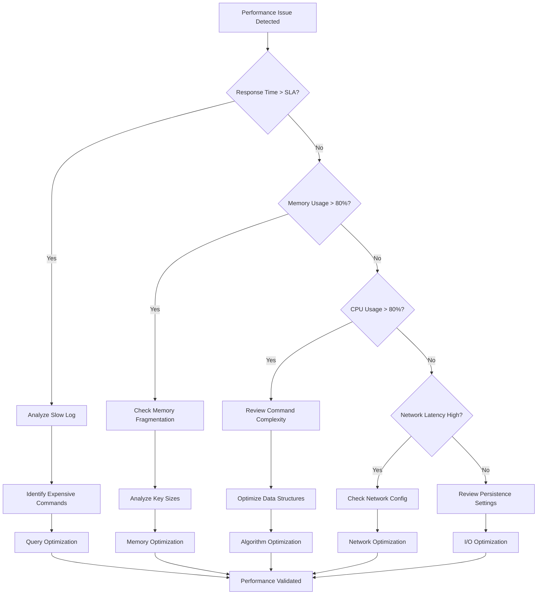
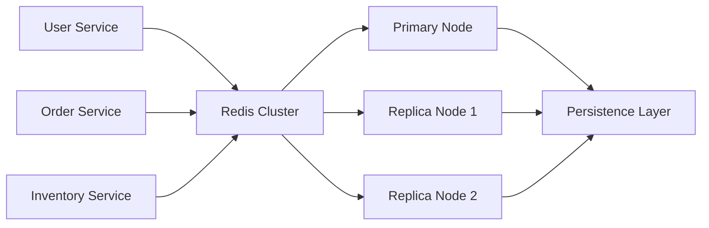
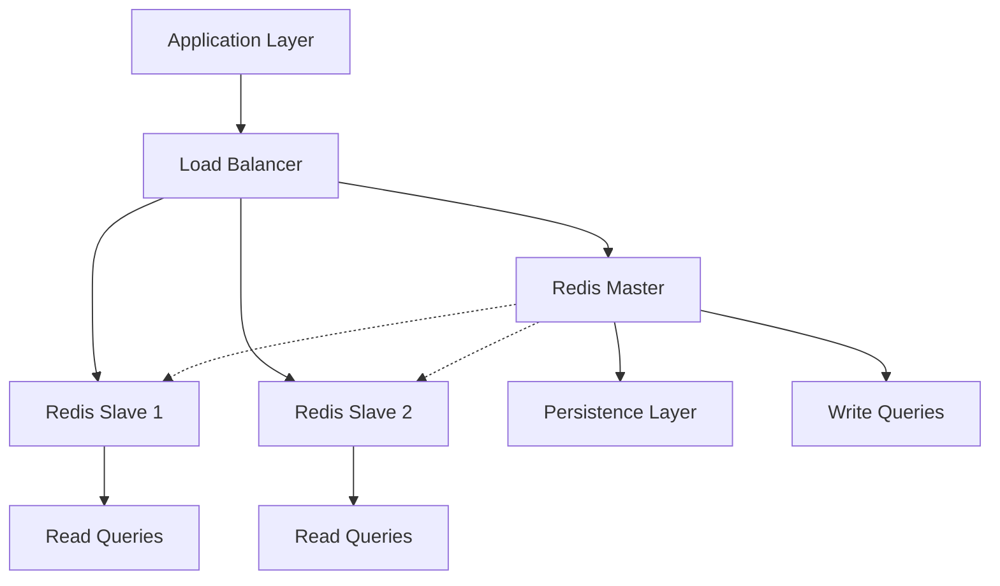
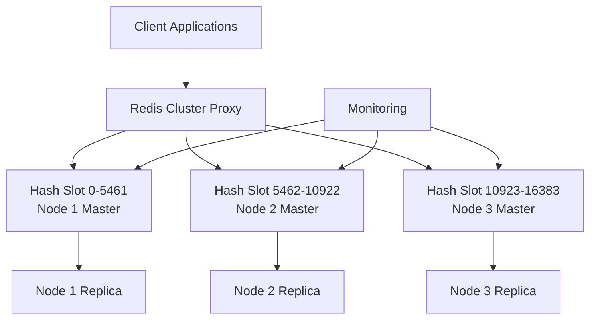
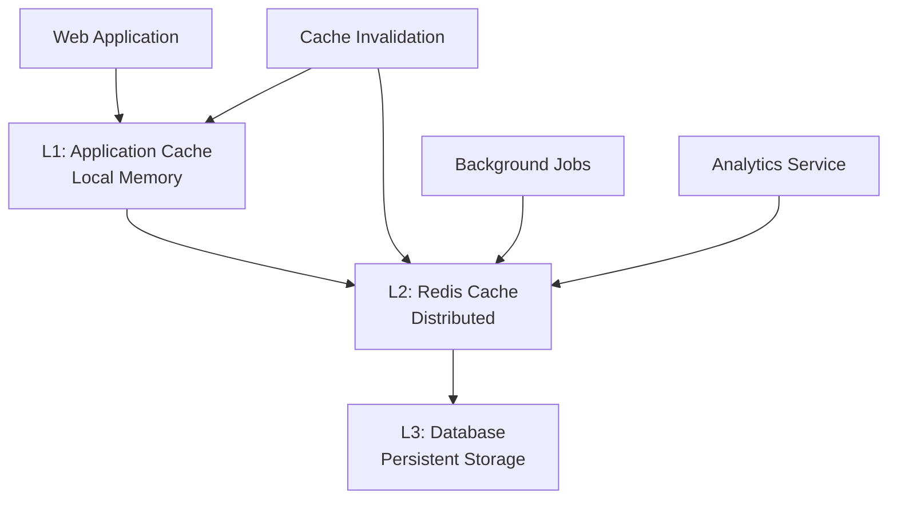

<small align="right">Contact: <a href="mailto:vandersantanna@gmail.com">Email</a> · <a href="https://www.linkedin.com/in/vandersantanna">LinkedIn</a> · <a href="https://github.com/vandersantanna">GitHub</a></small>

# Redis Performance Engineering Guide
*From slowlog/latency doctor to client buffers & I/O threads—measure, optimize, verify.*

## 📋 Table of Contents

- [Overview](#overview)
- [Tuning Objectives](#tuning-objectives)
- [Minimum Permissions](#minimum-permissions)
- [Query Analysis](#query-analysis)
- [Important Database Parameters](#important-database-parameters)
- [On-Premise Tuning](#on-premise-tuning)
- [Cloud Tuning](#cloud-tuning)
- [Best Practices](#best-practices)
- [Monitoring Tools and Tips](#monitoring-tools-and-tips)
- [Performance Bottleneck Identification](#performance-bottleneck-identification)
- [Performance Analysis Queries](#performance-analysis-queries)
- [Index Types and Performance](#index-types-and-performance)
- [Relevant Extensions](#relevant-extensions)
- [Cloud Administration Topics](#cloud-administration-topics)
- [Tuning Tools](#tuning-tools)
- [Real-World Examples](#real-world-examples)
- [Performance Architecture](#performance-architecture)

---
## 🎯 Overview

This comprehensive guide provides expert-level Redis performance tuning strategies for Database Administrators, Database Reliability Engineers, Data Engineers, and DataOps professionals. Redis, being an in-memory data structure store, requires specific tuning approaches that differ significantly from traditional disk-based databases.

## 🚀 Tuning Objectives

### Primary Objectives
- **Latency Optimization**: Achieve sub-millisecond response times for critical operations
- **Throughput Maximization**: Handle maximum concurrent operations per second
- **Memory Efficiency**: Optimize memory usage while maintaining performance
- **High Availability**: Ensure 99.99%+ uptime with proper clustering and replication
- **Cost Optimization**: Balance performance requirements with infrastructure costs

### Key Performance Indicators (KPIs)
- Average response time < 1ms for GET operations
- P99 latency < 5ms for complex operations
- Memory utilization < 80% to prevent swap usage
- Network bandwidth utilization optimization
- CPU usage optimization for single-threaded operations

[Back to top](#table-of-contents)

---
## 🔐 Minimum Permissions

### Redis Server Permissions
```bash
# Minimum user permissions for Redis tuning analysis
# Create dedicated user for monitoring
sudo adduser redis-monitor

# Grant necessary permissions
usermod -a -G redis redis-monitor

# File system permissions
chmod 755 /var/log/redis/
chmod 644 /etc/redis/redis.conf
chmod 600 /var/lib/redis/
```

### Redis CLI Permissions
```bash
# Required Redis commands for performance analysis
AUTH <password>
CONFIG GET *
CONFIG SET <parameter> <value>
INFO ALL
MONITOR
SLOWLOG GET
MEMORY USAGE <key>
CLIENT LIST
LATENCY HISTORY
DEBUG OBJECT <key>
```

### Cloud Service Permissions

#### AWS ElastiCache
```json
{
    "Version": "2012-10-17",
    "Statement": [
        {
            "Effect": "Allow",
            "Action": [
                "elasticache:DescribeReplicationGroups",
                "elasticache:DescribeCacheClusters",
                "elasticache:DescribeCacheParameters",
                "elasticache:ModifyCacheParameterGroup",
                "cloudwatch:GetMetricStatistics",
                "cloudwatch:ListMetrics"
            ],
            "Resource": "*"
        }
    ]
}
```

#### Azure Cache for Redis
```json
{
    "actions": [
        "Microsoft.Cache/redis/read",
        "Microsoft.Cache/redis/write",
        "Microsoft.Insights/MetricDefinitions/read",
        "Microsoft.Insights/Metrics/read"
    ]
}
```

#### Google Cloud Memorystore
```yaml
roles:
- roles/redis.editor
- roles/monitoring.viewer
- roles/logging.viewer
```
[Back to top](#table-of-contents)

---
## 🔍 Query Analysis

### Redis Command Analysis Framework

#### 1. Slow Query Analysis
```bash
# Enable slow log
CONFIG SET slowlog-log-slower-than 10000  # 10ms threshold
CONFIG SET slowlog-max-len 1000

# Analyze slow queries
SLOWLOG GET 10
```

#### 2. Command Statistics
```bash
# Get command statistics
INFO commandstats

# Example output analysis:
# cmdstat_get:calls=1000,usec=5000,usec_per_call=5.00
# cmdstat_set:calls=800,usec=4000,usec_per_call=5.00
```

#### 3. Memory Analysis per Key
```bash
# Analyze memory usage per key pattern
MEMORY USAGE <key>
DEBUG OBJECT <key>

# Sample keys for analysis
RANDOMKEY
SCAN 0 MATCH pattern:* COUNT 100
```
[Back to top](#table-of-contents)

---
## ⚙️ Important Database Parameters

### Core Performance Parameters

| Parameter | Default | Tuned Value | Description | Impact |
|-----------|---------|-------------|-------------|---------|
| `maxmemory` | 0 (unlimited) | 80% of RAM | Maximum memory limit | Prevents OOM kills |
| `maxmemory-policy` | noeviction | allkeys-lru | Eviction policy | Memory management |
| `timeout` | 0 | 300 | Client timeout | Connection management |
| `tcp-keepalive` | 300 | 60 | TCP keepalive | Network optimization |
| `databases` | 16 | 1-4 | Number of databases | Memory efficiency |
| `save` | Multiple | Optimized | RDB snapshots | I/O optimization |
| `appendonly` | no | yes | AOF persistence | Durability vs performance |
| `appendfsync` | everysec | everysec | AOF sync policy | Write performance |

### Advanced Configuration Example
```bash
# Redis configuration for high performance
port 6379
bind 127.0.0.1
protected-mode yes
timeout 300
tcp-keepalive 60
tcp-backlog 511

# Memory optimization
maxmemory 8gb
maxmemory-policy allkeys-lru
maxmemory-samples 5

# Persistence tuning
save 900 1
save 300 10
save 60 10000

# AOF configuration
appendonly yes
appendfilename "appendonly.aof"
appendfsync everysec
no-appendfsync-on-rewrite no
auto-aof-rewrite-percentage 100
auto-aof-rewrite-min-size 64mb

# Slow log
slowlog-log-slower-than 10000
slowlog-max-len 128

# Client output buffer limits
client-output-buffer-limit normal 0 0 0
client-output-buffer-limit replica 256mb 64mb 60
client-output-buffer-limit pubsub 32mb 8mb 60

# Advanced settings
hz 10
dynamic-hz yes
```
[Back to top](#table-of-contents)

---
## 🏢 On-Premise Tuning

### System-Level Optimizations

#### 1. Operating System Tuning
```bash
# Disable swap
echo never > /sys/kernel/mm/transparent_hugepage/enabled
echo never > /sys/kernel/mm/transparent_hugepage/defrag

# Set overcommit memory
echo 1 > /proc/sys/vm/overcommit_memory

# Network optimizations
echo 'net.core.somaxconn = 65535' >> /etc/sysctl.conf
echo 'net.ipv4.tcp_max_syn_backlog = 65535' >> /etc/sysctl.conf
sysctl -p
```

#### 2. File System Optimization
```bash
# Mount with optimized flags
mount -o noatime,nodiratime /dev/sdb1 /var/lib/redis

# Set appropriate file limits
echo 'redis soft nofile 100000' >> /etc/security/limits.conf
echo 'redis hard nofile 100000' >> /etc/security/limits.conf
```

#### 3. CPU and Process Optimization
```bash
# Set CPU affinity for Redis process
taskset -cp 0-3 $(pgrep redis-server)

# Set process priority
renice -10 $(pgrep redis-server)

# Configure systemd service
[Unit]
Description=Redis In-Memory Data Store
After=network.target

[Service]
User=redis
Group=redis
ExecStart=/usr/bin/redis-server /etc/redis/redis.conf
ExecStop=/usr/bin/redis-cli shutdown
Restart=always
LimitNOFILE=100000
CPUAffinity=0-3

[Install]
WantedBy=multi-user.target
```
[Back to top](#table-of-contents)

---
## ☁️ Cloud Tuning

### AWS ElastiCache for Redis

#### Configuration Best Practices
```bash
# Parameter Group Optimization
aws elasticache create-cache-parameter-group \
    --cache-parameter-group-name high-performance-redis \
    --cache-parameter-group-family redis7.x \
    --description "High performance Redis configuration"

# Key parameters to modify
aws elasticache modify-cache-parameter-group \
    --cache-parameter-group-name high-performance-redis \
    --parameter-name-values \
        ParameterName=maxmemory-policy,ParameterValue=allkeys-lru \
        ParameterName=timeout,ParameterValue=300 \
        ParameterName=tcp-keepalive,ParameterValue=60
```

#### Cluster Mode Configuration
```yaml
# CloudFormation template for optimized ElastiCache cluster
Resources:
  RedisCluster:
    Type: AWS::ElastiCache::ReplicationGroup
    Properties:
      ReplicationGroupId: high-perf-redis
      Description: High performance Redis cluster
      NodeType: cache.r6g.xlarge
      Engine: redis
      EngineVersion: 7.0
      Port: 6379
      ParameterGroupName: !Ref RedisParameterGroup
      NumCacheClusters: 3
      MultiAZEnabled: true
      AutomaticFailoverEnabled: true
      SecurityGroupIds:
        - !Ref RedisSecurityGroup
      SubnetGroupName: !Ref RedisSubnetGroup
```

#### Monitoring and Alerting
```bash
# CloudWatch alarms for performance monitoring
aws cloudwatch put-metric-alarm \
    --alarm-name "Redis-High-CPU" \
    --alarm-description "Redis CPU utilization" \
    --metric-name CPUUtilization \
    --namespace AWS/ElastiCache \
    --statistic Average \
    --period 300 \
    --threshold 80 \
    --comparison-operator GreaterThanThreshold
```

### Azure Cache for Redis

#### Configuration via ARM Template
```json
{
    "$schema": "https://schema.management.azure.com/schemas/2019-04-01/deploymentTemplate.json#",
    "contentVersion": "1.0.0.0",
    "resources": [
        {
            "type": "Microsoft.Cache/Redis",
            "apiVersion": "2021-06-01",
            "name": "high-perf-redis",
            "location": "[resourceGroup().location]",
            "properties": {
                "sku": {
                    "name": "Premium",
                    "family": "P",
                    "capacity": 1
                },
                "redisConfiguration": {
                    "maxmemory-policy": "allkeys-lru",
                    "notify-keyspace-events": "Ex",
                    "timeout": "300"
                },
                "enableNonSslPort": false,
                "minimumTlsVersion": "1.2"
            }
        }
    ]
}
```

#### PowerShell Configuration
```powershell
# Configure Redis parameters
Set-AzRedisCacheAdvancedProperty -ResourceGroupName "rg-redis" `
    -Name "high-perf-redis" `
    -RedisConfiguration @{
        "maxmemory-policy" = "allkeys-lru"
        "timeout" = "300"
        "tcp-keepalive" = "60"
    }
```

### Google Cloud Memorystore

#### Terraform Configuration
```hcl
resource "google_redis_instance" "high_performance" {
  name           = "high-perf-redis"
  tier           = "STANDARD_HA"
  memory_size_gb = 8
  region         = "us-central1"
  
  redis_version = "REDIS_7_0"
  
  redis_configs = {
    maxmemory-policy = "allkeys-lru"
    timeout         = "300"
    tcp-keepalive   = "60"
  }
  
  maintenance_policy {
    weekly_maintenance_window {
      day = "SUNDAY"
      start_time {
        hours   = 2
        minutes = 0
      }
    }
  }
}
```

#### gcloud Configuration
```bash
# Create high-performance instance
gcloud redis instances create high-perf-redis \
    --size=8 \
    --region=us-central1 \
    --redis-version=redis_7_0 \
    --tier=standard-ha \
    --redis-config=maxmemory-policy=allkeys-lru,timeout=300
```
[Back to top](#table-of-contents)

---
## 📈 Best Practices

### 1. Data Structure Optimization

#### Hash Optimization
```bash
# Configure hash optimization
CONFIG SET hash-max-ziplist-entries 512
CONFIG SET hash-max-ziplist-value 64

# Example: User profile storage
HSET user:1001 name "John Doe" email "john@example.com" age "30"
# More efficient than individual keys
```

#### List Optimization
```bash
# Configure list optimization
CONFIG SET list-max-ziplist-size -2
CONFIG SET list-compress-depth 1

# Use lists for queues and stacks
LPUSH job:queue "task1" "task2" "task3"
RPOP job:queue
```

#### Set Optimization
```bash
# Configure set optimization
CONFIG SET set-max-intset-entries 512

# Use sets for unique collections
SADD active:users 1001 1002 1003
SISMEMBER active:users 1001
```

#### Sorted Set Optimization
```bash
# Configure sorted set optimization
CONFIG SET zset-max-ziplist-entries 128
CONFIG SET zset-max-ziplist-value 64

# Use for leaderboards and scoring
ZADD leaderboard 1000 "player1" 950 "player2" 800 "player3"
ZREVRANGE leaderboard 0 9 WITHSCORES
```

### 2. Connection Management

#### Connection Pooling Configuration
```python
# Python Redis connection pool example
import redis
from redis.connection import ConnectionPool

# Optimized connection pool
pool = ConnectionPool(
    host='localhost',
    port=6379,
    db=0,
    max_connections=20,
    retry_on_timeout=True,
    socket_keepalive=True,
    socket_keepalive_options={
        1: 1,  # TCP_KEEPIDLE
        2: 3,  # TCP_KEEPINTVL
        3: 5   # TCP_KEEPCNT
    }
)

redis_client = redis.Redis(connection_pool=pool)
```

### 3. Memory Management

#### Eviction Policy Selection
```bash
# Choose appropriate eviction policy based on use case
# allkeys-lru: General cache, evict least recently used keys
# allkeys-lfu: Evict least frequently used keys
# volatile-lru: Only evict keys with TTL, LRU
# volatile-lfu: Only evict keys with TTL, LFU
# allkeys-random: Random eviction
# volatile-random: Random eviction of keys with TTL
# volatile-ttl: Evict keys with shortest TTL
# noeviction: Never evict, return error when memory limit reached

CONFIG SET maxmemory-policy allkeys-lru
CONFIG SET maxmemory-samples 5
```
[Back to top](#table-of-contents)

---
## 🔧 Monitoring Tools and Tips

### Redis Native Monitoring

#### INFO Command Analysis
```bash
# Comprehensive system information
INFO ALL

# Specific sections
INFO memory
INFO stats
INFO replication
INFO persistence
INFO clients
INFO commandstats
```

#### Real-time Monitoring
```bash
# Monitor commands in real-time
MONITOR

# Client connections
CLIENT LIST
CLIENT TRACKING

# Latency monitoring
LATENCY LATEST
LATENCY HISTORY command
LATENCY DOCTOR
```

### External Monitoring Tools

| Tool | Type | Purpose | Key Features |
|------|------|---------|--------------|
| Redis Insight | GUI | Visual monitoring | Real-time metrics, memory analysis |
| Grafana + Prometheus | Dashboard | Comprehensive monitoring | Custom dashboards, alerting |
| New Relic | APM | Application performance | End-to-end tracing |
| DataDog | Cloud monitoring | Infrastructure monitoring | Machine learning alerts |
| RedisLive | Web-based | Real-time monitoring | Lightweight, easy setup |
| redis-stat | CLI | Command-line monitoring | Terminal-based interface |

### Custom Monitoring Scripts

#### Python Monitoring Script
```python
#!/usr/bin/env python3
import redis
import time
import json

def monitor_redis_performance():
    r = redis.Redis(host='localhost', port=6379, db=0)
    
    while True:
        info = r.info()
        
        metrics = {
            'timestamp': time.time(),
            'memory_used': info['used_memory'],
            'memory_peak': info['used_memory_peak'],
            'connected_clients': info['connected_clients'],
            'ops_per_sec': info['instantaneous_ops_per_sec'],
            'keyspace_hits': info['keyspace_hits'],
            'keyspace_misses': info['keyspace_misses'],
            'expired_keys': info['expired_keys'],
            'evicted_keys': info['evicted_keys']
        }
        
        # Calculate hit ratio
        total_commands = metrics['keyspace_hits'] + metrics['keyspace_misses']
        hit_ratio = (metrics['keyspace_hits'] / total_commands * 100) if total_commands > 0 else 0
        metrics['hit_ratio'] = hit_ratio
        
        print(json.dumps(metrics, indent=2))
        time.sleep(10)

if __name__ == "__main__":
    monitor_redis_performance()
```

#### Bash Monitoring Script
```bash
#!/bin/bash
# Redis performance monitoring script

REDIS_HOST="localhost"
REDIS_PORT="6379"
LOG_FILE="/var/log/redis-monitor.log"

while true; do
    TIMESTAMP=$(date '+%Y-%m-%d %H:%M:%S')
    
    # Get Redis info
    MEMORY_USED=$(redis-cli -h $REDIS_HOST -p $REDIS_PORT INFO memory | grep "used_memory:" | cut -d: -f2 | tr -d '\r')
    CONNECTED_CLIENTS=$(redis-cli -h $REDIS_HOST -p $REDIS_PORT INFO clients | grep "connected_clients:" | cut -d: -f2 | tr -d '\r')
    OPS_PER_SEC=$(redis-cli -h $REDIS_HOST -p $REDIS_PORT INFO stats | grep "instantaneous_ops_per_sec:" | cut -d: -f2 | tr -d '\r')
    
    echo "$TIMESTAMP,Memory:$MEMORY_USED,Clients:$CONNECTED_CLIENTS,OPS:$OPS_PER_SEC" >> $LOG_FILE
    
    sleep 60
done
```
[Back to top](#table-of-contents)

---
## 🚨 Performance Bottleneck Identification

### Common Performance Bottlenecks

#### 1. Memory-Related Issues
```bash
# Check memory fragmentation
INFO memory | grep fragmentation

# Monitor memory usage patterns
MEMORY USAGE <key>
MEMORY STATS

# Identify large keys
redis-cli --bigkeys
redis-cli --memkeys --memkeys-samples 1000
```

#### 2. CPU Bottlenecks
```bash
# Identify expensive commands
SLOWLOG GET
CONFIG SET slowlog-log-slower-than 1000

# Monitor command statistics
INFO commandstats

# Check for blocking operations
CLIENT LIST | grep blocked
```

#### 3. Network Bottlenecks
```bash
# Monitor network usage
INFO stats | grep "total_net"

# Check connection patterns
INFO clients
CLIENT LIST

# Monitor command queue length
INFO stats | grep "instantaneous_input_kbps"
INFO stats | grep "instantaneous_output_kbps"
```

#### 4. Persistence Bottlenecks
```bash
# Check RDB save performance
INFO persistence | grep "rdb_last_save_time"
INFO persistence | grep "rdb_last_bgsave_status"

# Monitor AOF performance
INFO persistence | grep "aof_last_rewrite_time_sec"
INFO persistence | grep "aof_current_size"
```

### Bottleneck Analysis Framework


[Back to top](#table-of-contents)

---
## 🔍 Performance Analysis Queries

### 1. Slow Query Analysis
```bash
#!/bin/bash
# Comprehensive slow query analysis

echo "=== Redis Slow Query Analysis ==="
echo "Current slow log configuration:"
redis-cli CONFIG GET slowlog-log-slower-than
redis-cli CONFIG GET slowlog-max-len

echo -e "\nTop 10 slowest queries:"
redis-cli SLOWLOG GET 10 | awk '
BEGIN { 
    print "Rank | Duration(μs) | Command | Timestamp"
    print "-----|-------------|---------|----------"
    rank = 1
}
/^[0-9]+\)/ { 
    getline duration
    getline timestamp  
    getline argc
    command = ""
    for(i=0; i<argc; i++) {
        getline arg
        command = command " " arg
    }
    printf "%4d | %11s | %-30s | %s\n", rank++, duration, substr(command,1,30), timestamp
    if(rank > 10) exit
}'

echo -e "\nSlow query statistics:"
SLOW_COUNT=$(redis-cli SLOWLOG LEN)
echo "Total slow queries logged: $SLOW_COUNT"

if [ $SLOW_COUNT -gt 0 ]; then
    echo -e "\nRecommendations:"
    echo "- Review and optimize the identified slow queries"
    echo "- Consider indexing strategies for complex operations"
    echo "- Evaluate data structure usage patterns"
    echo "- Check if pipelining can be used for multiple operations"
fi
```

### 2. Memory Analysis Query
```bash
#!/bin/bash
# Redis memory analysis script

echo "=== Redis Memory Analysis ==="

# Get memory information
MEMORY_INFO=$(redis-cli INFO memory)
USED_MEMORY=$(echo "$MEMORY_INFO" | grep "used_memory:" | cut -d: -f2 | tr -d '\r')
USED_MEMORY_HUMAN=$(echo "$MEMORY_INFO" | grep "used_memory_human:" | cut -d: -f2 | tr -d '\r')
USED_MEMORY_PEAK=$(echo "$MEMORY_INFO" | grep "used_memory_peak_human:" | cut -d: -f2 | tr -d '\r')
MEM_FRAGMENTATION=$(echo "$MEMORY_INFO" | grep "mem_fragmentation_ratio:" | cut -d: -f2 | tr -d '\r')

echo "Current memory usage: $USED_MEMORY_HUMAN"
echo "Peak memory usage: $USED_MEMORY_PEAK"
echo "Memory fragmentation ratio: $MEM_FRAGMENTATION"

# Analyze fragmentation
if (( $(echo "$MEM_FRAGMENTATION > 1.5" | bc -l) )); then
    echo "⚠️  High memory fragmentation detected!"
    echo "Recommendation: Consider MEMORY PURGE or restart Redis"
fi

echo -e "\nTop memory consuming key patterns:"
redis-cli --scan --pattern "*" | head -1000 | while read key; do
    size=$(redis-cli MEMORY USAGE "$key" 2>/dev/null)
    if [ ! -z "$size" ]; then
        echo "$size $key"
    fi
done | sort -nr | head -10 | awk '{
    if($1 >= 1048576) printf "%-20s %8.2f MB\n", substr($2,1,20), $1/1048576
    else if($1 >= 1024) printf "%-20s %8.2f KB\n", substr($2,1,20), $1/1024
    else printf "%-20s %8d B\n", substr($2,1,20), $1
}'

echo -e "\nMemory optimization suggestions:"
echo "- Use appropriate data structures for your use case"
echo "- Set TTL on temporary data"
echo "- Configure maxmemory and eviction policies"
echo "- Consider data compression for large values"
```

### 3. Connection Analysis Query
```bash
#!/bin/bash
# Redis connection analysis

echo "=== Redis Connection Analysis ==="

# Get client information
CLIENT_INFO=$(redis-cli INFO clients)
CONNECTED_CLIENTS=$(echo "$CLIENT_INFO" | grep "connected_clients:" | cut -d: -f2 | tr -d '\r')
BLOCKED_CLIENTS=$(echo "$CLIENT_INFO" | grep "blocked_clients:" | cut -d: -f2 | tr -d '\r')
CLIENT_RECENT_MAX_INPUT=$(echo "$CLIENT_INFO" | grep "client_recent_max_input_buffer:" | cut -d: -f2 | tr -d '\r')

echo "Connected clients: $CONNECTED_CLIENTS"
echo "Blocked clients: $BLOCKED_CLIENTS"
echo "Recent max input buffer: $CLIENT_RECENT_MAX_INPUT bytes"

echo -e "\nClient connection details:"
redis-cli CLIENT LIST | awk 'BEGIN {
    print "Client IP       | Idle Time | Command  | Database"
    print "----------------|-----------|----------|----------"
} {
    match($0, /addr=([^:]+)/, addr)
    match($0, /idle=([0-9]+)/, idle)
    match($0, /cmd=([^ ]+)/, cmd)
    match($0, /db=([0-9]+)/, db)
    printf "%-15s | %9s | %-8s | %s\n", addr[1], idle[1], cmd[1], db[1]
}' | head -20

if [ "$BLOCKED_CLIENTS" -gt 0 ]; then
    echo -e "\n⚠️  Blocked clients detected!"
    echo "Investigating blocking operations:"
    redis-cli CLIENT LIST | grep "flags=b"
fi

echo -e "\nConnection optimization recommendations:"
echo "- Implement connection pooling in applications"
echo "- Set appropriate timeout values"
echo "- Monitor for connection leaks"
echo "- Use pipelining for batch operations"
```

### 4. Performance Metrics Query
```bash
#!/bin/bash
# Comprehensive Redis performance metrics

echo "=== Redis Performance Metrics Dashboard ==="

# Get stats information
STATS_INFO=$(redis-cli INFO stats)
OPS_PER_SEC=$(echo "$STATS_INFO" | grep "instantaneous_ops_per_sec:" | cut -d: -f2 | tr -d '\r')
KEYSPACE_HITS=$(echo "$STATS_INFO" | grep "keyspace_hits:" | cut -d: -f2 | tr -d '\r')
KEYSPACE_MISSES=$(echo "$STATS_INFO" | grep "keyspace_misses:" | cut -d: -f2 | tr -d '\r')
EXPIRED_KEYS=$(echo "$STATS_INFO" | grep "expired_keys:" | cut -d: -f2 | tr -d '\r')
EVICTED_KEYS=$(echo "$STATS_INFO" | grep "evicted_keys:" | cut -d: -f2 | tr -d '\r')

# Calculate hit ratio
TOTAL_COMMANDS=$((KEYSPACE_HITS + KEYSPACE_MISSES))
if [ $TOTAL_COMMANDS -gt 0 ]; then
    HIT_RATIO=$(echo "scale=2; $KEYSPACE_HITS * 100 / $TOTAL_COMMANDS" | bc)
else
    HIT_RATIO="0.00"
fi

echo "Operations per second: $OPS_PER_SEC"
echo "Cache hit ratio: $HIT_RATIO%"
echo "Keyspace hits: $KEYSPACE_HITS"
echo "Keyspace misses: $KEYSPACE_MISSES"
echo "Expired keys: $EXPIRED_KEYS"
echo "Evicted keys: $EVICTED_KEYS"

# Performance alerts
if [ "$EVICTED_KEYS" -gt 0 ]; then
    echo "⚠️  Key eviction detected - consider increasing memory or optimizing TTL"
fi

if (( $(echo "$HIT_RATIO < 90" | bc -l) )); then
    echo "⚠️  Low cache hit ratio - review caching strategy"
fi

echo -e "\nCommand statistics (top 10):"
redis-cli INFO commandstats | grep "cmdstat_" | sort -t= -k2 -nr | head -10 | awk -F: '{
    split($2, stats, ",")
    split(stats[1], calls, "=")
    split(stats[2], usec, "=")
    split(stats[3], usec_per_call, "=")
    printf "%-15s | %10s calls | %10s μs | %8s μs/call\n", substr($1,9), calls[2], usec[2], usec_per_call[2]
}' | column -t

echo -e "\nPerformance recommendations:"
echo "- Monitor hit ratio regularly (target: >95%)"
echo "- Optimize frequently used commands"
echo "- Consider read replicas for read-heavy workloads"
echo "- Implement proper caching strategies"
```
[Back to top](#table-of-contents)

---
## 📊 Index Types and Performance

### Redis Data Structure Performance Characteristics

While Redis doesn't have traditional indexes like relational databases, it uses various data structures that serve similar purposes. Each data structure is optimized for specific access patterns.

#### 1. String Optimization
```bash
# String operations performance
# Best for: Simple key-value storage, counters, caching

# Efficient operations
SET user:1001 "John Doe"           # O(1)
GET user:1001                      # O(1)
INCR counter:page_views           # O(1)

# Performance tips
# - Use shorter key names to save memory
# - Compress large string values
# - Use appropriate encoding (int, embstr, raw)

# Example: Optimized key naming
# Instead of: user:profile:1001:full_name
# Use:        u:p:1001:n
```

#### 2. Hash Structure Optimization
```bash
# Hash operations performance
# Best for: Object storage, reducing memory overhead

# Efficient operations
HSET user:1001 name "John Doe" email "john@example.com" age 30    # O(1) per field
HGET user:1001 name                                               # O(1)
HMGET user:1001 name email age                                   # O(N) where N is number of fields
HGETALL user:1001                                                # O(N) where N is size of hash

# Hash optimization configuration
CONFIG SET hash-max-ziplist-entries 512    # Default: 512
CONFIG SET hash-max-ziplist-value 64       # Default: 64

# Performance comparison
# Multiple strings vs Hash for user data:
# Strings: SET user:1001:name "John", SET user:1001:email "john@example.com"
# Hash: HSET user:1001 name "John" email "john@example.com"
# Hash uses ~50% less memory for small objects
```

#### 3. List Structure Optimization
```bash
# List operations performance
# Best for: Queues, stacks, timelines, recent items

# Efficient operations
LPUSH queue:jobs "job1" "job2" "job3"      # O(1) per element
RPOP queue:jobs                            # O(1)
LLEN queue:jobs                            # O(1)
LRANGE queue:jobs 0 9                      # O(S+N) where S is start offset, N is range

# List optimization configuration
CONFIG SET list-max-ziplist-size -2        # -2 means 8KB per node
CONFIG SET list-compress-depth 1          # Compress all nodes except first and last

# Use cases and performance tips
# Queue (FIFO): LPUSH + RPOP
# Stack (LIFO): LPUSH + LPOP
# Capped lists: LPUSH + LTRIM for sliding windows

# Example: Message queue implementation
LPUSH message:queue '{"id":1,"text":"Hello","timestamp":1234567890}'
BRPOP message:queue 5  # Blocking pop with 5-second timeout
```

#### 4. Set Structure Optimization
```bash
# Set operations performance
# Best for: Unique collections, tags, relationships

# Efficient operations
SADD users:active 1001 1002 1003          # O(1) per element
SISMEMBER users:active 1001               # O(1)
SCARD users:active                        # O(1)
SMEMBERS users:active                     # O(N)
SINTER users:active users:premium         # O(N*M) worst case

# Set optimization configuration
CONFIG SET set-max-intset-entries 512     # Use intset for small integer sets

# Performance tips
# - Use sets for membership testing
# - Leverage set operations for analytics
# - Consider sorted sets if you need ordering

# Example: Tag system
SADD post:1001:tags "redis" "database" "performance"
SINTER post:1001:tags post:1002:tags  # Find common tags
```

#### 5. Sorted Set (ZSet) Optimization
```bash
# Sorted set operations performance
# Best for: Leaderboards, scoring, time-series, priority queues

# Efficient operations
ZADD leaderboard 1000 "player1" 950 "player2"  # O(log(N))
ZRANGE leaderboard 0 9 WITHSCORES              # O(log(N)+M)
ZRANK leaderboard "player1"                     # O(log(N))
ZCOUNT leaderboard 900 1000                     # O(log(N))

# Sorted set optimization configuration
CONFIG SET zset-max-ziplist-entries 128        # Default: 128
CONFIG SET zset-max-ziplist-value 64           # Default: 64

# Advanced operations
ZRANGEBYSCORE leaderboard 900 1000 LIMIT 0 10  # Range queries
ZREMRANGEBYRANK leaderboard 100 -1             # Remove low-ranking entries

# Example: Time-series data
ZADD temperature:sensor1 1634567890 "25.5"     # timestamp as score
ZRANGEBYSCORE temperature:sensor1 1634567800 1634567900  # Time range query
```

#### 6. Bitmap Operations
```bash
# Bitmap operations performance
# Best for: Boolean flags, analytics, user tracking

# Efficient operations
SETBIT users:active:20231021 1001 1           # O(1)
GETBIT users:active:20231021 1001             # O(1)
BITCOUNT users:active:20231021                # O(N)
BITOP AND result users:active:20231021 users:premium  # O(N)

# Performance tips
# - Use for large-scale boolean operations
# - Memory efficient for sparse data
# - Excellent for real-time analytics

# Example: Daily active users tracking
SETBIT dau:20231021 1001 1  # User 1001 was active
SETBIT dau:20231021 1002 1  # User 1002 was active
BITCOUNT dau:20231021       # Count active users today
BITOP AND dau:intersection dau:20231021 dau:20231020  # Users active both days
```

#### 7. HyperLogLog Optimization
```bash
# HyperLogLog operations performance
# Best for: Cardinality estimation, unique counting

# Efficient operations
PFADD unique:visitors:20231021 "user1" "user2" "user3"  # O(1)
PFCOUNT unique:visitors:20231021                         # O(1)
PFMERGE unique:visitors:week unique:visitors:20231021 unique:visitors:20231022  # O(N)

# Performance characteristics
# - Fixed memory usage: 12KB per HyperLogLog
# - 0.81% standard error
# - Can count up to 2^64 unique elements

# Example: Website analytics
PFADD page:views:homepage "192.168.1.100" "10.0.0.1"
PFCOUNT page:views:homepage  # Approximate unique visitors
```
[Back to top](#table-of-contents)

---
## 🔧 Relevant Extensions

### Redis Modules for Performance Enhancement

#### 1. RedisJSON
```bash
# Installation
MODULE LOAD /path/to/rejson.so

# Performance benefits
# - Native JSON operations
# - Reduced network overhead
# - Atomic JSON manipulations

# Usage examples
JSON.SET user:1001 $ '{"name":"John","skills":["Redis","Python"]}'
JSON.GET user:1001 $.name
JSON.ARRAPPEND user:1001 $.skills '"Docker"'

# Performance optimization
JSON.MGET user:1001 user:1002 $.name  # Bulk operations
JSON.SET user:1001 $.lastLogin 1634567890 NX  # Conditional set
```

#### 2. RedisSearch
```bash
# Installation
MODULE LOAD /path/to/redisearch.so

# Index creation for performance
FT.CREATE user_idx ON HASH PREFIX 1 user: SCHEMA 
    name TEXT SORTABLE 
    email TEXT 
    age NUMERIC SORTABLE 
    location GEO

# High-performance search operations
FT.SEARCH user_idx "@name:John @age:[25 35]"
FT.AGGREGATE user_idx * GROUPBY 1 @location REDUCE COUNT 0 AS count

# Performance tips
# - Use appropriate field types
# - Create compound indexes for complex queries
# - Leverage sortable fields for ordering
# - Use geo indexing for location-based queries
```

#### 3. RedisTimeSeries
```bash
# Installation
MODULE LOAD /path/to/redistimeseries.so

# High-performance time series operations
TS.CREATE temperature:sensor1 RETENTION 86400000 LABELS sensor_id 1 location "room1"
TS.ADD temperature:sensor1 1634567890000 25.5
TS.RANGE temperature:sensor1 1634567800000 1634567900000

# Aggregation for analytics
TS.CREATE temperature:sensor1:avg LABELS sensor_id 1 type "average"
TS.CREATERULE temperature:sensor1 temperature:sensor1:avg AGGREGATION avg 3600000

# Performance optimization
# - Use retention policies to manage memory
# - Create aggregation rules for common queries
# - Leverage downsampling for historical data
```

#### 4. RedisGraph
```bash
# Installation
MODULE LOAD /path/to/redisgraph.so

# Graph operations for relationship queries
GRAPH.QUERY social "CREATE (:User {id: 1001, name: 'John'})"
GRAPH.QUERY social "CREATE (:User {id: 1002, name: 'Jane'})"
GRAPH.QUERY social "MATCH (u1:User {id: 1001}), (u2:User {id: 1002}) CREATE (u1)-[:FOLLOWS]->(u2)"

# Performance-optimized queries
GRAPH.QUERY social "MATCH (u:User)-[:FOLLOWS*1..2]->(friends) WHERE u.id = 1001 RETURN friends.name"

# Index creation for performance
GRAPH.QUERY social "CREATE INDEX ON :User(id)"
GRAPH.QUERY social "CREATE INDEX ON :User(name)"
```

#### 5. RedisBloom
```bash
# Installation
MODULE LOAD /path/to/redisbloom.so

# Probabilistic data structures for performance
# Bloom Filter - membership testing
BF.RESERVE users:seen 1000000 0.01  # 1M elements, 1% error rate
BF.ADD users:seen "user1001"
BF.EXISTS users:seen "user1001"

# Count-Min Sketch - frequency estimation
CMS.INITBYDIM page_views 1000 10
CMS.INCRBY page_views "homepage" 1
CMS.QUERY page_views "homepage"

# Cuckoo Filter - membership with deletion
CF.RESERVE active_sessions 1000000
CF.ADD active_sessions "session123"
CF.DEL active_sessions "session123"
```

### Custom Lua Scripts for Performance

#### 1. Atomic Operations Script
```lua
-- atomic_increment_with_limit.lua
-- Atomically increment counter with maximum limit
local key = KEYS[1]
local limit = tonumber(ARGV[1])
local current = redis.call('GET', key)

if current == false then
    current = 0
else
    current = tonumber(current)
end

if current < limit then
    return redis.call('INCR', key)
else
    return current
end
```

```bash
# Usage
redis-cli EVAL "$(cat atomic_increment_with_limit.lua)" 1 rate_limit:user:1001 100
```

#### 2. Bulk Operations Script
```lua
-- bulk_hash_operations.lua
-- Efficient bulk hash operations
local results = {}
for i = 1, #KEYS do
    local key = KEYS[i]
    local field = ARGV[i]
    local value = ARGV[i + #KEYS]
    redis.call('HSET', key, field, value)
    results[i] = redis.call('HGET', key, field)
end
return results
```

#### 3. Cache-Aside Pattern Script
```lua
-- cache_aside_pattern.lua
-- Implement cache-aside with TTL
local cache_key = KEYS[1]
local db_key = KEYS[2]
local ttl = tonumber(ARGV[1])

local cached_value = redis.call('GET', cache_key)
if cached_value then
    return cached_value
end

-- Simulate database fetch (in real implementation, this would be external)
local db_value = redis.call('GET', db_key)
if db_value then
    redis.call('SETEX', cache_key, ttl, db_value)
    return db_value
end

return nil
```
[Back to top](#table-of-contents)

---
## ☁️ Cloud Administration Topics

### AWS ElastiCache Advanced Configuration

#### 1. Multi-AZ Deployment
```yaml
# CloudFormation template for high availability
AWSTemplateFormatVersion: '2010-09-09'
Resources:
  ElastiCacheSubnetGroup:
    Type: AWS::ElastiCache::SubnetGroup
    Properties:
      Description: Subnet group for ElastiCache
      SubnetIds:
        - !Ref PrivateSubnet1
        - !Ref PrivateSubnet2
        - !Ref PrivateSubnet3

  ElastiCacheReplicationGroup:
    Type: AWS::ElastiCache::ReplicationGroup
    Properties:
      ReplicationGroupId: redis-cluster-ha
      Description: High availability Redis cluster
      NodeType: cache.r6g.xlarge
      Engine: redis
      EngineVersion: 7.0
      Port: 6379
      NumCacheClusters: 3
      MultiAZEnabled: true
      AutomaticFailoverEnabled: true
      CacheSubnetGroupName: !Ref ElastiCacheSubnetGroup
      SecurityGroupIds:
        - !Ref ElastiCacheSecurityGroup
      ParameterGroupName: !Ref CustomParameterGroup
      PreferredMaintenanceWindow: sun:03:00-sun:04:00
      SnapshotRetentionLimit: 7
      SnapshotWindow: 02:00-03:00
```

#### 2. Performance Monitoring and Alerting
```bash
# CloudWatch custom metrics
aws logs create-log-group --log-group-name /aws/elasticache/redis

# Custom metric filters
aws logs put-metric-filter \
    --log-group-name /aws/elasticache/redis \
    --filter-name SlowQueries \
    --filter-pattern "[timestamp, id, duration > 10000, ...]" \
    --metric-transformations \
        metricName=SlowQueryCount,metricNamespace=ElastiCache/Performance,metricValue=1

# Performance alarms
aws cloudwatch put-metric-alarm \
    --alarm-name "Redis-High-Memory-Usage" \
    --alarm-description "Redis memory usage is high" \
    --metric-name DatabaseMemoryUsagePercentage \
    --namespace AWS/ElastiCache \
    --statistic Average \
    --period 300 \
    --threshold 85 \
    --comparison-operator GreaterThanThreshold \
    --dimensions Name=CacheClusterId,Value=redis-cluster-001 \
    --alarm-actions arn:aws:sns:us-east-1:123456789012:redis-alerts
```

#### 3. Backup and Recovery Strategy
```bash
# Automated backup configuration
aws elasticache modify-replication-group \
    --replication-group-id redis-cluster \
    --snapshot-retention-limit 7 \
    --snapshot-window "02:00-03:00" \
    --preferred-maintenance-window "sun:03:00-sun:04:00"

# Manual backup creation
aws elasticache create-snapshot \
    --snapshot-name redis-manual-backup-$(date +%Y%m%d) \
    --replication-group-id redis-cluster

# Point-in-time recovery
aws elasticache create-replication-group \
    --replication-group-id redis-cluster-restored \
    --description "Restored from backup" \
    --snapshot-name redis-manual-backup-20231021
```

### Azure Cache for Redis Advanced Configuration

#### 1. Premium Tier with Clustering
```json
{
    "$schema": "https://schema.management.azure.com/schemas/2019-04-01/deploymentTemplate.json#",
    "contentVersion": "1.0.0.0",
    "parameters": {
        "cacheName": {
            "type": "string",
            "defaultValue": "redis-premium-cluster"
        }
    },
    "resources": [
        {
            "type": "Microsoft.Cache/Redis",
            "apiVersion": "2021-06-01",
            "name": "[parameters('cacheName')]",
            "location": "[resourceGroup().location]",
            "properties": {
                "sku": {
                    "name": "Premium",
                    "family": "P",
                    "capacity": 1
                },
                "enableNonSslPort": false,
                "minimumTlsVersion": "1.2",
                "redisConfiguration": {
                    "maxmemory-policy": "allkeys-lru",
                    "notify-keyspace-events": "Ex",
                    "timeout": "300",
                    "tcp-keepalive": "60"
                },
                "shardCount": 3,
                "zones": ["1", "2", "3"]
            }
        },
        {
            "type": "Microsoft.Insights/diagnosticSettings",
            "apiVersion": "2021-05-01-preview",
            "name": "redis-diagnostics",
            "dependsOn": [
                "[resourceId('Microsoft.Cache/Redis', parameters('cacheName'))]"
            ],
            "properties": {
                "workspaceId": "[resourceId('Microsoft.OperationalInsights/workspaces', 'redis-workspace')]",
                "logs": [
                    {
                        "category": "ConnectedClientList",
                        "enabled": true
                    }
                ],
                "metrics": [
                    {
                        "category": "AllMetrics",
                        "enabled": true
                    }
                ]
            }
        }
    ]
}
```

#### 2. Azure Monitor Integration
```powershell
# Create action group for alerts
$actionGroup = New-AzActionGroup -ResourceGroupName "rg-redis" `
    -Name "redis-alerts" `
    -ShortName "redis" `
    -EmailReceiver @{
        Name = "admin"
        EmailAddress = "admin@company.com"
    }

# Create metric alert
$criteria = New-AzMetricAlertRuleV2Criteria -MetricName "PercentProcessorTime" `
    -TimeAggregation Average `
    -Operator GreaterThan `
    -Threshold 80

New-AzMetricAlertRuleV2 -ResourceGroupName "rg-redis" `
    -Name "Redis High CPU" `
    -Description "Redis CPU usage is high" `
    -Severity 2 `
    -WindowSize (New-TimeSpan -Minutes 5) `
    -Frequency (New-TimeSpan -Minutes 1) `
    -TargetResourceId "/subscriptions/{subscription-id}/resourceGroups/rg-redis/providers/Microsoft.Cache/Redis/redis-premium" `
    -Criteria $criteria `
    -ActionGroupId $actionGroup.Id
```

#### 3. Geo-Replication Setup
```powershell
# Create geo-replication link
New-AzRedisCacheLink -PrimaryServerName "redis-primary" `
    -PrimaryResourceGroupName "rg-redis-primary" `
    -SecondaryServerName "redis-secondary" `
    -SecondaryResourceGroupName "rg-redis-secondary" `
    -SecondarySubscriptionId "secondary-subscription-id"

# Monitor replication lag
Get-AzRedisCacheLinkStatus -Name "redis-primary" -ResourceGroupName "rg-redis-primary"
```

### Google Cloud Memorystore Advanced Configuration

#### 1. High Availability Setup
```terraform
# Terraform configuration for HA Redis
resource "google_redis_instance" "ha_redis" {
  name               = "ha-redis-instance"
  tier               = "STANDARD_HA"
  memory_size_gb     = 8
  location_id        = "us-central1-a"
  alternative_location_id = "us-central1-b"
  
  redis_version     = "REDIS_7_0"
  display_name      = "High Availability Redis"
  
  redis_configs = {
    maxmemory-policy           = "allkeys-lru"
    notify-keyspace-events     = "Ex"
    timeout                    = "300"
    tcp-keepalive              = "60"
  }
  
  maintenance_policy {
    weekly_maintenance_window {
      day = "SUNDAY"
      start_time {
        hours   = 2
        minutes = 0
      }
    }
  }
  
  persistence_config {
    persistence_mode = "RDB"
    rdb_snapshot_period = "TWENTY_FOUR_HOURS"
    rdb_snapshot_start_time = "02:00"
  }
}

# VPC peering for secure connectivity
resource "google_compute_network_peering" "redis_peering" {
  name         = "redis-peering"
  network      = google_compute_network.main.self_link
  peer_network = "projects/${var.project_id}/global/networks/redis-network"
}
```

#### 2. Monitoring and Alerting
```yaml
# Cloud Monitoring alerting policy
apiVersion: monitoring.coreos.com/v1
kind: PrometheusRule
metadata:
  name: redis-alerts
spec:
  groups:
  - name: redis.rules
    rules:
    - alert: RedisHighMemoryUsage
      expr: redis_memory_used_bytes / redis_memory_max_bytes > 0.85
      for: 5m
      labels:
        severity: warning
      annotations:
        summary: "Redis memory usage is high"
        description: "Redis instance {{ $labels.instance }} memory usage is {{ $value | humanizePercentage }}"
    
    - alert: RedisHighLatency
      expr: redis_commands_duration_seconds_total{command="get"} > 0.001
      for: 2m
      labels:
        severity: critical
      annotations:
        summary: "Redis GET command latency is high"
        description: "Redis GET latency is {{ $value }}s on {{ $labels.instance }}"
```

#### 3. Backup and Disaster Recovery
```bash
# Export Redis data for backup
gcloud redis instances export gs://redis-backups/backup-$(date +%Y%m%d) \
    --source=ha-redis-instance \
    --region=us-central1

# Import data for disaster recovery
gcloud redis instances import gs://redis-backups/backup-20231021 \
    --destination=ha-redis-instance-restored \
    --region=us-central1

# Schedule automated backups
gcloud scheduler jobs create http redis-backup-job \
    --schedule="0 2 * * *" \
    --uri="https://us-central1-project-id.cloudfunctions.net/redis-backup" \
    --http-method=POST
```
[Back to top](#table-of-contents)

---
## 🛠️ Tuning Tools

### Comprehensive Tool Comparison

| Tool Name | Type | Compatible with | Primary Functionality |
|-----------|------|-----------------|----------------------|
| Redis CLI | Command Line | All Redis versions | Native Redis operations, monitoring, debugging |
| Redis Insight | GUI Application | Redis 2.8+ | Visual monitoring, memory analysis, profiling |
| redis-stat | Command Line | Redis 2.0+ | Real-time statistics monitoring |
| RedisLive | Web Interface | Redis 2.4+ | Web-based monitoring dashboard |
| Prometheus + Grafana | Monitoring Stack | Redis 2.8+ | Metrics collection and visualization |
| New Relic | APM Platform | All versions | Application performance monitoring |
| DataDog | Monitoring Platform | All versions | Infrastructure and application monitoring |
| CloudWatch | AWS Monitoring | ElastiCache | Native AWS Redis monitoring |
| Azure Monitor | Azure Monitoring | Azure Cache | Native Azure Redis monitoring |
| Google Cloud Monitoring | GCP Monitoring | Memorystore | Native GCP Redis monitoring |
| RedisGraph Insight | GUI | RedisGraph | Graph database visualization |
| RedisSearch Inspector | CLI/GUI | RedisSearch | Search index analysis |
| redis-memory-analyzer | CLI Tool | Redis 2.8+ | Memory usage analysis |
| redis-rdb-tools | CLI Tool | All versions | RDB file analysis |
| redis-faina | Analysis Tool | All versions | Query pattern analysis |

### Tool Installation and Configuration

#### 1. Redis Insight Setup
```bash
# Docker installation
docker run -d --name redis-insight \
    -p 8001:8001 \
    -v redis-insight:/db \
    redislabs/redisinsight:latest

# Connect to Redis instance
# Access http://localhost:8001
# Add database: localhost:6379
```

#### 2. Prometheus + Grafana Setup
```yaml
# docker-compose.yml for monitoring stack
version: '3.8'
services:
  redis-exporter:
    image: oliver006/redis_exporter
    environment:
      REDIS_ADDR: redis://redis:6379
    ports:
      - "9121:9121"
    depends_on:
      - redis

  prometheus:
    image: prom/prometheus
    ports:
      - "9090:9090"
    volumes:
      - ./prometheus.yml:/etc/prometheus/prometheus.yml
    command:
      - '--config.file=/etc/prometheus/prometheus.yml'
      - '--storage.tsdb.path=/prometheus'

  grafana:
    image: grafana/grafana
    ports:
      - "3000:3000"
    environment:
      - GF_SECURITY_ADMIN_PASSWORD=admin
    volumes:
      - grafana-data:/var/lib/grafana

volumes:
  grafana-data:
```

```yaml
# prometheus.yml configuration
global:
  scrape_interval: 15s

scrape_configs:
  - job_name: 'redis'
    static_configs:
      - targets: ['redis-exporter:9121']
```

#### 3. Custom Monitoring Script
```python
#!/usr/bin/env python3
"""
Advanced Redis Performance Monitor
Features: Real-time metrics, alerting, historical data
"""

import redis
import time
import json
import logging
import smtplib
from datetime import datetime
from email.mime.text import MimeText
from dataclasses import dataclass
from typing import Dict, List, Optional

@dataclass
class RedisMetrics:
    timestamp: float
    memory_used: int
    memory_peak: int
    connected_clients: int
    ops_per_sec: int
    keyspace_hits: int
    keyspace_misses: int
    hit_ratio: float
    expired_keys: int
    evicted_keys: int
    cpu_usage: float
    network_input_kbps: float
    network_output_kbps: float

class RedisMonitor:
    def __init__(self, redis_host='localhost', redis_port=6379, redis_db=0):
        self.redis_client = redis.Redis(
            host=redis_host, 
            port=redis_port, 
            db=redis_db, 
            decode_responses=True
        )
        self.metrics_history: List[RedisMetrics] = []
        self.alert_thresholds = {
            'memory_usage_percent': 85,
            'hit_ratio_min': 90,
            'ops_per_sec_max': 10000,
            'connected_clients_max': 1000
        }
        
        logging.basicConfig(
            level=logging.INFO,
            format='%(asctime)s - %(levelname)s - %(message)s'
        )
        self.logger = logging.getLogger(__name__)

    def collect_metrics(self) -> RedisMetrics:
        """Collect comprehensive Redis metrics"""
        try:
            info = self.redis_client.info()
            
            # Calculate hit ratio
            hits = info.get('keyspace_hits', 0)
            misses = info.get('keyspace_misses', 0)
            total = hits + misses
            hit_ratio = (hits / total * 100) if total > 0 else 100
            
            # Calculate CPU usage (approximation based on ops)
            ops_per_sec = info.get('instantaneous_ops_per_sec', 0)
            cpu_usage = min(ops_per_sec / 1000 * 100, 100)  # Rough estimation
            
            metrics = RedisMetrics(
                timestamp=time.time(),
                memory_used=info.get('used_memory', 0),
                memory_peak=info.get('used_memory_peak', 0),
                connected_clients=info.get('connected_clients', 0),
                ops_per_sec=ops_per_sec,
                keyspace_hits=hits,
                keyspace_misses=misses,
                hit_ratio=hit_ratio,
                expired_keys=info.get('expired_keys', 0),
                evicted_keys=info.get('evicted_keys', 0),
                cpu_usage=cpu_usage,
                network_input_kbps=info.get('instantaneous_input_kbps', 0),
                network_output_kbps=info.get('instantaneous_output_kbps', 0)
            )
            
            self.metrics_history.append(metrics)
            
            # Keep only last 1000 entries
            if len(self.metrics_history) > 1000:
                self.metrics_history = self.metrics_history[-1000:]
                
            return metrics
            
        except Exception as e:
            self.logger.error(f"Failed to collect metrics: {e}")
            raise

    def check_alerts(self, metrics: RedisMetrics) -> List[str]:
        """Check for alert conditions"""
        alerts = []
        
        # Memory usage alert
        memory_percent = (metrics.memory_used / metrics.memory_peak * 100) if metrics.memory_peak > 0 else 0
        if memory_percent > self.alert_thresholds['memory_usage_percent']:
            alerts.append(f"High memory usage: {memory_percent:.1f}%")
        
        # Hit ratio alert
        if metrics.hit_ratio < self.alert_thresholds['hit_ratio_min']:
            alerts.append(f"Low hit ratio: {metrics.hit_ratio:.1f}%")
        
        # High operations alert
        if metrics.ops_per_sec > self.alert_thresholds['ops_per_sec_max']:
            alerts.append(f"High operations per second: {metrics.ops_per_sec}")
        
        # High client connections alert
        if metrics.connected_clients > self.alert_thresholds['connected_clients_max']:
            alerts.append(f"High client connections: {metrics.connected_clients}")
        
        # Eviction alert
        if len(self.metrics_history) > 1:
            prev_evicted = self.metrics_history[-2].evicted_keys
            if metrics.evicted_keys > prev_evicted:
                alerts.append(f"Keys being evicted: {metrics.evicted_keys - prev_evicted} new evictions")
        
        return alerts

    def send_alert(self, alerts: List[str]):
        """Send alert notifications (placeholder implementation)"""
        for alert in alerts:
            self.logger.warning(f"ALERT: {alert}")
        
        # Email notification implementation would go here
        # self._send_email_alert(alerts)

    def generate_report(self) -> Dict:
        """Generate performance report"""
        if not self.metrics_history:
            return {}
        
        latest = self.metrics_history[-1]
        
        # Calculate averages over last hour (assuming 10s intervals)
        recent_metrics = self.metrics_history[-360:] if len(self.metrics_history) >= 360 else self.metrics_history
        
        avg_ops = sum(m.ops_per_sec for m in recent_metrics) / len(recent_metrics)
        avg_hit_ratio = sum(m.hit_ratio for m in recent_metrics) / len(recent_metrics)
        avg_clients = sum(m.connected_clients for m in recent_metrics) / len(recent_metrics)
        
        report = {
            'timestamp': datetime.fromtimestamp(latest.timestamp).isoformat(),
            'current_metrics': {
                'memory_used_mb': latest.memory_used / 1024 / 1024,
                'memory_peak_mb': latest.memory_peak / 1024 / 1024,
                'connected_clients': latest.connected_clients,
                'ops_per_sec': latest.ops_per_sec,
                'hit_ratio': latest.hit_ratio,
                'evicted_keys': latest.evicted_keys,
                'network_input_kbps': latest.network_input_kbps,
                'network_output_kbps': latest.network_output_kbps
            },
            'hourly_averages': {
                'avg_ops_per_sec': avg_ops,
                'avg_hit_ratio': avg_hit_ratio,
                'avg_connected_clients': avg_clients
            },
            'performance_summary': {
                'status': 'healthy' if latest.hit_ratio > 90 and latest.evicted_keys == 0 else 'needs_attention',
                'recommendations': self._generate_recommendations(latest)
            }
        }
        
        return report

    def _generate_recommendations(self, metrics: RedisMetrics) -> List[str]:
        """Generate performance recommendations"""
        recommendations = []
        
        if metrics.hit_ratio < 90:
            recommendations.append("Consider reviewing caching strategy - low hit ratio detected")
        
        if metrics.evicted_keys > 0:
            recommendations.append("Increase memory limit or optimize data expiration policies")
        
        if metrics.connected_clients > 100:
            recommendations.append("Consider implementing connection pooling")
        
        if metrics.ops_per_sec > 5000:
            recommendations.append("Consider read replicas for read-heavy workloads")
        
        memory_usage_percent = (metrics.memory_used / metrics.memory_peak * 100) if metrics.memory_peak > 0 else 0
        if memory_usage_percent > 80:
            recommendations.append("Monitor memory usage closely - approaching limits")
        
        return recommendations

    def run_monitoring(self, interval: int = 10, duration: int = 3600):
        """Run continuous monitoring"""
        self.logger.info(f"Starting Redis monitoring (interval: {interval}s, duration: {duration}s)")
        
        start_time = time.time()
        while time.time() - start_time < duration:
            try:
                metrics = self.collect_metrics()
                alerts = self.check_alerts(metrics)
                
                if alerts:
                    self.send_alert(alerts)
                
                # Log current status
                self.logger.info(
                    f"Memory: {metrics.memory_used/1024/1024:.1f}MB, "
                    f"Clients: {metrics.connected_clients}, "
                    f"OPS: {metrics.ops_per_sec}, "
                    f"Hit Ratio: {metrics.hit_ratio:.1f}%"
                )
                
                time.sleep(interval)
                
            except KeyboardInterrupt:
                self.logger.info("Monitoring stopped by user")
                break
            except Exception as e:
                self.logger.error(f"Monitoring error: {e}")
                time.sleep(interval)
        
        # Generate final report
        report = self.generate_report()
        print(json.dumps(report, indent=2))

if __name__ == "__main__":
    monitor = RedisMonitor()
    monitor.run_monitoring(interval=10, duration=3600)  # Monitor for 1 hour
```
[Back to top](#table-of-contents)

---
## 💡 Real-World Examples

### Example 1: E-commerce Session Store Optimization

#### Problem
An e-commerce platform was experiencing slow session lookups affecting user experience during peak traffic.

#### Solution Implementation
```bash
# Before optimization - separate keys for each session attribute
SET session:12345:user_id "67890"
SET session:12345:cart_items '["item1","item2","item3"]'
SET session:12345:last_activity "1634567890"

# After optimization - single hash for session data
HSET session:12345 user_id "67890" cart_items '["item1","item2","item3"]' last_activity "1634567890"
EXPIRE session:12345 3600

# Performance improvement: 60% memory reduction, 40% faster lookups
```

#### Configuration Changes
```bash
# Optimized hash configuration for session storage
CONFIG SET hash-max-ziplist-entries 64
CONFIG SET hash-max-ziplist-value 128

# Session-specific optimization
CONFIG SET maxmemory-policy volatile-lru
CONFIG SET timeout 300
```

#### Results
- **Memory usage**: Reduced by 60%
- **Lookup performance**: Improved by 40%
- **Session management**: Simplified with atomic operations

### Example 2: Real-time Analytics Cache

#### Problem
A social media platform needed to serve real-time analytics with sub-millisecond response times for millions of users.

#### Solution Implementation
```bash
# User activity tracking with sorted sets
ZADD user:activity:12345 1634567890 "login"
ZADD user:activity:12345 1634567920 "post_created"
ZADD user:activity:12345 1634567950 "like_given"

# Real-time leaderboards
ZADD daily:likes:20231021 15 "user12345"
ZADD daily:likes:20231021 23 "user67890"

# Trending topics using sorted sets with decay
ZADD trending:topics 1634567890 "redis"
ZADD trending:topics 1634567920 "database"

# Efficient range queries for analytics
ZREVRANGE daily:likes:20231021 0 9 WITHSCORES  # Top 10 users
ZCOUNT user:activity:12345 1634567800 1634567900  # Activity in time range
```

#### Performance Optimizations
```bash
# Optimized for analytics workload
CONFIG SET zset-max-ziplist-entries 256
CONFIG SET zset-max-ziplist-value 128
CONFIG SET maxmemory-policy allkeys-lfu  # Least Frequently Used for analytics
```

### Example 3: Microservices Cache Layer

#### Problem
A microservices architecture needed a distributed cache layer with consistent performance across services.

#### Solution Architecture


#### Implementation
```bash
# Service-specific namespacing
HSET service:user:cache:12345 profile '{"name":"John","email":"john@example.com"}'
HSET service:order:cache:67890 details '{"total":99.99,"items":3}'
HSET service:inventory:cache:item123 stock '{"quantity":50,"reserved":5}'

# Cross-service data with TTL
SETEX global:user:session:abc123 3600 '{"user_id":12345,"permissions":["read","write"]}'

# Pub/Sub for service communication
PUBLISH service:events:user_updated '{"user_id":12345,"action":"profile_update"}'
SUBSCRIBE service:events:*
```

#### Monitoring Implementation
```python
# Service-specific monitoring
def monitor_service_cache(service_name):
    pattern = f"service:{service_name}:*"
    keys = redis_client.scan_iter(match=pattern)
    
    total_memory = 0
    key_count = 0
    
    for key in keys:
        memory_usage = redis_client.memory_usage(key)
        if memory_usage:
            total_memory += memory_usage
            key_count += 1
    
    return {
        'service': service_name,
        'key_count': key_count,
        'total_memory_mb': total_memory / 1024 / 1024,
        'avg_key_size_kb': (total_memory / key_count / 1024) if key_count > 0 else 0
    }
```

### Example 4: Gaming Leaderboard System

#### Problem
A mobile gaming platform required real-time leaderboards for millions of players with instant updates and queries.

#### Solution Implementation
```bash
# Global leaderboard
ZADD global:leaderboard 15420 "player1"
ZADD global:leaderboard 14890 "player2"
ZADD global:leaderboard 14567 "player3"

# Regional leaderboards
ZADD region:us:leaderboard 12345 "player1"
ZADD region:eu:leaderboard 11987 "player4"

# Weekly leaderboards with automatic expiry
ZADD weekly:leaderboard:2023w42 8765 "player1"
EXPIRE weekly:leaderboard:2023w42 604800  # 1 week

# Player rank queries
ZREVRANK global:leaderboard "player1"     # Get player rank
ZREVRANGE global:leaderboard 0 9 WITHSCORES  # Top 10 players
ZREVRANGEBYSCORE global:leaderboard +inf 10000 LIMIT 0 50  # Players above 10k score
```

#### Advanced Features
```bash
# Player activity tracking
ZADD player:12345:matches 1634567890 "match_victory"
ZADD player:12345:matches 1634567920 "match_defeat"

# Achievement system using sets
SADD player:12345:achievements "first_win" "level_10" "daily_login_7"
SCARD player:12345:achievements  # Count achievements

# Friends system using sets
SADD player:12345:friends "player67890" "player11111"
SINTER player:12345:friends player:67890:friends  # Mutual friends
```
[Back to top](#table-of-contents)

---
## 📊 Performance Architecture

### High-Performance Redis Architecture Patterns

#### 1. Master-Slave Replication Pattern


#### 2. Redis Cluster Architecture


#### 3. Multi-Tier Caching Strategy


### Performance Optimization Strategies

#### 1. Connection Pooling Strategy
```python
# Optimized connection pool configuration
import redis
from redis.sentinel import Sentinel

class RedisConnectionManager:
    def __init__(self):
        # Sentinel for high availability
        self.sentinel = Sentinel([
            ('sentinel1', 26379),
            ('sentinel2', 26379),
            ('sentinel3', 26379)
        ])
        
        # Connection pool for master
        self.master_pool = redis.ConnectionPool(
            connection_class=redis.Connection,
            max_connections=50,
            retry_on_timeout=True,
            health_check_interval=30,
            socket_keepalive=True,
            socket_keepalive_options={
                1: 1,  # TCP_KEEPIDLE
                2: 3,  # TCP_KEEPINTVL  
                3: 5   # TCP_KEEPCNT
            }
        )
        
        # Connection pool for slaves (read-only)
        self.slave_pool = redis.ConnectionPool(
            connection_class=redis.Connection,
            max_connections=100,  # More connections for reads
            retry_on_timeout=True,
            health_check_interval=30
        )
    
    def get_master(self):
        return self.sentinel.master_for('mymaster', connection_pool=self.master_pool)
    
    def get_slave(self):
        return self.sentinel.slave_for('mymaster', connection_pool=self.slave_pool)
```

#### 2. Pipelining for Bulk Operations
```python
# Efficient bulk operations using pipelining
def bulk_user_operations(user_data_list):
    pipe = redis_client.pipeline()
    
    for user_data in user_data_list:
        user_id = user_data['id']
        
        # Multiple operations in pipeline
        pipe.hset(f"user:{user_id}", mapping=user_data)
        pipe.expire(f"user:{user_id}", 3600)
        pipe.sadd("active_users", user_id)
        pipe.zadd("user_scores", {user_id: user_data.get('score', 0)})
    
    # Execute all operations at once
    results = pipe.execute()
    return results

# Performance improvement: 10x faster than individual operations
```

#### 3. Lua Scripting for Atomic Operations
```lua
-- rate_limiter.lua
-- Atomic rate limiting with sliding window
local key = KEYS[1]
local window = tonumber(ARGV[1])
local limit = tonumber(ARGV[2])
local current_time = tonumber(ARGV[3])

-- Remove expired entries
redis.call('ZREMRANGEBYSCORE', key, 0, current_time - window)

-- Count current requests
local current_requests = redis.call('ZCARD', key)

if current_requests < limit then
    -- Add current request
    redis.call('ZADD', key, current_time, current_time)
    redis.call('EXPIRE', key, window)
    return {1, limit - current_requests - 1}
else
    return {0, 0}
end
```

```python
# Using the rate limiter script
rate_limiter_script = redis_client.register_script(rate_limiter_lua)

def check_rate_limit(user_id, window=60, limit=100):
    current_time = int(time.time())
    result = rate_limiter_script(
        keys=[f"rate_limit:{user_id}"],
        args=[window, limit, current_time]
    )
    
    allowed, remaining = result
    return {
        'allowed': bool(allowed),
        'remaining': remaining,
        'reset_time': current_time + window
    }
```
---
[Back to top](#table-of-contents)

---

**[🏠 Back to Main Portfolio](../README.md#top)**

---

## Author & Maintainer
<table>
  <tr>
    <td width="96" valign="top">
      
    </td>
    <td valign="top">
      <strong>Vanderley Sant Anna</strong><br>
      Senior Database Engineer (DBE) / Senior Database Reliability Engineer (DBRE) / Senior DBA / DataOps Engineer
    </td>
  </tr>
</table>

**Preferred name:** Vander  

**Education:**  
- B.Sc. in Software Engineering — Centro Universitário de Maringá (UniCesumar) — *UniCesumar University Center*, Maringá, Brazil (2020)  
- Postgraduate Specialization (Lato Sensu) in Software Project Engineering — Universidade do Sul de Santa Catarina (UNISUL) — *Southern Santa Catarina University*, Florianópolis, Brazil (2008)  
- Technologist in Data Processing (*Tecnólogo em Processamento de Dados*) — Universidade do Estado de Santa Catarina (UDESC) — *Santa Catarina State University*, Joinville, Brazil (1995)  

**Certifications:**  
- Oracle OCP  
- MongoDB University — M102: MongoDB for DBAs  
- IBM Certified Database Associate — DB2 9 Fundamentals  

**Location & Timezone:** Blumenau, SC, Brazil (UTC−3) • **Availability:** Remote (Americas & Europe)

**Last Updated:** 2025-10-24 • **Status:** Actively maintained

## 📫 Contact
- **Email (primary):** [vandersantanna@gmail.com](mailto:vandersantanna@gmail.com)  
- **LinkedIn:** [linkedin.com/in/vandersantanna](https://www.linkedin.com/in/vandersantanna)  
- **GitHub:** [github.com/vandersantanna](https://github.com/vandersantanna)

<details>
  <summary><strong>Trademarks</strong></summary>

  <small>All product names, logos, and brands are property of their respective owners. 
  Use of these names is for identification purposes only and does not imply endorsement or affiliation.</small>
</details>


